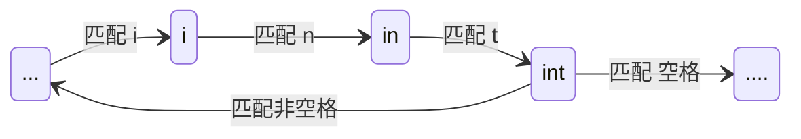

## From Code to Program: C语言代码如何运行？

想要在电脑上运行一段C语言代码非常简单，你只需要一样东西：编译器。

简单来说，编译器的作用就是把人类写的C语言代码”翻译“成机器码——二进制的0和1，以方便机器去执行。这个过程就叫“编译”。

编译器有很多种，最常用的是GCC。此外还有Mac预装的Clang，以及LVVM等。在这里我们只关心GCC编译器。GCC原简称为GNU C Compiler，现改为GNU Compiler Collection，因为它已经时一个非常完善、功能丰富的编译套装了。

你现有一个经典的hello world程序：

```c
// helloworld.c
#include <stdio.h>

int main() {
	printf("Hello World!");
	return 0;
}
```

想要运行它，你只需要在命令行中调用：

```bash
gcc helloworld.c -o helloworld.o
```

然后，文件列表内就会多出一个`helloworld.o`的可执行文件。你可以执行它：

```bash
./helloworld.o
```

你会得到输出：

```bash
Hello World!
```

这个过程看似十分简单，从`.c`源码文件到`.o`的可执行文件，编译的过程其实主要经过四个阶段：预处理、编译、汇编、和链接。本文将就每个阶段进行展开讲解。

## 一、预处理

> 参考： https://www.runoob.com/cprogramming/c-preprocessors.html

[main.c](./demo/stage-0_source-code/main.c) ➡ [main.i](./demo/stage-1_preprocessed-code/main.i)

预处理阶段的输入是你的一系列`.c`源文件，输出则是一系列`.i`文件。所谓的`.i`文件仍然是C语言代码，只不过编译器对它进行了一些处理，包含以下方面：

1. 宏替换：将宏定义的宏名替换成宏定义的宏值。
2. 文件展开：将包含的文件的内容插入到当前文件。
3. 条件编译：根据不同的平台，选择性编译部分代码。
4. 特殊指令处理

这些操作都跟宏指令（即`#`开头的指令）相关。

想要查看预处理后的代码，你可以运行：

```bash
gcc -E helloworld.c -o helloworld.i
```

### 1.1 宏替换

将使用`#define`定义的宏（包含常量和函数）替换成实际值。

预处理前：

```c
// 宏替换
#define ONE 1
#define TWO 2
#define MAX(a, b) ((a > b) ? a : b)

// ...

int main() {
    int a = ONE;
    int b = TWO;
    printf("1 + 2 = %d\n", add(a, b));
    printf("MAX(1, 2) = %d\n", MAX(a, b));

	// ...
}
```

预处理后：

```c
int main() {
    int a = 1; // ONE -> 1
    int b = 2; // TWO -> 2
    printf("1 + 2 = %d\n", add(a, b));
    printf("MAX(1, 2) = %d\n", ((a > b) ? a : b)); // MAX(a, b) -> ((a > b) ? a : b)
}
```
### 1.2 文件展开

将通过`#include`指令指向的源文件内容插入到当前文件中。如`stdio.h`。

预处理前：

```c
// 文件展开
#include <stdio.h>
#include "addition.h"
```

预处理后：

```c
// Start of stdio.h
typedef unsigned char __u_char;
typedef unsigned short int __u_short;
typedef unsigned int __u_int;
// ...
int getentropy (void *__buffer, size_t __length)
    __attribute__ ((__access__ (__write_only__, 1, 2)));
// end of stdio.h
// addition.h
int add(int a, int b);
```

### 1.3 条件留存

只保留`#ifdef`为`true`（或`#ifndef`为`false`）的代码段。即，假设某个宏已被定义，则`#ifdef`为`true`的代码段将被保留，否则将被忽略。这个过程常用来判断编译的平台。如：Windows平台定义了`_WIN32`宏，而Linux平台定义了`__linux__`宏。

预处理前：

```c
int main() {
 	//...
#ifdef __linux__
    printf("Compiling under linux/unix!\n");
    sleep(5);
#elif _WIN32
    printf("Compiling under windows!\n");
    Sleep(5);
#endif
    return 0;
}
```

预处理后 (linux)：

```c
int main() {
    // ...
    printf("Compiling under linux/unix!\n");
    sleep(5);
    return 0;
}

```

预处理后 (windows)：

```c
int main() {
	// ...
	printf("Compiling under windows!\n");
	Sleep(5);
	return 0;
}
```

### 1.4 特殊指令处理

#### 1.3.1 `#undef` 取消定义

我们的操作系统平台和ANSI C具有自带的宏。如`FILE_SIZE`。 我们可以使用`#undef` 取消定义，并赋予它新的定义。

```c
#undef FILE_SIZE
#define FILE_SIZE 1024
```

#### 1.3.2 `#error` 产生错误

我们可以根据错误条件是否满足而主动产生编译错误，属于类似fail-fast机制。

```c
#if !defined(C99)
    #error "C99 standard is required."
#endif
```

#### 1.3.3 ANSI C宏

| 宏 | 描述 |
|-|-|
| `__DATE__` | 当前日期，"MMM DD YYYY" 格式， 冻结为编译时间 |
| `__TIME__` | 当前时间，"HH:MM:SS" 格式， 冻结为编译时间 |
| `__FILE__` | 当前文件名， 字符串常量 |
| `__LINE__` | 当前行号， 十进制常量 |
| `__STDC__` | 1，表示 ANSI C 标准， 0 表示非 ANSI C 标准 |

---

## 二、编译

> 参考：https://blog.csdn.net/shengGod/article/details/124403212

[main.i](./demo/stage-1_preprocessed-code/main.i) ➡ [main.s](./demo/stage-2_assembly-code/main.s)

C语言的编译阶段中，编译器将处理后的纯文本代码（`.i`文件）转换成平台相关汇编代码（`.s`文件）。意即，相同编译器的编译结果会因操作系统、架构二者任一的差异而不同。我们这里仅以linux下的x86架构为例。

想查看编译后的汇编代码，你可以运行：

```bash
gcc -S helloworld.i -o helloworld.s
```

此时，你会发现 `helloworld.s` 中有很多`.cfi`开头的汇编指令，这是用于调试的。此外，GCC默认使用AT&T风格，比较难以阅读。我们使用Intel风格的汇编。想要解决这两个问题，需要添加一些参数。完整指令如下：

```bash
gcc -S helloworld.i \
    -masm="intel" \                     # 使用Intel风格
    -fno-asynchronous-unwind-tables \   # 禁用调试
    -o helloworld.s
```

编译阶段分为五个关键子步骤：

1. 词法分析 (Lexical Analysis)
2. 语法分析 (Syntax Analysis)
3. 语义分析 (Semantic Analysis)
4. 中间代码生成与优化 (Intermediate Code Generation and Optimization)
5. 目标代码生成 (Assembly Code Generation)

### 2.1 词法分析

这是编译的第一道工序，它的作用是将 **字符流 (Character Stream)** 转换成 **记号流 (Token Stream)**。

- 输入字符流（以 `int a = 1;` 为例）：`['i', 'n', 't', ' ', 'a', '=', '1', ';']` 
- 输出记号流：`[Keyword(int), Identifier(a), Operator(=), Number(1), Delimiter(;)]`

词法分析的具体工作流程如下。

**1 扫描 (Scanning)**

编译器从左到右粗去字符。它会忽略对语义没有影响的空白字符（如空格、制表符），但会保留换行符用于错误报告。

**2 模式匹配 (Pattern Matching)**

编译器使用正则表达式来定义每种Token的结构。

- 关键字 (Keywords)：`if`, `else`, `int`, `return` 等；
- 标识符 (Identifiers)：变量、函数名称、宏名等；
- 字面量 (Literals)：正数、浮点数、字符串；
- 运算符 (Operations)：`+`, `-`, `*`, `/` 等；
- 分隔符 (Delimiters)：`(`, `)`, `{`, `}`, `;` 等。

正则表达式本身等价于一种自动机，叫 **确定有限自动机**，即 Deterministic Finite Automata (DFA)。比如，识别`int`这个关键字的过程可以表示为以下自动机：



**3 符号表交互 (Symbol Table Interaction)**

当词法分析器识别到一个标识符（对应到变量名、函数名等）时，会查询或创建符号条目。

#### 2.1.1 常见词法错误

- 非法字符：`$`或中文标点
- 未闭合的字符串：如 `"hello world`
- 未闭合的注释

#### 2.1.2 词法分析示例

源代码片段：

```c
int sum = 0;
```

字符流：

```
['i', 'n', 't', ' ', 's', 'u', 'm', '=', '0', ';']
```

词法分析结果：

```
[Keyword(int), Identifier(sum), Operator(=), Number(0), Delimiter(;)]
```

### 2.2 语法分析

这是编译的第二道工序，它的作用是将 **记号流 (Token Stream)** 转换成 **抽象语法树 (Abstract Syntax Tree)**。它和词法分析的区别是：词法分析只关心**这个记号是什么**， 而语法分析则关心 **这些记号组成的句子是否合法**。

它的原理为，利用上下文无关语法（Context-Free Grammar, CFG），使用解析算法来构建层级结构。如, 以下代码：

```c
int main() {
    int a = 1;
    if (a > 0) {
        printf("a");
    } else {
        printf("b");
    }
}
```

解析为语法树可能为：

```
TranslationUnit                                 (翻译单元, C程序最高节点，代表整个源文件)
└── FunctionDefinition                          (函数定义: main)
    ├── DeclarationSpecifiers                   (返回类型说明符)
    │   └── Type: int
    ├── Declarator                              (函数声明器)
    │   ├── Identifier: main
    │   └── ParameterList: void                 (参数列表)
    └── CompoundStatement                       (函数体/复合语句)
        ├── BlockItem: Declaration              (局部变量声明)
        │   ├── DeclarationSpecifiers: int
        │   └── InitDeclaratorList              (初始化声明列表)
        │       ├── Declarator: a               (变量名)
        │       └── Initializer: 1              (初始值)
        │
        └── BlockItem: SelectionStatement       (选择语句: if-else)
            ├── Condition                       (条件表达式)
            │   └── BinaryOperator              (二元运算符: >)
            │       ├── Left Operand: a         (DeclRefExpr)
            │       └── Right Operand: 0        (IntegerLiteral)
            │
            ├── ThenStatement                   (if 分支体)
            │   └── CompoundStatement
            │       └── ExpressionStatement     (表达式语句)
            │           └── CallExpression      (函数调用: printf)
            │               ├── Callee: printf  (Identifier)
            │               └── Argument: "a"   (StringLiteral)
            │
            └── ElseStatement                   (else 分支体)
                └── CompoundStatement
                    └── ExpressionStatement     (表达式语句)
                        └── CallExpression      (函数调用: printf)
                            ├── Callee: printf  (Identifier)
                            └── Argument: "b"   (StringLiteral)
```

> 注：类似于正则表达式 (Regular Expression, RE) 等价于确定性有限状态机，上下文无关语言 (Context-Free Language, CFL) 也等价于一种状态机，叫做非确定性有限状态机 (Non-Deterministic Finite Automata, NFA)。这种状态机允许存在分叉转换。即：一个状态可以有多个转换，这些转换的输入字符可以不同。

#### 2.2.1 常见语法错误

- 缺少分号
- 括号不匹配
- 结构错误：如在函数外写执行语句。

### 2.3 中间代码生成与优化

现代编译器（如GCC，Clang）不会从AST直接生成汇编，而是先生成 **与机器无关的** 中间表示，即 Intermediate Representation (IR)。这样做的目的是：

1. 解耦：前端 (C语言解析) 和后端 （x86/ARM 汇编代码生成）分离。
2. 优化：在IR层面进行优化更加容易，且可以兼容不同的架构。

> GCC 使用 GIMPLE 和 RTL，Clang/LVVM使用 LVVM IR。

常见的优化操作有：

- 常量折叠：逻辑层面，将`int a = 3 + 5;` 直接变为 `int a = 8;`；
- 死代码消除：删除永远不会执行的代码或从未使用的变量；
- 循环展开：减少循环跳转开销；
- 函数内联：将小函数直接插入调用处，减少函数使用开销。
    - 请注意，每次函数调用在内存层面都有一个额外的入栈过程，涉及到多个寄存器的内容变更及备份，具有一定的开销。对小函数而言，这种开销的性价比非常低。

### 2.4 目标代码生成

这是编译的最后一步，编译器将优化后的IR转换为目标架构的汇编指令。这里以linux x86_64为例：


```s
; ...常量定义等
main:
	endbr64
	push	rbp
	mov	rbp, rsp
	sub	rsp, 16
	mov	DWORD PTR -8[rbp], 1
	mov	DWORD PTR -4[rbp], 2
	mov	edx, DWORD PTR -4[rbp]
	mov	eax, DWORD PTR -8[rbp]
	mov	esi, edx
	mov	edi, eax
	call	add@PLT
	mov	esi, eax
	lea	rax, .LC0[rip]
	mov	rdi, rax
	mov	eax, 0
	call	printf@PLT
	mov	edx, DWORD PTR -4[rbp]
	mov	eax, DWORD PTR -8[rbp]
	cmp	edx, eax
	cmovge	eax, edx
	mov	esi, eax
	lea	rax, .LC1[rip]
	mov	rdi, rax
	mov	eax, 0
	call	printf@PLT
	lea	rax, .LC2[rip]
	mov	rdi, rax
	call	puts@PLT
	mov	edi, 5
	call	sleep@PLT
	mov	eax, 0
	leave
	ret
```

> 简单补充：r开头的寄存器代表64位，e开头的寄存器代表只读取前32位。rbp为栈基指针，rsp为栈顶指针。若要了解更多汇编语言的知识，请移步 [Assembly Language Overview](../../assembly-language/overview.md) 。请同时查阅操作系统相关知识 [Operating Systems Overview](../../operating-systems/overview.md) 以保证学习质量。

---

## 三、汇编

[main.s](./demo/stage-2_assembly-code/main.s) ➡ [main.o](./demo/stage-3_object-code/main.o)

编译阶段的核心任务是，将汇编语言的 **汇编助记符** 翻译成 **二进制机器指令**， 并生成后续链接的 **符号表** 和 **重定位信息**。

汇编器的工作比编译器要简单得多，因为它不需要处理复杂的语法树和优化，它只负责 “翻译” 和 “打包”。主要包含以下四个步骤：

1. 语法分析与指令翻译
2. 符号解析
3. 外部符号标记
4. 生成目标文件格式

### 3.1 语法分析与指令翻译

汇编器读取`.s`文件的每一行，解析汇编语法。

- **助记符转操作码：** 将人类可读的指令转换为CPU能够理解的二进制操作码；
    - 如：x86-64中， `add ebx eax` 可被编码为 `01 D8`；
- **操作数处理：** 解析寄存器 (`rax`)，立即数、内存地址（`[rbp]`）等，并将其编码金指令的二进制格式中。

### 3.2 符号解析

汇编代码中通常包含标签，例如函数名或跳转的目标（如`.main`等）。

- **局部符号：** 如果标签定义在当前文件中（如`.loop_starg`），汇编器会计算该标签对于当前段的偏移量 (offset)。
- **记录位置：** 汇编器会记住哪里引用了这个标签，以便后续填入地址。

### 3.3 外部符号标记

**重定位 (Relocation)**

当汇编器生成`.o`文件时，如果源汇编代码调用了其他文件定义的函数或全局变量，则汇编器此时不知道它们的地址。因此，汇编器生成 **重定位条目 (Reolcation Entry)**， 在指令中填写一个占位符，然后再`.o`文件的特殊区域记录一张清单，记录“这里有一个坑，需要连接器之后来填上”。

#### 3.4.1 查看符号表

我们读取 [main.o](./demo/stage-3_object-code/main.o) 的符号表：

```bash
readelf -s main.o
```

得到：

```
Symbol table '.symtab' contains 8 entries:
   Num:    Value          Size Type    Bind   Vis      Ndx Name
     0: 0000000000000000     0 NOTYPE  LOCAL  DEFAULT  UND
     1: 0000000000000000     0 FILE    LOCAL  DEFAULT  ABS main.c
     2: 0000000000000000     0 SECTION LOCAL  DEFAULT    5 .rodata
     3: 0000000000000000   128 FUNC    GLOBAL DEFAULT    1 main
     4: 0000000000000000     0 NOTYPE  GLOBAL DEFAULT  UND add
     5: 0000000000000000     0 NOTYPE  GLOBAL DEFAULT  UND printf
     6: 0000000000000000     0 NOTYPE  GLOBAL DEFAULT  UND puts
     7: 0000000000000000     0 NOTYPE  GLOBAL DEFAULT  UND sleep
```

可以见到，`add`，`printf`， `puts` 和 `sleep` 都是未定义 (UND) 的，因为它们来自于外部。

#### 3.4.2 查看重定位表

我们读取 [main.o](./demo/stage-3_object-code/main.o) 的重定位表：

```bash
readelf -r main.o
```

得到：

```
Relocation section '.rela.text' at offset 0x230 contains 8 entries:
  Offset          Info           Type           Sym. Value    Sym. Name + Addend
000000000025  000400000004 R_X86_64_PLT32    0000000000000000 add - 4
00000000002e  000200000002 R_X86_64_PC32     0000000000000000 .rodata - 4
00000000003b  000500000004 R_X86_64_PLT32    0000000000000000 printf - 4
00000000004f  000200000002 R_X86_64_PC32     0000000000000000 .rodata + 8
00000000005c  000500000004 R_X86_64_PLT32    0000000000000000 printf - 4
000000000063  000200000002 R_X86_64_PC32     0000000000000000 .rodata + 18
00000000006b  000600000004 R_X86_64_PLT32    0000000000000000 puts - 4
000000000075  000700000004 R_X86_64_PLT32    0000000000000000 sleep - 4
```

以第一行的`add`为例。

- `Offset`：重定位条目所对应的指令的偏移量。
- `Type`：重定位类型。`R_X86_64_PLT32` 表示相对于函数入口的32位跳转。`R_X86_64_PC32` 代表相对于程序计数器的32位跳转。
- `Sym. Value`：告诉连接器，这里需要填入`add`的地址。

含义：汇编器在 `call add` 对应的机器码中填入了临时值，并告诉连接器，请在0x25处，根据`add`的最终地址计算相对偏移并计入。


### 3.4 生成目标文件格式

将翻译好的机器码、数据、符号表、重定位信息按照特定的格式（如ELF, Match-O, PE等）打包成`.o`文件。

**目标文件结构（以Linux ELF为例）**

| 段名 | 内容 | 权限 |
|--|--|--|
| `.text` | **代码段。** 存放编译后的机器指令。 | r-x |
| `.data` | **数据段。** 存放已初始化的全局变量和静态变量。 | rw- |
| `.bss` | **未初始化数据段。** 存放未初始化的全局变量和静态变量。 | rw- |
| `.rodata` | **只读数据段。** 存放只读数据，如字符串常量。 | r-- |
| `.symtab` | **符号表。** 记录本文件定义的和引用的所有符号，如函数名、变量名、标签名等。 | - |
| `.strtab` | **字符串表。** 存放符号表中的符号名字符串。 | - |
| `.rel.text` | **重定位表（代码）** 记录`.text`中需要链接器修改的位置。 | - |
| `.rel.data` | **重定位表（数据）** 记录`.data`中需要链接器修改的位置。 | - |
| `.shstrtab` | **段字符串表。** 存放段名。 | - |

> 注：text，data和bss段在程序执行时会被加载到内存中，成为 **进程控制块 (Process Control Block, PCB)** 的组成部分。此外，进程控制块中还包含调用栈 (Stack)。详细内容请移步至 Operating Systems - Process。

---

## 四、链接

链接是C语言编译流程的最后一个阶段，也是将程序从分散的代码片段组装成“可执行整体”的关键步骤。

- 输入：一个或多个目标 `.o` 文件、静态库（`.a`）、动态库（`.so`/`.dll`）
- 输出：一个可执行文件（`.out` / `.exe`）或动态库（`.so` / `.dll`）

在汇编阶段，每个`.c`文件被单独编译成了`.o`文件。这引入了两个问题：

1. 每个 `.o` 文件都假设自己从内存地址 `0` 开始，加载到内存时会产生冲突；
2. `main.o` 调用了 `add.o` 中的 `add` 函数，而汇编至 `main.o` 时汇编器不知道 `add` 函数具体地址，只能在符号表和重定位表中留了一个“坑”。

链接器的作用就是：**合并地址空间，填补空缺地址。**

### 4.1 符号解析

连接器会扫描所有输入的`.o`和库文件，维护一张 **全局符号表**。目标是，将每一个 **符号引用** 绑定到一个确切的 **符号定义**。

符号具有以下类型：
- 全局符号 (Global)：非静态函数、非静态全局变量。对其他文件可见。
- 局部符号 (Local)：静态函数、静态全局变量。仅对当前文件可见。
- 外部符号 (External)：当前文件未定义，但在其他文件或库中定义的符号。

#### 4.1.1 冲突处理

冲突处理基于符号的强弱：
- 强符号：函数名、已初始化的全局变量。
- 弱符号：未初始化的全局变量，或用 `__attribute__((weak))` 标记的符号。

冲突处理规则如下：

| | 强符号 | 弱符号 |
|--|--|--|
| 强符号 | 报错 `multiple definition` | 选择强符号|
| 弱符号 | 选择强符号 | 任选一个，通常选第一个 |

示例：

```c
// file1.c
int x = 1;      // 强符号
void func() {}  // 强符号

// file2.c
int x;          // 弱符号 -> 选择强符号，x=1
void func() {}  // 强符号，链接报错
```

### 4.2 重定位

这是链接过程最复杂的部分。一旦符号解析完成，连接器知道了 **每个符号的最终地址**，就需要修改代码中的占位符。

#### 4.2.1 合并段

将所有 `.o` 文件中 **相同类型的段** 合并，并输出到文件的每一个段中。

- 如，`.text` 段合并 `.text` 段， `.bss` 合并 `.bss` 段， `.data` 段合并 `.data` 段。

#### 4.2.2 修补指令

链接器遍历每个段的 **重定位条目**，找到汇编阶段留下的“坑”，根据符号解析得到的地址计算 **相对偏移量**，然后将计算出的值填入“坑”中。

*重定位公式（以x86相对寻址为例）：*

```
引用处的值 = 目标符号地址 - (引用地址 + 引用指令长度)
```

- 目标符号地址：合并后，链接器计算出`add`函数的最终地址；
- 引用处地址：`call add`指令所在的地址；
- 引用指令长度：`call add`指令的长度。

### 4.3 动态链接

对于 **静态链接** (Linux下为 `.a` (Archive)， Windows下为 `.lib` (Library))，链接器将库文件的代码 **直接复制** 到可执行文件中。生成的可执行文件包含所有代码，运行时不需要加载外部库。但是具有以下问题：

1. 体积大：每个程序都包含同一份库代码。
2. 内存浪费：多个程序运行，多分相同的代码会加载于内存中。
3. 难以维护：某个库修复Bug，所有程序都要重新编译链接。

对于 **动态链接**(Linux下为 `.so` (Shared Object)， Windows下为 `.dll` (Dynamic Linking Library))，可执行文件中 **不包含** 库代码，只记录其“需要哪个库”。代码在程序 **运行时** 由动态链接器加载。

#### 4.3.1 GOT 与 PLT

动态链接在编译时无法确定库函数的地址。为了解决这两个问题，引入了两张表：

**过程链接表：Procedure Linkage Table, PLT**

- 位于 `.text` 段，是一小段跳转代码。
- 当你调用 `add` 时，实际上跳转到 `add@PLT`。

**全局偏移表：Global Offset Table, GOT**

- 位于 `.data` 段，存放真正的函数地址。
- `add@PLT` 会去查看GOT表，拿到`add`的地址再跳过去。

**延迟绑定机制 (Lazy Binding)**

程序第一次调用 `add` 时，GOT表中还没有 `add` 的地址。PLT会触发动态链接器去查找地址，填入GOT，然后再跳转。第二次调用时，GOT已经有该地址，直接跳转，无需查找。