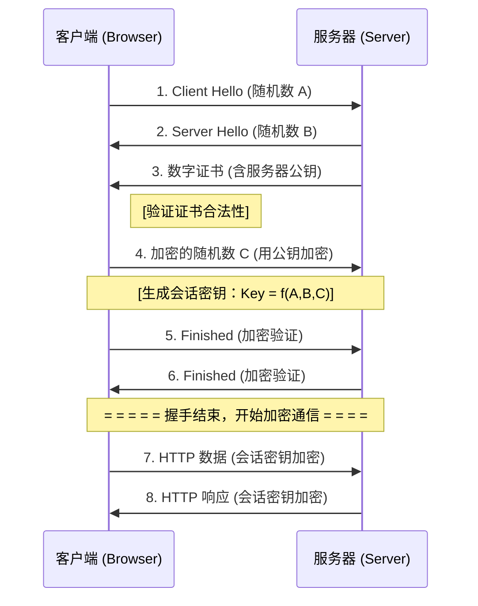

## 一、HTTP 与 HTTPS 的区别与应用简述

### 1.1 核心定义

| 协议        | 全称                          | 本质                |
| --------- | --------------------------- | ----------------- |
| **HTTP**  | HyperText Transfer Protocol | 超文本传输协议，**明文传输**  |
| **HTTPS** | HTTP + **SSL/TLS**          | 加密的 HTTP，**安全传输** |

### 1.2 核心区别对比

| 对比维度       | HTTP            | HTTPS                               |
| ---------- | --------------- | ----------------------------------- |
| **安全性**    | 明文传输，易被窃听、篡改、劫持 | 加密传输（对称+非对称加密），防窃听、防篡改、防冒充          |
| **默认端口**   | `80`            | `443`                               |
| **协议层**    | 应用层             | 应用层 + **SSL/TLS 安全层**               |
| **证书要求**   | 无需证书            | 需向 CA 机构申请数字证书（验证身份）                |
| **握手过程**   | 简单，直接发送请求       | 复杂，需先进行 **TLS 握手**（协商密钥、验证证书）       |
| **性能开销**   | 低，无加密计算         | 略高，加解密消耗 CPU；但 HTTP/2、TLS 1.3 已大幅优化 |
| **SEO 影响** | 无加成             | 搜索引擎（如 Google）优先收录 HTTPS 站点         |

---

## 二、HTTPS加密原理

HTTPS 加密过程的核心逻辑是：
1.  **验明正身**（通过 CA 证书验证服务器公钥）。
2.  **安全协商**（通过非对称加密交换生成对称密钥的种子）。
3.  **高效通信**（使用协商好的对称密钥加密实际数据）。

这一机制在保证**机密性**（防窃听）、**完整性**（防篡改）和**身份认证**（防冒充）的同时，兼顾了网络传输的**性能**。

### 2.1 简化流程

1. 客户端发起 HTTPS 请求
2. 服务器返回数字证书（含公钥）
3. 客户端验证证书合法性（CA 签发、域名匹配、有效期）
4. 客户端生成「会话密钥」，用服务器公钥加密后发送
5. 服务器用私钥解密，获得会话密钥
6. 后续通信使用该会话密钥进行对称加密传输

**混合加密机制**：  
- **非对称加密**（RSA/ECC）：用于密钥交换，保证安全  
-  **对称加密**（AES/ChaCha20）：用于数据传输，保证效率

> 📌 **行业趋势**：  
> - 浏览器对 HTTP 站点标记「不安全」🚨  
> - 微信/支付宝等小程序强制要求 HTTPS  
> - HTTP/2、HTTP/3 协议**仅支持 HTTPS**

### 2.2 混合加密机制

HTTPS 的加密过程并不是单一算法，而是**混合加密机制**（Hybrid Encryption）。它结合了**非对称加密**的安全性和**对称加密**的高效性。

- **为何不全称使用非对称加密？** 非对称加密（如 RSA）计算极其复杂，性能比对称加密（如 AES）慢 1000 倍以上。如果全程使用，服务器 CPU 会爆满，网页加载极慢。
- **为何不全称使用对称加密？** 对称加密需要双方持有同一把密钥。如果在网络上传输密钥，容易被黑客截获（中间人攻击）。一旦密钥泄露，所有通信都被破解。

核心：
- 用**非对称加密**解决“密钥配送”的安全问题（只传一次，代价可接受）。
* 用**对称加密**解决“数据传输”的效率问题（大量数据，速度要快）。

核心流程分为两个阶段：**TLS 握手阶段**（协商密钥）和 **数据传输阶段**（加密通信）。

#### 2.2.1 核心加密概念准备

在理解流程前，需明确三种技术的作用：

| 技术                      | 特点                       | 在 HTTPS 中的作用                   |
| :---------------------- | :----------------------- | :----------------------------- |
| **非对称加密** (RSA/ECC)     | 有公钥和私钥，公钥加密私钥解密。**速度慢**。 | 用于**身份认证**和**交换密钥**（确保密钥不被窃听）。 |
| **对称加密** (AES/ChaCha20) | 只有一把密钥，加解密**速度快**。       | 用于**实际数据传输**（保证效率）。            |
| **数字证书** (CA)           | 由权威机构签发，包含公钥和身份信息。       | 用于**验证服务器身份**，防止中间人攻击（防伪造公钥）。  |

#### 2.2.2 详细加密流程 (以 TLS 1.2 为例)

TLS 1.3 流程更简化，但 TLS 1.2 更能体现经典原理。

**第一阶段：TLS 握手 (协商会话密钥)**
*目标：安全地生成一个只有客户端和服务器知道的“会话密钥”。*

1.  **Client Hello (客户端发起)**
    *   客户端发送支持的加密套件列表、TLS 版本、一个**随机数 A**。
2.  **Server Hello (服务器响应)**
    *   服务器确认加密套件、TLS 版本、生成一个**随机数 B**。
    *   **发送数字证书**：包含服务器的**公钥**（由 CA 签发）。
3.  **证书验证 (客户端)**
    *   客户端验证证书合法性（是否由可信 CA 签发、域名是否匹配、是否过期）。
    *   *若验证失败，浏览器报错拦截。*
4.  **密钥交换 (关键步骤)**
    *   客户端生成第三个**随机数 C** (Pre-Master Secret)。
    *   客户端用**服务器公钥**加密 **随机数 C**，发送给服务器。
    *   *（注：现代常用 ECDHE 算法，双方通过算法共同计算出密钥，不直接传输 C，具备前向安全性）*
5.  **生成会话密钥**
    *   服务器用**私钥**解密得到 **随机数 C**。
    *   此时，客户端和服务器都拥有了 A、B、C 三个随机数。
    *   双方使用相同的算法，由 A+B+C 生成最终的**会话密钥 (Session Key)**。
6.  **握手结束 (Finished)**
    *   双方发送加密的 "Finished" 消息，验证握手过程是否被篡改。

**第二阶段：数据传输 (对称加密)**
*目标：高效、安全地传输 HTTP 业务数据。*

1.  **加密发送**
    *   客户端使用**会话密钥**（对称加密）加密 HTTP 请求数据。
2.  **解密接收**
    *   服务器使用相同的**会话密钥**解密数据，处理业务。
3.  **加密响应**
    *   服务器使用**会话密钥**加密 HTTP 响应数据，发回客户端。
4.  **解密展示**
    *   客户端解密响应，渲染页面。

#### 2.2.3 流程图解



### 2.3 TLS 1.3 的优化 (进阶)

目前主流的 TLS 1.3 对上述流程做了简化：
1.  **减少握手次数：** 从 2-RTT（两次往返）减少到 1-RTT，甚至支持 0-RTT（恢复会话时）。
2.  **更安全：** 移除了不安全的加密算法（如 RSA 密钥交换、MD5、SHA-1），强制使用具备**前向安全性**的 ECDHE 算法。
3.  **加密握手：** 握手过程本身也加密了，防止指纹识别。

---

## 三、HTTPS 的局限性

HTTPS 只能保证 **传输层的安全**（数据在传输过程中不被窃听或篡改），但无法解决应用层、客户端、服务器端或人为因素导致的安全问题。

### 3.1 HTTPS 失效/不安全的典型场景

#### 1. 证书相关问题

| 场景           | 风险说明                        | 实际影响                       |
| ------------ | --------------------------- | -------------------------- |
| **证书过期**     | 证书有有效期，过期后浏览器会警告            | 用户若忽略警告强行访问，通信仍可能被监听       |
| **证书伪造**     | 攻击者伪造证书 + 劫持 DNS/路由，实施中间人攻击 | 若用户信任伪造证书，数据完全暴露           |
| **CA 机构被攻破** | 权威 CA 私钥泄露，攻击者可签发"合法"假证书    | 历史上 DigiNotar 事件导致数千假证书被签发 |
| **用户忽略警告**   | 浏览器提示"证书无效"时用户点击"继续访问"      | 人为绕过安全机制，HTTPS 形同虚设        |
| **自签名证书**    | 未受信任的 CA 签发，浏览器默认不信任        | 内网可用，公网使用会被标记为不安全          |

> 📌 **关键点**：证书体系依赖「信任链」，任何一环被攻破（CA、服务器、用户行为），安全即失效。

#### 2. DNS 劫持 / 域名污染

```text
正常流程：
用户 → 输入 example.com → DNS 解析 → 正确 IP → 建立 HTTPS 连接

劫持流程：
用户 → 输入 example.com → DNS 被劫持 → 攻击者 IP → 伪造证书 → 用户忽略警告 → 数据泄露
```

- **HTTPS 能防御吗？**
  - 如果用户**严格验证证书**（域名匹配 + CA 可信），即使 DNS 被劫持，浏览器会因证书域名不匹配而拦截。
  - 但如果用户**忽略证书警告**，或攻击者已攻破 CA 伪造了合法证书，则劫持成功。

- **增强方案**：
  - **DNS over HTTPS (DoH) / DNS over TLS (DoT)**：加密 DNS 查询，防止本地 DNS 劫持。
  - **HPKP（已废弃） / CAA 记录**：限制哪些 CA 可为域名签发证书。

#### 3. 中间人攻击 (MITM) 的特殊场景

| 攻击方式              | 原理                           | HTTPS 能否防御     |
| ----------------- | ---------------------------- | -------------- |
| **SSL 剥离**        | 强制将 `https://` 降级为 `http://` | 需配合 HSTS 才能防御  |
| **恶意 WiFi / 路由器** | 控制局域网出口，伪造证书 + DNS 劫持        | 用户忽略警告则失效      |
| **企业/学校代理**       | 安装自签 CA 到客户端，解密所有 HTTPS 流量   | 技术上合法，但隐私风险高   |
| **BGP 劫持**        | 劫持 IP 路由，将流量导向攻击者服务器         | 需证书 + 用户警惕双重保障 |

> 🛡️ **HSTS (HTTP Strict Transport Security)** 是重要防御：  
> 服务器返回响应头 `Strict-Transport-Security: max-age=31536000`，浏览器会强制后续请求使用 HTTPS，防止降级攻击。

#### 4. 应用层攻击（HTTPS 完全无法防护）

HTTPS 只加密「传输管道」，不关心管道里流动的内容逻辑：

| 攻击类型              | 说明                      | HTTPS 是否有效              |
| ----------------- | ----------------------- | ----------------------- |
| **XSS（跨站脚本）**     | 恶意 JS 窃取用户 Cookie/Token | 无效，攻击在浏览器内执行            |
| **CSRF（跨站请求伪造）**  | 诱导用户发起非本意请求             | 无效，需靠 Token/SameSite 防御 |
| **SQL 注入**        | 恶意输入操纵数据库查询             | 无效，属后端逻辑漏洞              |
| **钓鱼网站**          | 伪造登录页面骗取凭证              | 无效，甚至钓鱼站也可用 HTTPS       |
| **恶意 JS / 供应链攻击** | 第三方库被篡改，执行恶意代码          | 无效，加密传输的也可能是恶意代码        |

#### 5. 其他潜在风险

| 风险 | 说明 |
|------|------|
| **协议/算法降级攻击** | 攻击者迫使客户端使用弱加密算法（如 RC4、SHA-1） |
| **前向安全性缺失** | 若使用 RSA 密钥交换，私钥泄露后可解密历史流量 |
| **客户端漏洞** | 浏览器/系统 SSL 库漏洞（如 Heartbleed） |
| **服务器配置错误** | 启用弱加密套件、未禁用 TLS 1.0/1.1 |
| **0-RTT 重放攻击**（TLS 1.3） | 为性能牺牲部分安全性，可能被重放请求 |

### 3.2 最大化 HTTPS 的安全性

#### 3.2.1 服务端配置
```nginx
# Nginx 示例：强制 HTTPS + 安全配置
server {
    listen 443 ssl http2;
    server_name example.com;
    
    # 使用强加密套件
    ssl_ciphers 'ECDHE-ECDSA-AES128-GCM-SHA256:ECDHE-RSA-AES256-GCM-SHA384';
    ssl_protocols TLSv1.2 TLSv1.3;  # 禁用旧版本
    ssl_prefer_server_ciphers on;
    
    # HSTS：强制 HTTPS，包含子域名，预加载
    add_header Strict-Transport-Security "max-age=63072000; includeSubDomains; preload" always;
    
    # OCSP Stapling：加速证书验证
    ssl_stapling on;
    ssl_stapling_verify on;
}
```

#### 3.2.2 证书管理
- 使用可信 CA（Let's Encrypt / DigiCert 等）
- 开启**自动续期**，避免过期
- 配置 **CAA 记录**，限制可签发证书的 CA
- 监控证书透明度日志（Certificate Transparency）

#### 3.2.3 客户端/用户教育
- **永远不要忽略证书警告**🚨
- 核对域名是否正确（警惕同形异义字攻击）
- 使用浏览器扩展（如 HTTPS Everywhere）
- 启用浏览器安全功能（如 Safe Browsing）

#### 3.2.4 纵深防御（Defense in Depth）
```text
HTTPS 只是第一道防线，还需：
├─ 应用层：输入校验、CSP、CSRF Token、XSS 过滤
├─ 认证层：多因素认证（2FA）、短时效 Token
├─ 监控层：异常登录检测、请求频率限制
├─ 运维层：WAF、入侵检测、日志审计
```

