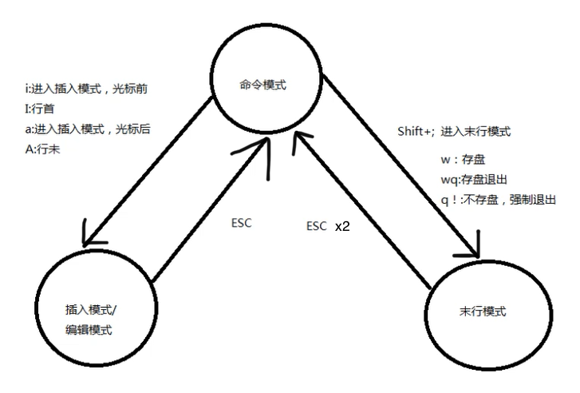
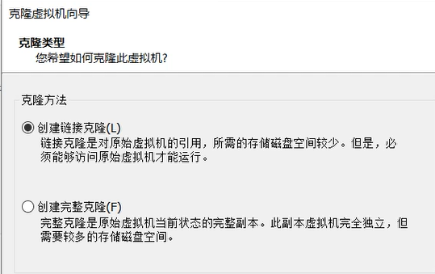
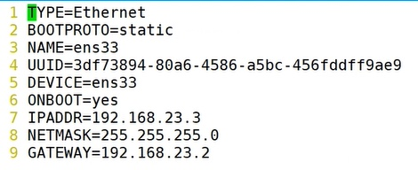
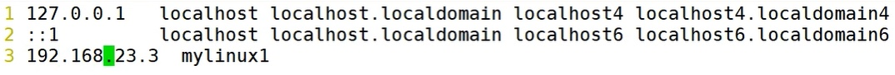
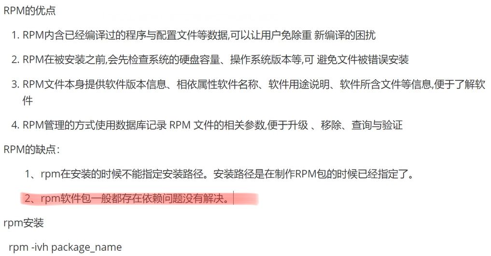
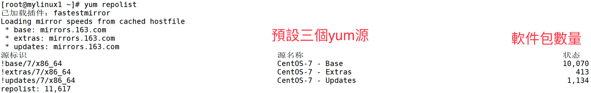
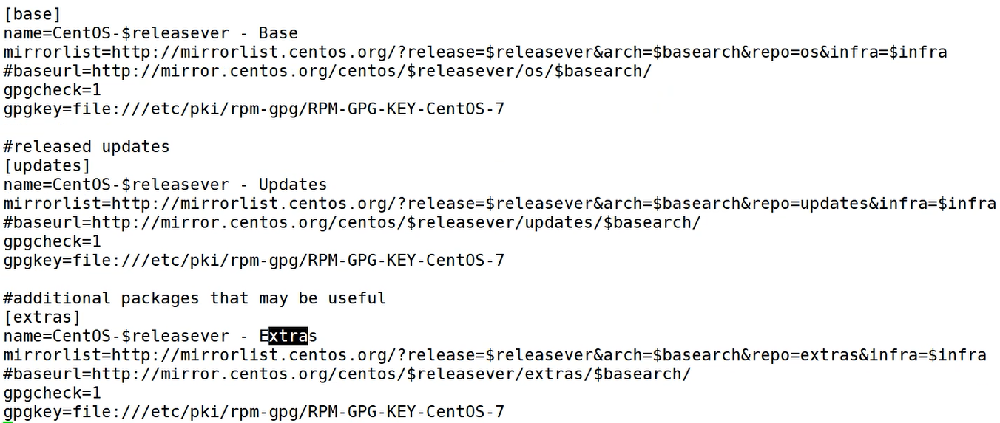
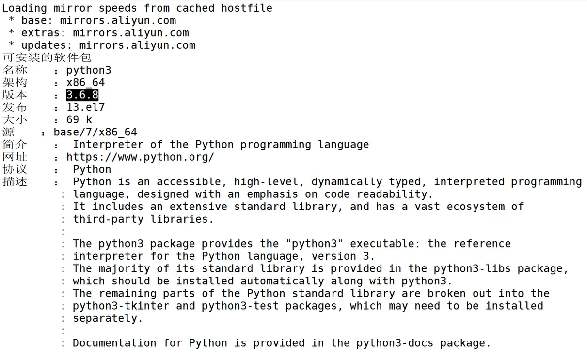
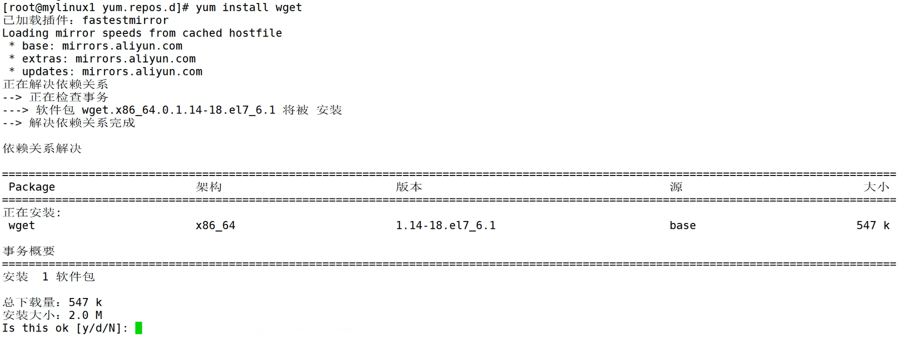
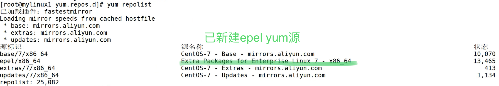

***由於是個人筆記所以很亂 XD***

## 1 Linux概述

OS

- CentOS使用最多

Linux發行版

- CentOS, RedHat, Debian企業服務器中用得最多

- Ubuntu: PC端中用最多

Linux

- 開源免費

- 內核

- 企業級服務器，嵌入式開發平台

甚麼人要學Linux

- Linux管理人員

- 數據庫管理員

- 網絡工程師

## 2 安裝VMare

CentOS用最多

利用VMware

## 5 Static IP config

Vi命令

打開文件 vi &lt;filename>

進入編輯模式 按i

退出編輯模式 按Esc (返回命令模式)
:q! 不儲存退出
:wq 儲存並退出

swap文件
如果沒有使用命令退出，會出現.swp文件
可使用rm &lt;file>.swp 移除，然後y 確認

cat &lt;filename> 輸出文件內容

yum源
軟件倉庫地址
可以用Ali yum源，下載國外資源較快

關閉防火牆

靜態IP設置
(詳情參閱設置pdf)
IPADDR=“192.168.68.66”
NETMASK=“255.255.255.0”
DNS1=“202.175.36.16”
GATEWAY=“192.168.68.2”

## 6 文件結構

所有檔案存放於/目錄下

Bin 用戶可執行的命令
Boot 開機引導目錄
Dev 設備目錄
Media USB Disk目錄
Proc 虛擬文件目錄
Root 管理員主目錄
Etc 所有文件的配置文件
網絡配置 /Etc/sysconfig/network-scripts/
vi ifcfg-ens33 編輯網絡配置
:wq 在vi模式下儲存並退出
pwd顯示當前命令

/bin /sbin /user/bin /user/sbin
存放可執行命令

/var 存放操作系統的日誌數據

/home/
所有用戶目錄位於 /home/
su 轉換用戶
自己用戶的檔案會放到/home/裡面
root用戶的「家」目錄在/root

[kelvin@localhost ~]$ cd~
用戶名@主機名 ~表示在家目錄 即/home/kelvin

絕對路徑 /斜槓開頭
相對路徑 不以/斜槓開頭
當前目錄 .
父目標 ..

## 7 基本概念

用戶等級：

1. 超級管理員用戶 root
2. 普通用戶

r: 對文件可讀，對目錄可瀏覽文件列表
w: 對文件可新增、修改，對目錄內文件可刪除、移動
x:對文件可執行，對目錄可進入

ls -l
列出當前所有文件之詳細
dr-xr-x—- root
d 目錄
lrwxrwxrwx bin
l 捷徑文件

drwxr-xr-x &lt;username> &lt;group name>
三組rwx
第一組：建立文件者
第二組：用戶所在群組（默認情況下組名=用戶名）
第三組：其他用戶
<username (文件屬主)>
<group name (文件屬組)>

etc/passwd 列出所有用戶 (UID:0, GID:0, root的user ID跟group ID是0)
etc/group 列出所有的組

## 8 基本命令

ls —help 列出ls命令選項

.hello.txt .開頭是隱藏文件

ls
-a 同時列出隱藏文件
-l 列出文件詳細
-r 名稱倒序
-t 由遠至近
-tr 由近至遠
-R recursively
-F 目錄名後會加斜線

cd - 切換至上一次瀏覽的目錄
cd .. 切換至父目錄
cd ../.. 切換至父目錄的父目錄

pwd
顯示當前路徑

## 9 基本命令2

mkdir
創建目錄
mkdir -p x/y
(注意 mkdir x/y會失敗, 因./x不存在)

touch
更新文件3種時間屬性，如文件不存在則，則創建空文件
-時間屬性有如下3種
最近訪問
最近更改
最近改動

更改：更改文件內容
改動：更改文件名稱、位置、內容

stat 查看文件屬性

rmdir 用於刪除空目錄 （少用）

rm 刪除文件、目錄
-i 詢問確認 重要‼️
-r 遞歸刪除

mv
mv [options] source new-name
mv [options] source directory
更改文件/目錄名字
更改文件/目錄位置
-i 覆蓋前會詢問確認 重要‼️
*當前目錄所有文件

mv * ../ 移動當前pwd所有文件到父目錄

## 10 基本命令3

cp &lt;src> &lt;dst>
複製文件

cp hello.txt ../mashibin/hello3.txt
複製hello.txt到父目錄的mashibin目錄下，同時更名為hello3.txt

-a或-dpR
複製連結、以及文件屬性、遞歸地
*常用 cp -ai

cat 打印文件內容
-n 連同行號一起打印

more 一頁一頁打印文件 (只能向前)
more -10 x.txt 每屏顯示10行
more +10 x.txt 從第10行開始顯示
❕空格翻頁
❕q退出
❕enter翻一行

less 隨意瀏覽文件

history 查看命令輸入記錄
ps aux 查看Linux運行進程 (等於windows的工作管理員)

## 11 基本命令4

head -n 20 &lt;filename>
顯示文件頭20行內容

tail -n 20 &lt;filename>
顯示文件尾20行內容

tail -f &lt;filename> ‼️
即時打印出文件新加入的內容
❕Ctrl+c 中斷命令

clear 清屏

which 查找目錄/文件/命令的位置
which ls
ls 在 usr/bin/ls

whereis 打印可執行文件 幫助手冊 源碼文件位置

echo \$PATH 打印環境變量 (\$ 即變量)

yum install mloacte 下載locate

locate 以關鍵字搜索 顯示所有符合文件/目錄
快的原因是因為會訪問locate數據庫(索引)
❕updatedb 更新locate數據庫

## 12 基本命令5

Find 實時查找整個硬盤，並非使用索引
Find pathname
-print 打印匹配之文件
-exec 匹配文件之上再執行shell語句

find ./x -name “*.txt” -exec cp {} /opt/ \;
find 找
./x 當前目下的x folder
-name 文件名為
“*.txt” txt後綴的
-exec 執行
cp 複製
{} 配匹文件名
/opt/ 到 opt目錄
\; 結束 -exec之shell 命令

-name 按照名字
-perm 按照權限
-user 按照文件屬主
-group 按照文件所屬的組
-type 按照文件類型
-size 按照文件大小 (+100c)

find -amin -60
最近60分鐘被訪問過的文件
-cmin被修改過

find ./ -name “*.log”
當前目錄下所有log文件
-size +1000c 文件字符大於1000的文件

chmod 調用文件權限
❕文件調用權限分3級：文件擁有者、群組、其他
-R 目錄下所以子文件進行權限修改
u: 文件/目錄當前擁有者
g: 文件/目錄當前群組
o: 其他
a: 所有用戶及群組

chmod o+w, o+x hello.txt
o 針對其他用戶群經
+w 加上可write文件之權限
+x 加上可執行文件之權限
hello.txt 到hello.txt文件
(su root 以改更用戶)

chmod 646 hello2.txt
r:4 w:2 x:1 -:0(rwx全刪)
6=4+2=read+write
4=read
6=read+write
改文件權限為u:read+write, g:read, o:read+write

chown
chown &lt;user>:&lt;group> hello.txt
chown :&lt;group> hello.txt 只改屬組
❕修改文件用戶屬組、用戶屬主
-R 套用到所有子文件

drwxr-xr-x &lt;username> &lt;group name>
三組rwx
第一組：文件屬主
第二組：用戶所在群組（默認情況下組名=用戶名）
第三組：其他用戶

chown laoxiao:laoxiao hello.txt
修改文件屬主和屬組為 <用戶>：<用戶組>
laoxiao對hello.txt的權限由o成為u

## 13 基本命令6

tar
將多個文件打包，並不是壓縮文件
-c打包❕
-f 指定文件名打包/解包
-r 添加文件到已經壓縮包中
-u 添加改了和現有的文件到壓縮包去
-x 解包❕
-t 題示壓縮包中內容
-z 支持gzip壓縮 (打包/解包.tar.gz格式)
-j 支持bzip2壓縮
-v 顯示操作過程（顯示被打包文件）

tar -cvf log.tar ./*
對當前目錄下所有文件進行打包
打包成log.tar文件 並顯示被打包文件

❗️—exclude &lt;filename> 除了某文件不打包
❗️不能exclude目錄

date 顯示當前time stamp
2020年11月04日 星期三 20:20:49 CST

cal 顯示日曆

grep 顯示查找內容匹配項
grep ‘&lt;keyword>’ &lt;filename>
grep -n ‘for’ profile
在profile文件顯示有for的行以及行數

grep -n ‘for’ profile
在profile文件中顯示以for開頭的行及行數

ps -ef | grep svn
找查進程中有svn的一行

## 14 vi命令1

ps 顯示進程

R Runnable (on run queue)
運行(正在運行或在運行隊列中等待)
S Sleeping
中斷 (休眠中，受阻，正在等待條件或信號)
D uninterruptible sleep (usually IO)
不可中斷 (收到信號不運行，必須等待到中斷發生)
T Traced or stopped
停止 (收到SIGSTOP, SIGSTP, SIGTIN, SIGTOU信號後停止運行)
Z a defunct (“Zombie”) process
僵死 (進程已終止，但進程描述符存在，直到父進程調用wait4()系統調用後釋放)

ps -aux 常用

kill 終止進程
tail -f profile 是一個進程
kill -9 &lt;thread id>

編輯內容 vi vim
yum instal vim 下載vim
* 在Linux下大多數文件都是ASCII純文本
* 可以利用Unix內置vi文本編輯器
* vim 是vi的高級版本, 含顏色,底線等功能
* vim可以識別文件類型(如.py)從而調用該程序的語法判斷式

命令模式 輸入模式 末行命令模式

vi hello.txt 進入vi編輯器命令模式
按i 輸入enter insert mode命令
按ESC返回命令模式
按shift+; 進入末行模式

## 15 vi命令2

vi命令模式
❗️case sensitive
光標移動：
←h ↓j ↑k →l, 或方向鍵 (可配合數字多行移動, 輸入30j 向下移30行)
翻頁移動：
向下Ctrl+F, 或page down
向上Ctrl+B, 或page up
向下半頁Ctrl+D
向上半頁Ctrl+U

+ 移到非空格符的下一行
- 移到非空格符的上一行
0 移到行首
$ 移到行尾
H 移到屏幕最上行第一字符
M 移到屏幕中央行第一字符
L 移到屏幕最下行第一字符
gg 移到文件第一行 (=1G)
G 移到文件最後行
20G 移到第20行
:set nu 進入末行模式，顯示行號
30 向下移動30行

搜索
/word 光標之下尋找word匹配字符串
?word 光標之上尋找word匹配字符串
n next matched target
N last matched target

刪除
x delete
X BackSpace
10x 刪除10個字符
dw 刪除一個單詞
10dw 刪除10個單詞

d$ 向右刪除全部字符
d0 向左刪除全部字符
dd 刪除一整行

20dd 向下刪除20行
d1G 向上刪除所有行
dG 向下刪除所有行

複製貼上
yw 複製一個單詞
yy 複製一整行
y0 複製到行首
y$ 複製到行尾
20yy 向下複製20行

p 光標所在行貼上
P 光標所在行上一行貼上

‼️u 復原(=Ctrl+Z)
‼️Ctrl+r 取消復原 (=Ctrl+Y)
‼️. 重複上一個動作

R 取代模式(replace mode)

保存
ZZ 保存及退出
ZQ 不保存退出

## 16 vi命令3

末行模式
vi profile
先進入profile文件vi編輯器
:sp hello.txt
向上分列新窗口文件，同時編輯兩個文件
:bn
回到profile文件
:bp
回到hello.txt文件

:w 保存
:wq 保存及退出
:q 退出
:q! 不保出強制退出

:w hello2.txt 另存到hello2.txt
:r hello.txt 將hello.txt內容貼上光標下一行
:1,10w top.txt 將第一至十行另存至top.txt

:! ls /home/kelvin
暫時離開vi編輯器, 運行ls (按enter返回vi)

:1,30s/before/after/gi
將1-30行的所有before替換成after
g 全部替換
i 忽略大小寫

:1,$s/before/after/g 或 :%/before/after
將文件全部before替換成after

:%/before/after/c
(每次確認)將文件全部before替換成after

:set nu 顯示行號
:set nonu 隱藏行號

:set ts=4 設置縮排(Tap)為4空格字符

永久所有vi顯示行號
su root
vi /etc/virc
在空白行輸入set nu
(*如已安裝vim則在/etc/vimrc 中修改)

使用塊選擇模式多行輸入
Ctrl+v （進入塊選擇模式）
按下 ↓ （向下選取行）
按大寫i （進入向前輸入模式）
輸入#（python中的注釋）
按兩下ESC （退出兩個模式）

## 17,18 Snapshot & Clone

快照在關機狀態下進行會較好
init 0, 或shutdown 關機

Clone

完整克隆，避免與被複製體連結

克隆後更改網絡配置
因為不能與舊的一致
vi /etc/sysconfig/network-scripts/ifcfg-ens33

1. UUID要刪掉（之後會自動配置新的）
2. IPADDR要改
3. :wq
4. service network restart (重啟網絡)
5. hostnamectl set-hostname mylinux2   (更改主機名)
6. vi /etc/hosts

7. 改成192.168.23.4 mylinux2
8. init 6 (重啟)

ip addr顯示ip配置

## 19 配置Yum源

RPM軟件包安裝
(RedHat Package Manager)

阿里雲RPM centos7軟件包整合下載
https://mirrors.aliyun.com/centos/7/os/x86_64/Packages/
國外
http://mirror.centos.org/centos/7/os/x86_64/Packages/

rpm安装
rpm -ivh package_name 
选项与参数: 
-i :install的意思 
-v :察看更细部的安装信息画面 
-h :以安装信息列显示安装进度
Ø 安装单个rpm包 
rpm -ivh package_name 
Ø 安装多个rpm包 
rpm -ivh a.i386.rpm b.i386.rpm *.rpm 
Ø 安装网上某个位置rpm包 
rpm -ivh http://website.name/path/pkgname.rpm

rpm -qa 已安裝的軟件包
rpm -qa | grep python 檢查是否安裝python

yum 命令
yum解決rpm命令軟件依賴性問題
yum [options] [command] [package…]

❕先設置yum源
檢查yum源
yum repolist

cd /etc/yum.repos.d/CentOS-Base.repo

可以看到有3個yum源

更換yum源
配置方法
https://developer.aliyun.com/mirror/centos?spm=a2c6h.13651102.0.0.3e221b11yMttMf

1. 備份
mv /etc/yum.repos.d/CentOS-Base.repo /etc/yum.repos.d/CentOS-Base.repo.backup
2. 下載新的 CentOS-Base.repo 
curl -o /etc/yum.repos.d/CentOS-Base.repo https://mirrors.aliyun.com/repo/Centos-7.repo
3. 產生緩存
yum makecache

## 20 Yum使用

檢查是否安裝了python
yum search python

存在interpreter of the Python

查看軟件包訊息
yum info python3.x86_64

Python只有69KB, 因為會依賴到其他文件

沒有wget時進行安裝
yum install wget

添加epel yum源 (因aliyun CentOS太少)
wget -O /etc/yum.repos.d/epel.repo http://mirrors.aliyun.com/repo/epel-7.repo
yum makecache

yum search mysql 會多了很多軟件包源

刪除軟件包
yum remove gcc (不會刪除依賴軟件包)