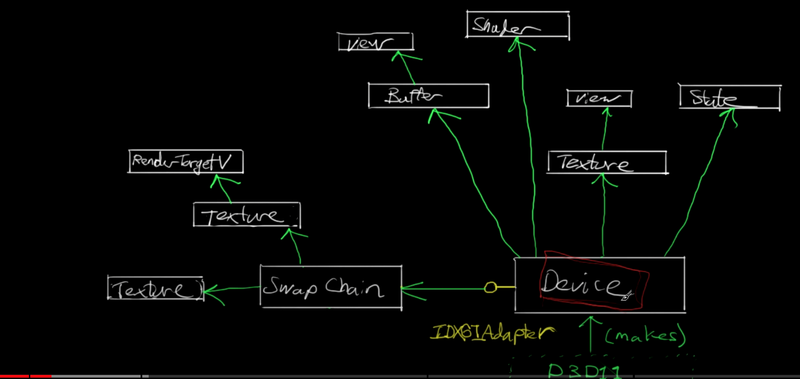

# D3D Architecture

D3D本質上還是一個API，只是提供了一組接口，使得開發者可以更方便的使用GPU。

# Device 

Device，你可以想像成一個接口，這接口對所有的GPU顯卡進行操作

在D3D11中以工廠模式來實現Device，在D3D12中以模塊化來實現Device

```c++
// in D3D12
#include <wrl.h>
using Microsoft::WRL::ComPtr;

ComPtr<IDXGIFactory> factory;
HRESULT WINAPI CreateDXGIFactory1(REFIID riid, _COM_Outptr_ void **ppFactory);
// riid: COM對應ID
// ppFactory: COM接口 (&factory or factory.GetAddressOf())
```

```c++
CreateDXGIFactory1(IID_PPV_ARGS(&factory));
```

```c++
// D3D12 創建模版
ComPtr<ID3D12Interface> object;
CreateInterfaceFunction(param, ..., IID_PPV_ARGS(&object));
object->InterfaceFunction(param, ...);
```

- Texture
- State
- Buffer
- Swap Chain
- ...



# Swap Chain


# Direct3D Graphics Pipeline
The graphics pipeline provides the horsepower to efficiently process and render Direct3D scenes to a display, taking advantage of available hardware. The following diagram shows the building blocks of the pipeline:


