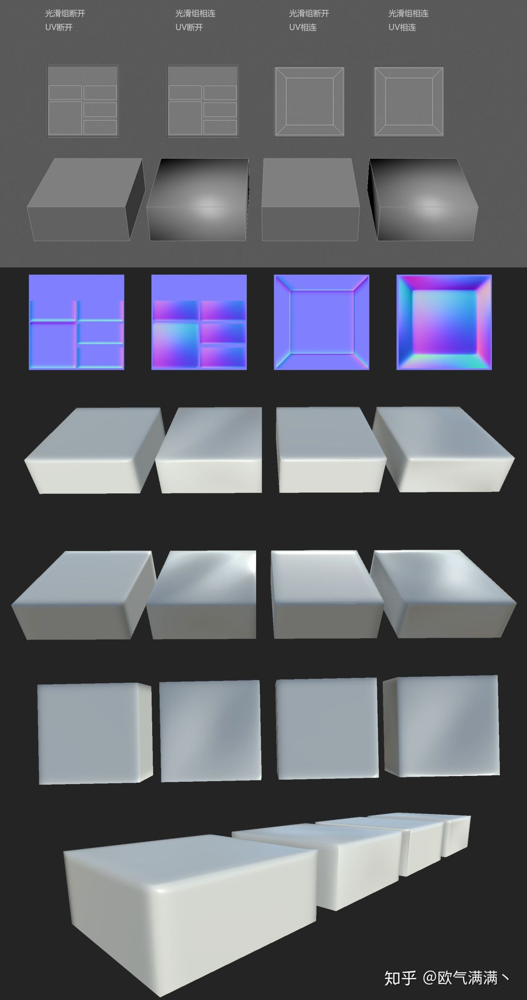

# GQ002 模型格式和材質

# OBJ文件
OBJ文件是一種被廣泛使用的3D模型文件格式（obj為後綴名）。由Alias|Wavefront公司為3D建模和動畫軟件"Advanced Visualizer"開發的一種標準，適合用於3D軟件模型之間的互導，也可以通過3dsmax、Maya等建模軟件讀寫。

重點:
- v（vertex）数据段: 模型顶点列表
- vt（vertex texture）数据段：模型顶点的纹理坐标列表
- vn（vertex normal）数据段：顶点法线列表
- f（face）：模型的三角面列表
- 紋理座標 (UV座標)

## OBJ文件格式:
```obj
# "#"号开头是注释行
# v（vertex）数据段: 模型顶点列表
# 顶点位置信息，是xyz三维坐标
# v开头的每一行描述一个顶点，行数等于顶点数。8个顶点所以有8行
v  1.00  -1.00  -1.00
v  1.00  1.00  1.00
......
# vt（vertex texture）数据段：模型顶点的纹理坐标列表
# 顶点的纹理坐标信息，是xy二维坐标
# vt开头的每一行描述一个纹理坐标，行数大于等于顶点数，因为一个模型顶点在贴图的UV坐标系中很可能对应多个顶点/纹理坐标。且坐标值范围是在0~1之间，这个模型中有14行。
# 关于纹理坐标，本文不多解释纹理坐标，就是UV座標
vt  0.74  0.75
vt  0.29  0.55
......
# vn（vertex normal）数据段：顶点法线列表
# 三维法向量，xyz
# vn开头的每一行描述一个法向量，行数大于等于顶点数。 前面介绍了，法线是与面相关的概念，但是现在的面是靠顶点来描述，拿点"1"为例，它与参与构成了三个面，所以"顶点1"对应有3条法线
# 可能你已经发现了，在这个立方体模型中，共面顶点的法向量的方向是相同的，也就是说这里面的数据会重复，所以在建模软件导出obj文件时有个优化的选项，勾选后的导出的法线列表数据中就不会有重复项，这里的例子优化后有6条法线*
vn  -1.00 0.00 0.00 
vn  1.00 0.00 0.00
vn  0.00 1.00 0.00
......
# f（face）：模型的三角面列表
# f开头的每一行描述一个面 ，关键的来了，三个点组成一个面，怎样拿到这三个点呢？通过从1开始的索引，去前面的v、vt、vn列表中去取。
# 总结一下就是：每一行定义1个面，1个面包含3个点，1个点具有“顶点/纹理坐标/法线”3个索引值，索引的是前面3个列表的信息。
f  1/1/1  2/2/1  3/3/1      # 顶点1、顶点2、顶点3 组成的面
f  2/2/1  3/3/1  4/4/1      # 顶点2、顶点3、顶点4 组成的面
f  1/1/1  5/10/1  8/14/6  # 顶点1、顶点5、顶点8 组成的面
......
```
以上便是obj 文件的核心部分，此外還有一些數據段，記錄如下。

o 對象名
g 組名
s 平滑組
usemtl 材質名
mtllib 材質庫.mtl

由於Obj文件和mtl文件是息息相關的，這裡留下mtl文件格式供你自行研究

* [更加詳細mtl文件格式](https://www.loc.gov/preservation/digital/formats/fdd/fdd000508.shtml)

在model/文件下存放著一些obj格式文件(~~找了很久卻網上沒有的模型~~)，你也可以參考一下!

# FBX格式
和OBJ格式差不多，可以儲存更多類型的信息，比如動畫、材質特性、貼圖、骨骼動畫、燈光、攝像機，頂點顏色等，是更加通用的文件格式

# 提高內容:
1. 材質 反射光 光滑組
<details>

# 材質
在現實世界中不存在完美的表面，一個模型能攜帶的法線也有限。因此可以使用漫反射，高光，折射等計算去調整法線，也就能影響光照計算的結果

# 反射光
在現實世界中，每個物體都會對光產生不同的反應，例如:
- 有些物體反射光的時候不會產生太多的散射(Scatter)，而是產生一個較小的高光點
- 有些物體則散射較多，產生一個更大半徑的高光點

# 反射光類型
- 漫反射: 將入射光線均勻地反射出去 (Lambertian 模型)
- 鏡面反射: 將入射光線根據表面法線進行反射，且只有在反射方向有能量，其他方向能量則為0
- 折射: 根據折射率折射一部分光線進入物體之中
- 粗糙鏡面反射: 光線偏移較小，反射集中於一個區域內
- 粗糙鏡面折射: 光線偏移較小，反射和折射集中於一個區域內
- 多層材質: 多個物體反射(表面一層)出來的投影
- 次表面散射: 在半透明的物體內多次反射，多出現於半透明的物體 (玉石，牛奶，皮膚(通常有三層))

# 頂點顏色小技巧

- 最常用的：作為一種存儲的mask使用（這樣可以少使用一張圖）
1. 不想讓臉上有菲涅爾效應，就把臉塗黑，乘上頂點色
2. 不想讓某些地方有描邊，可以如法炮製
3. 想把其它信息塞入頂點色。
- 可用於預先指定照明、阻光和其他視覺效果。
- 把顏色信息存在頂點裡，但在低模的情況下效果很差。
(塞入頂點色的信息必須是線性變化的，如果不是，就要做好精度打折的準備)

* [3ds Max 顶点颜色](https://www.ddove.com/edu/chapter/8123.html)

3ds Max 中的所有對像都具有貼圖通道，其中保存關於紋理貼圖以及頂點顏色、照明和 Alpha 的信息。網格對象同樣具有幾何體和頂點選擇通道。
> 主通道為頂點顏色，這可以使對像中的每個頂點都有其自己的顏色，並且在頂點之間自動漸變。此著色默認情況下不可見，但您可以通過“對象屬性”設置切換其顯示。還可以通過“頂點繪製”修改器等各種功能查看和編輯頂點著色。它可用於預先指定照明、阻光和其他視覺效果。貼圖通道數據也可由如游戲引擎等外部應用程序使用

# 光滑組
光滑組（smoothing group）是用來設置邊緣線的光滑顯示的。

smoothing group定義了模型邊緣被渲染出來的方式，下圖三個瓶子是同一個模型。左邊的瓶子是硬邊渲染出來的。右邊的瓶子就是光滑的邊緣渲染出來的。中間的瓶子在高光區域設置了smoothing group，所以高光區是平滑的，而其他邊緣仍然是硬邊渲染


下面圖標出了面的亮度(不是確切數字)，兩面之間的過渡就是兩面亮度和的平均值，光滑組處理面之間的光照信息，提高它們的亮度、飽和度


- 如果兩個面一個光滑組是1，另一個是2，就不進行計算
- 如果他們的光滑組都是1，就會進行光照計算，產生光滑效果，影響最終渲染


# 光滑組和法線
使用Substance Painter軟件製作漸變色的法線貼圖的時候，會出現黑邊情況
- 光滑組相連的模型，法線貼圖都存在大漸變色，導致模型的法線效果會很奇怪（平面上有發暗發亮的光影）。當你發現你的模型出現這種漸變時，一定是出現了光滑組的問題。
- 中間的兩個模型出現了不同程度的接縫（第三個模型的接縫非常明顯，第二個模型則弱一些）。光滑組和uv統一相連或斷開，是不會出現明顯接縫的，當遇到接縫問題，優先考慮模型的光滑組和uv是否統一



# 紋理動畫

在採樣紋理的時候，可以嘗試把紋理的圖片UV座標平移，達到產生複雜動畫的錯覺

</details>

# 備忘
https://www.adobe.com/products/substance3d-painter.html


