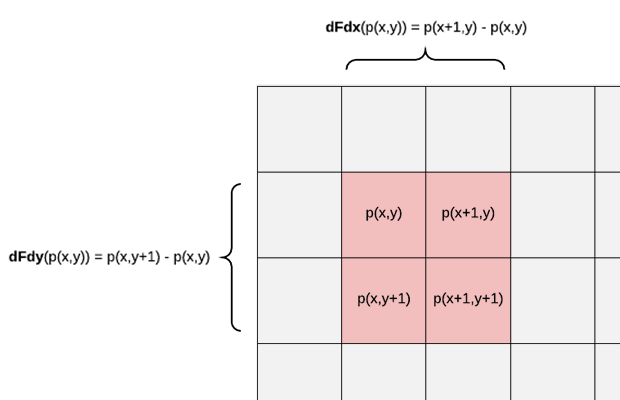

# HLSL 入門和基本函數
什麼是HLSL？

高階著色器語言（High Level Shader Language，簡稱HLSL），就是用來編寫shader的一種語言

類似的語言還有：

## CG
它是由NVIDIA公司所開發的，基於C語言同時被OpenGL和Direct3D所支持的開發語言，其語法和HLSL類似。在《GPU編程與CG語言之陽春白雪》中雖然曾認為CG會越來越受歡迎，但遺憾的是，NVIDIA還是拋棄了CG，目前CG的最終版本是3.1。雖然在一些簡單的shader編寫上還是可以使用，但是在新的硬件環境下還是可能不支持，且對一些新功能的支持較差。

## GLSL
GLSL是基於OpenGL的接口，其語法體係自成一家。但是它不支持DirectX，就不得不放棄僅支持DirectX的Xbox等平台。

## HLSL
HLSL是由微軟開發的，在Windows平台上一家獨大，多用於遊戲領域。語法類似CG語言，在Unity中CG和HLSL等價。

# 常用函數分類
1. 基本數學運算
2. 冪指對函數
3. 數據範圍類
4. 類型判斷類
5. 三角函數與雙曲線函數
6. 向量與矩陣類
7. 光線運算類
8. 1D紋理查找
9. 2D紋理查找
10. 3D紋理查找
11. 立體紋理查找

# 基本數學運算
| 函數名 | 用途
|------	|-------
| max（a，b） | 返回較大的 |
| min（a，b） |	返回較小的 |
| mul（a，b） | 兩向量相乘，常用於矩陣運算 |
| abs（a）	  | 返回a的絕對值 |
| round（x）  | 返回與x最近的整數 |
| sqrt（x）	  | 返回x的平方根 |
| rsqrt（x）  | 返回x的平方根的倒數 |
| degrees（x）| 將弧度轉化為角度 |
| redians（x）| 將角度轉化為弧度 |
| noise（x）  | 噪聲函數,在每個像素點上輸出0/1可形成噪波圖 |

# 冪指對函數
| 函數名 | 用途 | 數學式
|------	|------- |-------
| pow（x，y） | x的y次冪（x、y都可以是自變量或具體數）| $x^{y}$ |
| exp（x）| 返回以e為底的指數函數 | $e$ |
| exp2（value x）|	返回以2為底，x為指數的冪 | $2^{x}$ |
| ldexp（x，exp）|	返回與2的exp次方的乘積 | $x*2^{exp}$ |
| log（x）|	返回指定值的以e為底數的對數 | $lnx$ |
| log10（x）| 求以10為底的對數 | $log_{10}x$ |
| log2（x）	| 求以2為底數的對數 | $log_{2}x$ |
| frexp（x，out exp）|	將浮點數分解成尾數和指數，x的返回值是尾數,exp參數返回的值是指數（加上out會返回exp和規格化小數）| $x=ret*2^{exp}$ |

# 類型判斷類
| 函數名 | 用途
|------	|------- 
|ceil（x）|	返回>=x的最小整數（向下取整）
|floor（x）|	返回<=x的最大整數（向上取整）
|step（x，y）|	x<=y返回1（真），否則返回0
|saturate（x）|	返回將x箝制到[0,1]範圍之間的值
|clamp（x，min，max）|	將x限制在[min，max]範圍的值，比min小返回min，比max大返回max
|fmord（x，y）|	返回x對y取餘的餘數
|frac（x）|	取x的小數部分
|modf（x，out ip）|	將x分為小數和整數部分（輸出的ip為整數部分，返回值為小數部分）
|lerp（x，y，s）|	按照s在x到y之間插值，返回
|smoothstep（min，max，x）|	如果x在[min，max]範圍內，就返回介於[0，1]之間的平滑Hermite插值，使用smoothstep在兩個值創建平滑過渡， 例如平滑地混合兩種顏色


# 三角函數與雙曲線函數
| 函數名 | 用途 
|------	|------- 
|sin（x）、cos（x）、tan（x）|三角函數（弧度製：$1°=π/180 rad$）
|asin（x）、acos（x）、atan（x）|	反三角函數
|sincos（x，out s，out c）|	返回x的正弦和余弦
|tan（y，x）|	返回$y/x$的正切
|atan2（y，x）|	返回$y/x$的反正切
|sinh（x）|	返回$x$的雙曲正弦值
|cosh（x）|	返回$x$的雙曲餘弦值
|tanh（x）|	返回$x$的雙曲正弦值

# 向量與矩陣類
| 函數名 | 用途 
|------	|------- 
|length(v)|	返迴向量的長度
|normalize(v)|	向量歸一化，x/length(x) 方向向量歸一化
|distance(a,b)|	返回兩個向量之間的距離，不平行的兩個向量應該為0，此處表示為根號下各分量之差的平方和
|dot(a,b)	|返回a和b兩向量的點積
|cross(a,b)|	返回a和b兩向量的叉積，返回值是向量，並且與a,b都垂直
|determinant(m)	|返回指定浮點矩陣的按行列式方式計算的值
|transpose(m)|	返回矩陣m的轉置矩陣

# 光線運算類
| 函數名 | 用途 
|------	|------- 
|reflect(i,n)| 以i為入射向量n為法線方向的反射光
|refract(i,n,ri)|	以i為入射向量n為法線方向,ri為折射率的折射光
|lit(n_dot_l,n_dot_h，m)|	輸入標量(normal,light,半角向量h,鏡面反射係數m) 返迴光照向量(環境光，漫反射光，鏡面高光反射，1)該計算依據的是BlingPhong光照模型
|faceforward(n,i,ng)|	得到面向視圖方向的曲面法向量輸入輸出為同元向量,返回-n*sign(dot(i,ng))(normal,light,normal)

# 紋理查找
紋理查找就是GPU在片元處理階段中在屏幕空間的XY坐標系中對每一個像素對應的紋理查找對應的紋素來確定像素的顏色

1D紋理其實就是一條線，可看做一維數組，2D可看做二維數組（面），3D三維（體）

# 1D紋理查找 (幾乎不用)
| 函數名 | 用途 
|------	|------- 
|tex1D(s, t)|	普通一維紋理查找 返迴紋理採樣器s在標量t位置的color4
|tex1D(s,t,ddx,ddy)|	使用微分查詢一維紋理， t和ddxy均為vector
|tex1Dlod(s, t)|	使用LOD查找紋理s在t.w位置的color4
|tex1Dbias(s, t)|	將t.w決定的某個MIP層偏置後的一維紋理查找
|tex1Dgrad(s,t,ddx,ddy)|	使用微分並指定MIP層的一維紋理查找
|tex1Dproj(s, t)|	把紋理當做一張幻燈片投影到場景中，先使用投影紋理技術需要計算出投影紋理坐標t(坐標t.w除以透視值)，然後使用投影紋理坐標進行查詢

# 2D紋理查找
| 函數名 | 用途 
|------	|------- 
|tex2D(s, t)|	普通二維紋理查找 返迴紋理採樣器s在vector t位置的顏色
|tex2D(s,t,ddx,ddy)|	使用微分查詢二維紋理，t和ddxy均為vector
|tex2Dlod(s, t)|	使用LOD查找紋理s在t.w位置的color4
|tex2Dbias(s, t)|	將t.w決定的某個MIP層偏置後的二維紋理查找
|tex2Dgrad(s,t,ddx,ddy)|	使用微分並指定MIP層的二維紋理查找
|tex2Dproj(s, t)|	把紋理當做一張幻燈片投影到場景中，先使用投影紋理技術需要計算出投影紋理坐標t(坐標t.w除以透視值)，然後使用投影紋理坐標進行查詢

# 3D紋理查找
| 函數名 | 用途 
|------	|------- 
|tex3D(s, t)|	普通三維紋理查找 返迴紋理採樣器s在vector t位置的顏色
|tex3D(s,t,ddx,ddy)|	使用微分查詢三維紋理， t和ddxy均為vector
|tex3Dlod(s, t)|	使用LOD查找紋理s在t.w位置的color4
|tex3Dbias(s, t)|	將t.w決定的某個MIP層偏置後的三維紋理查找
|tex3Dgrad(s,t,ddx,ddy)|	使用微分並指定MIP層的三維紋理查找
|tex3Dproj(s, t)|	把紋理當做一張幻燈片投影到場景中，先使用投影紋理技術需要計算出投影紋理坐標t(坐標t.w除以透視值)，然後使用投影紋理坐標進行查詢

# 立體紋理查找
| 函數名 | 用途 
|------	|------- 
|texCUBE(s,t)|	返迴紋理採樣器s在vector t位置的顏色
|texCUBE(s,t,ddx,ddy)|	使用微分查詢立方體維紋理 ，t和ddxy均為vector
|texCUBEDload(s,t)|	使用LOD查找紋理s在t.w位置的color4
|texCUBEbias(s,t)|	將t.w決定的某個MIP層偏置後的立方體紋理查找
|texCUBEgrad(s,t,ddx,ddy)|	使用微分並指定MIP層的立方體紋理查找
|texCUBEproj(s,t)|	使用投影方式的立方體紋理查找

# 著色器導數函數
偏差分導函數（在HLSL和GLSL中）是片段著色器指令，可用於計算任何值相對於屏幕空間坐標的變化率

## 導數計算 dFdx 和 dFdy (ddx 和 ddy)
在三角形光柵化期間，GPU 以 2×2 的 block 片段來計算光柵化，通過取block 中像素值之間的差異來計算導數:

- dFdx 從右邊片段中減去左側片段像素值 (右 - 左)
- dFdy 從上邊片段中減去下部片段像素值 (上 - 下)
- 下圖其中網格表示渲染的屏幕像素，以紅色突出顯示的 2×2 block 對應的(x, y)屏幕座標



# 示例代碼
在Unity中嘗試調用 tex2D ddx ddy 等函數，在/Shader下ShaderOfDdx文件裡面有源碼

```shaderlab
Shader "Custom/ShaderOfDdx"
{
    Properties
    {
        [KeywordEnum(IncreaseEdgeAdj, BrightEdgeAdj)] _EADJ("Edge Adj type", Float) = 0
        _Tex("Tex", 2D) = "white" {}
        _Intensity("Intensity", Range(0, 20)) = 2
    }
    SubShader
    {
        Pass
        {
            Tags { "RenderType"="Opaque" }
            Cull off
            Blend SrcAlpha OneMinusSrcAlpha

            CGPROGRAM
            #pragma vertex vert
            #pragma fragment frag
            #pragma multi_compile _EADJ_INCREASEEDGEADJ _EADJ_BRIGHTEDGEADJ
            #include "UnityCG.cginc"
            struct appdata
            {
                float4 vertex : POSITION;
                float2 uv : TEXCOORD0;
            };
            struct v2f
            {
                float2 uv : TEXCOORD0;
                float4 vertex : SV_POSITION;
            };
            sampler2D _Tex;
            float4 _Tex_ST;
            float _Intensity;
            v2f vert (appdata v)
            {
                v2f o;
                o.vertex = UnityObjectToClipPos(v.vertex);
                o.uv = TRANSFORM_TEX(v.uv, _Tex);
                return o;
            }
            fixed4 frag (v2f i, float f : VFACE) : SV_Target
            {
                fixed a = 1;
                if (f < 0) a = 0.5;
                fixed3 c = tex2D(_Tex, i.uv).rgb;
                #if _EADJ_INCREASEEDGEADJ // 邊緣調整：增加邊緣差異調整
                c += (ddx(c) + ddy(c)) * _Intensity;
                #else //_EADJ_BRIGHTEDGEADJ // 邊緣調整：增加邊緣亮度調整
                //c += abs(ddx(c)) + abs(ddy(c)) *_Intensity;
                c += fwidth(c) * _Intensity; // fwidth(c) ==> abs(ddx(c)) + abs(ddy(c))
                #endif // end _EADJ_INCREASEEDGEADJ
                return fixed4(c, a);
            }
            ENDCG
        }
    }
    FallBack "Diffuse"
}
```


- 使用(ddx(c) + ddy(c))，沒有絕對值，會然邊緣的像素亮度差異變大，即：加強邊緣突出
- 使用fwidth函數，可以看出邊緣變亮，突出邊緣 // fwidth(c) ==> abs(ddx(c)) + abs(ddy(c))


# 備忘
* (hlsl-intrinsic-functions)[https://docs.microsoft.com/zh-cn/windows/win32/direct3dhlsl/dx-graphics-hlsl-intrinsic-functions?redirectedfrom=MSDN]

* (shader-derivative-functions)[http://www.aclockworkberry.com/shader-derivative-functions/#footnote_3_1104]

* (fwidth func in HLSL)[https://docs.microsoft.com/zh-cn/windows/desktop/direct3dhlsl/dx-graphics-hlsl-fwidth]