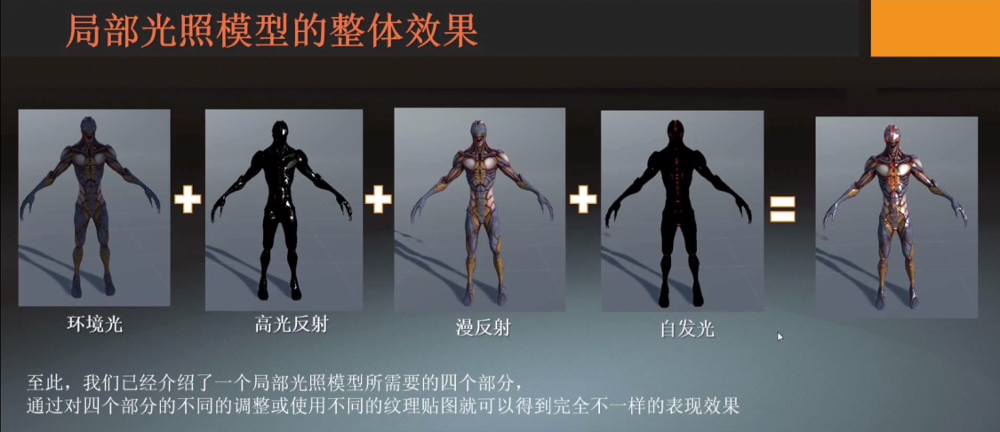

# 傳統光照模型詳解
光照模型分類:
- 基於物理的光照模型（PBR）（有可依據的公式）
- 經驗模型（近似、模擬）

局部光照的定義:
只考慮光源的影響，不考慮光線多次反射

（對應的概念：全局光照=直接光照+間接光照）

局部光照模型內容的分類:

局部光照模型滿足疊加原理，可分為四個部分:
- 漫反射項 $C_{diffuse}$
- 高光項 $C_{specular}$
- 環境光項 $C_{ambient}$
- 自發光

你可以理解成Photoshop中圖層1,圖層2,...,圖層4疊加而成的光照模型

# 漫反射 $C_{diffuse}$

光會被均勻的反射到不同的方向

漫反射過程中，光線發生了吸收和散射，所以顏色和方向發生了改變

## Lambert餘弦定律：

$C_{diffuse} = C_{light} * m_{diffuse} * dot(normal,L)$
>
> $C_{light}$ 光源強度和顏色
>
> $m_{diffuse}$ 材質的漫反射率
> 
> $dot(normal,L)$ 物體表面法線和入射光線的點乘

# 高光/鏡面反射 $C_{specular}$
$C_{specular} = C_{light} * m_{specular} * dot(v,r)^{m_{gloss}}$

> $C_{light}$ 光源強度和顏色 * dot(v,r)^{m_{gloss}}$
> 
> $m_{specular}$ 材質的高光/鏡面反射率
> 
> $dot(v,r)$ 視角方向和反射方向的點乘 (v為視角方向，r為反射方向)
>
> $m_{gloss}$ 材質的光澤度

# 環境光 $C_{ambient}$
假設模型在場景中發生多次散射和反射，並均等地射向物體表面

$C_{ambient} = Albedo * Ambient_{light}$

通常使用的公式:

$C_{ambient} = A_{light} * m_{diffuse}$

# 自發光
由模型自行發出的光，通常直接使用一張發光貼圖來描述自發光

發光貼圖的製作可以使用剛剛以上的生成公式 + 一張你喜歡貼圖，達到發光的效果

# Lambert 模型

只使用Lambert餘弦定律來構造的模型

## 成品:
$Color = C_{light} * m_{diffuse} * dot(normal,L)$

# Phong 模型
$C_{ambient} = Albedo * Ambient_{light}$

$C_{diffuse} = C_{light} * m_{diffuse} * dot(normal,L)$

$C_{specular} = C_{light} * m_{specular} * dot(v,r)^{m_{gloss}}$

## 成品:
$Color = C_{ambient} + C_{diffuse} + C_{specular}$

## Phong 模型 (附自發光) 完整流程圖



Unity Shader
```Shader
Shader "Custom/NewSurfaceShader"
{
    Properties
    {
        _Diffuse("Diffuse",color) = (1,1,1,1)
        _Specular("Specular",color) = (1,1,1,1)
        _Gloss("Gloss",Range(1.0,255)) = 20
        [KeywordEnum(LAMBERT,PH0NG,BLINNN_PH0NG)] _MODE("MODE",float) = 0
    }
    SubShader
    {
        Pass
        {
            CGPROGRAM
            #pragma vertex vert
            #pragma fragment frag

            //shader_feature
            #pragma multi_compile _MODE_LAMBERT _MODE_PH0NG _MODE_BLINNN_PH0NG


            #include "UnityCG.cginc"
            #include "Lighting.cginc"
            #include "AutoLight.cginc"

            struct appdata
            {
                float4 vertex : POSITION;
                float2 uv : TEXCOORD0;
                float3 normal : NORMAL;
            };

            struct v2f
            {
                float2 uv : TEXCOORD0;
                float4 vertex : SV_POSITION;
                float3 normalDir : TEXCOORD1;
            };

            v2f vert (appdata v)
            {
                v2f o;
                o.vertex = UnityObjectToClipPos(v.vertex);
                o.uv = v.uv;

                // 將物體法線從物體坐標系轉換到世界坐標系
                o.normalDir = UnityObjectToWorldNormal(v.normal);
                return o;
            }

            float4 _Diffuse;
            float4 _Specular;
            float _Gloss;

            fixed4 frag (v2f i) : SV_Target
            {
                // 法線方向
                float3 normalDirection = normalize(i.normalDir);
                // 燈光方向
                float lightDirection = normalize(_WorldSpaceLightPos0.xyz);
                // 基於蘭伯特模型計算燈光
                float NdotL = max(0,dot(normalDirection,lightDirection)); 
                // 燈光顏色
                float3 lightColor = _LightColor0.rgb;


                // 漫反射/方向光
                float3 diffuse = lightColor * _Diffuse.rgb * NdotL;

                // 計算燈光衰減
                //float attenuation = LIGHT_ATTENUATION(i);
                //float3 attenColor = attenuation * _LightColor0.xyz;

                // 燈光與材質球表面顏色進行作用
                //float3 texColor = tex2D(_MainTex, i.uv).rgb;
                //float3 diffuseColor = texColor *(directionDiffuse+inDirectionDiffuse);

                // LAMBERT 模型 (只有漫反射)
                #if defined(_MODE_LAMBERT)
                    float3 Color = diffuse;
                // PHONG 模型 (環境光 + 漫反射 + 高光反射)
                #elif defined(_MODE_PH0NG)
                    // 環境光  
                    float3 ambient = float3(0,0,0)+UNITY_LIGHTMODEL_AMBIENT.rgb;
                    // 高光反射
                    // 反射光方向 
                    float3 reflectDir = normalize(reflect(lightDirection,normalDirection));
                    // 視角方向
                    float viewDir = normalize(_WorldSpaceCameraPos.xyz - i.normalDir.xyz);
                    // 視角方向和反射光方向的點乘
                    float vdotR = max(0.0,dot(reflectDir,viewDir));
                    // 合成
                    float specular = _LightColor0.rgb * _Specular.rgb * pow(vdotR,_Gloss);
                    
                    float3 Color = diffuse + ambient + specular;
                // BLINNN_PH0NG 模型 (高光反射使用半程向量)
                #elif defined(_MODE_BLINNN_PH0NG)
                    // 環境光  
                    float3 ambient = float3(0,0,0)+UNITY_LIGHTMODEL_AMBIENT.rgb;
                    // 高光反射
                    // 視角方向
                    float viewDir = normalize(_WorldSpaceCameraPos.xyz - i.normalDir.xyz);
                    // 計算半角向量
                    float3 halfDir = normalize(lightDirection + viewDir);
                    // 半角向量和光線向量的點乘
                    float NdotH = saturate(dot(halfDir,normalDirection));
                    // 合成
                    float specular = _LightColor0.rgb * _Specular.rgb * pow(NdotH,_Gloss);
                    
                    float3 Color = ambient + specular + diffuse;
                #endif

                float4 finalColor = float4(Color,1);
                return finalColor;
            }
            ENDCG
        }
    }
    FallBack "Diffuse"
}
```


