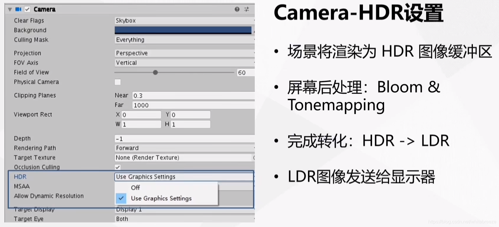
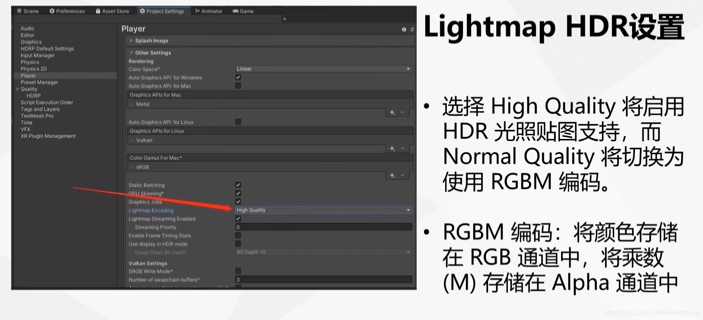
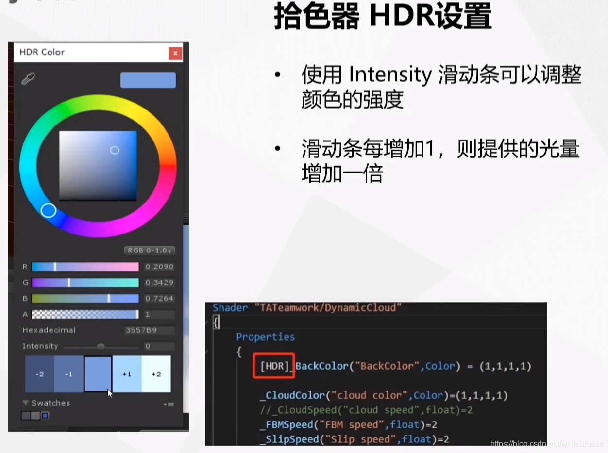
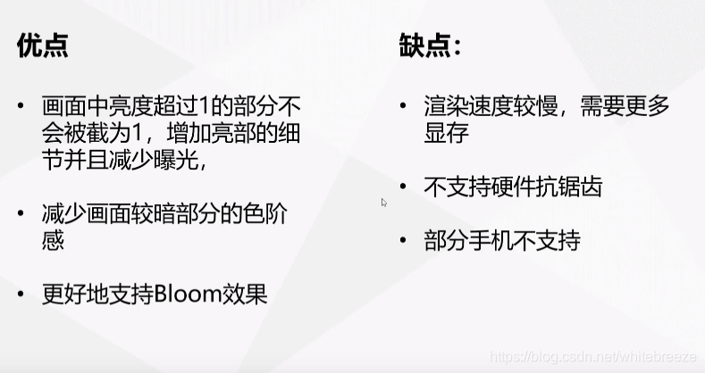
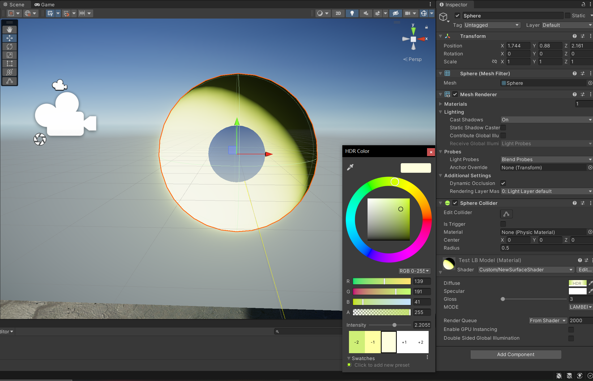

# LDR和HDR
DR: Dynamic Range 最高的亮度和最低的亮度的比值

LDR: Low Dynamic Range

HDR: High Dynamic Range ()

## LDR
- 8位精度 (0~255) 0 0 0 255 255 255
- 單通道0-1
- 格式: PNG, JPG
- 應用: 色板，圖片，電腦屏幕

## HDR
- 大於8位精度 (更加細膩的顏色像素)
- 單通道大於1 (可以存儲RGBA以外的圖像信息)
- 格式: HDR, TIF, EXR, RAW
- 應用: HDRI, 真實世界
- 好處: 防止畫面過曝，製作光暈效果

ToneMapping: HDR -> LDR 的過程

# HDR設置 (Unity)

