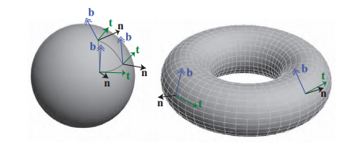
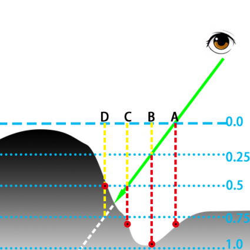
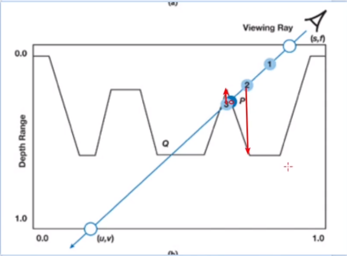

# 1.材質和外觀
在計算機圖形學中，紋理貼圖是使用圖像、函數或其他數據源來改變物體表面外觀的技術。例如，可以將一幅磚牆的彩色圖像應用到一個多邊形上，而不用對磚牆的幾何形狀進行精確表示。當觀察這個多邊形的時候，這張彩色圖像就出現在多邊形所在位置上。只要觀察者不接近這面牆，就不會注意到其中幾何細節的不足（比如其實磚塊和砂漿的圖像是顯示在光滑的表面上的事實）。通過這種方式將圖像和物體表面結合起來，可以在建模、存儲空間和速度方面節省很多資源

大尺度繪製:
- 覆蓋很多個像素
- 由頂點，三角形，其他的幾何圖元表示
- 例如: 角色的四肢

中尺度(細節)繪製: (Bump Mapping 重點)
- 覆蓋好幾個像素
- 細節可能特別複雜，無法使用單個三角形渲染
- 細節可能相對較大，可以觀察看到幾個像素以上的變化
- 例如: 人臉的皺紋、肌肉的褶皺、磚頭的縫隙

小尺度繪製:
- 一個像素
- 通常使用紋理貼圖作為參數
- 模擬了物體表面微觀幾何的相互作用
例如: 
* 有光澤的物體表面是光滑的、漫反射的物體，在微觀下表面是粗糙的 
* 角色的皮膚和衣服看起來也是不同的，因為使用了不同的著色模型/不同的參數

# 2.Bump Mapping
模擬中尺度的常用方法之一，可以讓觀察者感受到比模型尺度更小的細節

思路：
- 在紋理中將尺度相關的信息編碼進去
- 著色過程中，用受到干擾的表面去代替真實的表面
- 這樣一來，表面就會有小尺度的細節
原理：
- 從物體表面的貼圖進行變化然後再進行光照計算的一種技術
- 主要的原理是通過改變表面光照方程的法線，而不是表面的幾何法線，或對每個待渲染的像素在計算照明之前都要加上一個從高度圖中找到的擾動，來模擬凹凸不平的視覺特徵
- 例如：
  - 給法線分量添加噪音（法線映射貼圖）
  - 在一個保存擾動值的紋理圖中進行查找（視差映射、浮雕映射貼圖）
- 是一種提升物體真實感的有效方法， 且不用提升額外的幾何復雜度（不用改模型）

# 2.1 不同的凹凸映射
1. Bump Mapping: 凹凸貼圖
2. Normal Mapping: 法線貼圖
3. Displacement Mapping: 移位貼圖
4. Parallax Mapping (Virtual Displacement Mapping): 視差貼圖
5. Relief Mapping (Steep Parallax Mapping): 浮雕貼圖

- 用處非常廣泛，如增加模型的細節效果、或者做特殊的畫面表現 
- 最常用的：
  - 法線映射
    - 增加法線貼圖後，會對局部的物體表面產生擾動，進而改變明暗關係，來達到增加表面細節的效果。
- 很多映射都會用到法線貼圖


# 2.2 Normal Mapping
## 2.2.1 原理
法線貼圖：存有物體局部表面法線信息的一張貼圖
- 使用過程：
  - 在計算光照時，程序會去讀取法線圖，冰獲取到當前像素點的法線信息，結合光照信息進行光照計算。
- 優點：
  - 使用法線貼圖來計算光照，可以讓物體表現出更多豐富的細節，且隨著光照方向的變化而變化，這是普通的貼圖做不到的。
- 生成：
  - 法線貼圖一般由高模映射到對應的低模上來生成。
  - 對於金屬、木頭這類細節豐富的物體，可以藉助程序化的軟件，如PS、SD來生成
  - opengl-tutorial教程: [Tutorial 13 : Normal Mapping](http://www.opengl-tutorial.org/intermediate-tutorials/tutorial-13-normal-mapping/)
## 2.2.2 實際使用
- [clipdrop.co/relight](https://clipdrop.co/relight)
- 使用了AI的方法去生成了一張法線貼圖，我們就可以使用法線貼圖做出打光的效果
## 2.2.3 存儲：切線空間 
法線的存儲，一般會放到模型的切線空間中
- 切線空間：
  - 以物體表面的切線，副切線和法線組成的幾何空間
  - 每個頂點都有屬於自己的切線空間，這個空間的原點是頂點本身，z軸是頂點的法線方向（n），x軸是頂點的切線方向（t），y軸有前邊兩個軸叉乘而來，被稱為副切線（b）或者副法線。
  
  
 - 在計算光照時，需要把相關的向量放在統一的坐標系下進行運算。此時就需要不同空間坐標的轉換矩陣（世界空間轉切線空間/切線空間轉世界空間）
## 2.2.4 世界空間和切線空間的轉換
將世界坐標系下頂點的法線（Normal）、切線（Tangent）、副切線（Bitangent）作為切線空間坐標系的正交基。用這三個向量的標準正交基構建轉換矩陣。對應關係為：法線方向作為z軸，切線方向作為x軸，副切線方向作為y軸
- 轉換矩陣：
  - 切線空間到世界空間的轉換矩陣為一個3×3的旋轉矩陣，一般稱為TBN矩陣
  - 世界空間到切線空間的轉換矩陣為上述TBN矩陣的逆矩陣，因為是正交矩陣，所以逆矩陣就是它的轉置矩陣
  - [GLSL-TBN矩阵](https://blog.csdn.net/qq_35312463/article/details/105874855)

$$
TBN = \begin{bmatrix}
    T_x & B_x & N_x \\
    T_y & B_y & N_y \\
    T_z & B_z & N_z \\
\end{bmatrix}
$$

$$
TBN-1 = \begin{bmatrix}
    T_x & B_x & N_x \\
    T_y & B_y & N_y \\
    T_z & B_z & N_z \\
\end{bmatrix}^T =
\begin{bmatrix}
    T_x & T_y & T_z \\
    B_x & B_y & B_z \\
    N_x & N_y & N_z \\
\end{bmatrix}
$$

- 旋轉矩陣的逆=旋轉矩陣的轉置 (games101 lesson 4)
- 轉換矩陣完成之後，接下來就是光照計算
  - 將光照計算中需要的數據，例如光照方向、觀察方向、法線方向等參數，帶入到光照模型中計算
## 2.2.5 切線空間的優點
法線存在各個空間裡都可以，但關鍵不只是存在哪裡，還有後續的光照計算
- 切線空間的好處
  1. 自由度高。
    - 模型空間下是絕對法線信息（僅可以用在創建它時的那個模型）
    - 而切線空間下的是相對法線信息，是對當前物體法線的擾動。 （可以復用）
  2. 可進行uv動畫。
    - 比如：移動uv坐標來實現凹凸移動效果
  3. 可以重用法線紋理。
    - 比如：一個立方體，6個面可以用一張法線貼圖
  4. 可壓縮。
    - 由於切線空間下貼圖中法線的Z方向總是正方向（模型空間下可以是負的），那麼我們只存XY（切線和副切線）就能推出Z（法線）了，可以少存一個。
## 2.2.6 法線貼圖在Unity中的壓縮格式
在非移動平台上，會把法線貼圖轉化為DXRT5nm格式
  - 這個格式只有兩個有效GA通道（就是上邊說的只存xy，推出z） ，分別對應法線的y、x分量可以節省空間。
  - 在UnityCG.cginc中，提供了UnpackNormal()函數，可以解碼法線貼圖，它是對法線紋理的採樣結果的一個反映射操作，其對應的法線紋理需要設置為Normal map的格式，才能使用該函數，如下是函數的原型：
```shaderlab
// Unpack normal as DXT5nm (1, y, 1, x) or BC5 (x, y, 0, 1)
// Note neutral texture like "bump" is (0, 0, 1, 1) to work with both plain RGB normal and DXT5nm/BC5
fixed3 UnpackNormalmapRGorAG(fixed4 packednormal)
{
    // This do the trick
  packednormal.x *= packednormal.w;

  fixed3 normal;
  //法線分量範圍[-1,1]映射成像素[0,1]   Normal=pixel*2-1
  normal.xy = packednormal.xy * 2 - 1; 
  //用xy分量求出z分量 根號下1-x²*y²=z
  normal.z = sqrt(1 - saturate(dot(normal.xy, normal.xy)));
  return normal;
}
inline fixed3 UnpackNormal(fixed4 packednormal)
{
#if defined(UNITY_NO_DXT5nm)
    return packednormal.xyz * 2 - 1;
#else
    return UnpackNormalmapRGorAG(packednormal);
#endif
}
```
- 在移動平台上，使用傳統RGB通道。
```
inline fixed3 UnpackNormal(fixed4 packednormal)
{
#if defined(SHADER_API_GLES)  defined(SHADER_API_MOBILE)
    return packednormal.xyz * 2 - 1;//原理同上
#else
    fixed3 normal;
    normal.xy = packednormal.wy * 2 - 1;
    normal.z = sqrt(1 - normal.x*normal.x - normal.y * normal.y);
    return normal;
#endif
}
```
```
normal.xy = packednormal.xy * 2 - 1; 
```
- 關於解碼法線貼圖時要做一個“*2-1”的操作
  1. 法線紋理中存的就是表面法線，由於法線分量範圍為[-1,1]，像素的分量範圍為[0,1] 
  2. 因此我們通常需要做一個映射：pixel=（normal+1）/2，解碼時就要做一個反向的操作
- 關於 normal.xy *= scale；
  1. 對法線的擾動效果進行縮放

# 2.3 Parallax Mapping
## 2.3.1 原理
- 視差貼圖Parallax Mapping，又稱為 Offset Mapping，以及virtual displacement mapping)，於2001年由Kaneko引入，由Welsh進行了改進和推廣
- 主要為了賦予模型表面遮擋關係的細節。引入了一張高度圖
- 可以和法線貼圖一起使用，來產生一些真實的效果
- 高度圖一般視為頂點位移來使用，此時需要三角形足夠多，模型足夠精細，否則看起來會有塊狀
- 如果在有限的三角形面的情況下，怎麼辦？這就用到了視差映射技術
- 視差映射技術：
  - 核心：改變紋理坐標
  - 需要一張存儲模型信息的高度圖，利用模型表面高度信息來對紋理進行偏移（例如：低位置的信息被高位置的信息遮擋掉了，所以會採樣更高的信息）
## 2.3.2 實際使用
詳見參考資料
## 2.3.3 視差映射的實現
- 和法線貼圖一樣，是欺騙眼睛的做法（只改變紋路，不增加三角形）
- 我們的模型在切線空間下，所有的點都位於切線和副切線組成的平面內（圖中0.0點），但實際上物體要有更豐富的細節。
  - 例如圖中的情況
  - 如果不使用視差貼圖，要計算當前視角下，片元A點（黃色）的信息，就是圖中的Ha
  - 實際使用視差貼圖時，真實的情況應該是視線和A點延長線和物體的交點，也就是B點，相應的就是Hb

視差映射的具體算法：如何在知道A的uv值的情況下，算出B的uv值
  - 知道AB兩者的偏移量即可
  - 偏移量的獲得：用近似的方法去求解	
    - 首先拿A的高度信息進行採樣，得到物體表面距離水平面（0.0）的深度值Ha。
    - 用深度值Ha和視線的三角關係算出物體上等比的偏移方向，算出近似的B點（可以看到圖中近似點B和實際點B還是有挺大差距的，所以模擬度比較低）

    

```
float2 ParallaxMapping(float2 texCoords,float3 viewDir)
{ 
    float height = texture(depthMap, texCoords).r;    
    float2 p = viewDir.xy / viewDir.z * (height * height_scale);
    return texCoords - p;  //uv减偏移值
    //
    // i.uv.xy += offuv;
    // i.uv.zw += offuv;
}
```
  
得到偏移之後B點的uv，再去對法線貼圖進行採樣、計算時，就不會採樣A點了，而是B點

# 2.4 Steep Parallax Mapping (陡視差映射)
## 2.4.1 原理
  - 陡峭視差映射，不像簡單的視差映射近似，並不只是簡單粗暴的對紋理坐標進行偏移而不檢查合理性和關聯性，會檢查結果是否接近於正確值。這種方法的核心思想是把表面的深度切分成等距的若干層。然後從最頂端的一層開始採樣高度圖，每一次會沿著V的方向偏移紋理坐標。如果點已經低於了表面（當前的層的深度大於採樣出的深度），停止檢查並且使用最後一次採樣的紋理坐標作為結果。
  - 將物體表面分為若干層，從最頂端開始採樣，每次沿著視角方向偏移一定的值
  - 如果當前採樣的層數，大於實際採樣的層數，就停止採樣。
    - 例如圖中D點，採樣到0.75層，實際是0.5層，就停止採樣，返回偏移坐標



陡視差映射的算法：（計算偏移點的過程）
  - 首先對A點採樣，得到深度大約為0.8的位置，而其對應視線深度為0.0，不符合，繼續採樣
  - 採樣B點，深度為1，視線深度為0.25，不符合，繼續採樣
  - 採樣C點，深度大約為0.8，視線深度為0.5，不符合，繼續採樣
  - 採樣D點，採樣深度為0.5，視線深度約為0.75，符合上述的條件，認為是比較合理的一個偏移點，就返回結果（return）

Steep Parallax Mapping 的問題：
  - 在於分層機制，如果
    - 分層多，性能開銷就會大；
    - 分層小，渲染鋸齒就比較明顯。
  * 一種做法：可以根據視角v和法線n的角度限定採樣層數
  - 鋸齒問題會在浮雕貼圖上做改善

```C#
//"陡峭视差贴图"
vec2 steepParallaxMapping(vec2 uv, vec3 viewDir) 
{
	float layerDepth = 1.0 / ubo.numLayers;
	float currLayerDepth = 0.0;
	vec2 deltaUV = viewDir.xy * ubo.heightScale / (viewDir.z * ubo.numLayers);
	vec2 currUV = uv;
	float height = 1.0 - textureLod(sNormalHeightMap, currUV, 0.0).a;
	for (int i = 0; i < ubo.numLayers; i++) {
		currLayerDepth += layerDepth;
		currUV -= deltaUV;
		height = 1.0 - textureLod(sNormalHeightMap, currUV, 0.0).a;
		if (height < currLayerDepth) {
			break;
		}
	}
	return currUV;
}
```

# 2.5 Relief Mapping (浮雕映射)
## 2.5.1 原理
- 可以更精確的計算uv偏移量(視差如果偏移量大的話就會失真)、提供更多的深度、還可以做自陰影以及閉塞效果
- 例如下圖：可以看到浮雕的凹凸深度明顯更大，且凹凸有自陰影效果
- 浮雕映射一般用射線步進和二分查找來決定uv偏移量
  - 第一步：射線步進部分，和視差貼圖一樣
  — 第二步：二分查找部分：通過射線步進找到合適的步進後，在此步進內使用二分查找來找到精確的偏移值
- 為什麼不直接使用二分查找？
  - 會產生比較大的誤差
  - 下圖為例
    - 如果直接使用二分查找，在深度0和1的中間的1點，進一步為2點 -> 3點 ->Q點。但我們要的結果是P點，可以看到結果很明顯是錯誤的


```C#
//浮雕贴图
float2 ReliefMapping(float2 uv, real3 viewDirTS)
{
    float2 offlayerUV = viewDirTS.xy / viewDirTS.z * _HeightScale;
    float RayNumber = 20;
    float layerHeight = 1.0 / RayNumber;
    float2 SteppingUV = offlayerUV / RayNumber;
    float offlayerUVL = length(offlayerUV);
    float currentLayerHeight = 0;
    
    float2 offuv= float2(0,0);
    for (int i = 0; i < RayNumber; i++)
    {
        offuv += SteppingUV;

        float currentHeight = tex2D(_HeightMap, uv + offuv).r;
        currentLayerHeight += layerHeight;
        if (currentHeight < currentLayerHeight)
        {
            break;
        }
    }

    float2 T0 = uv-SteppingUV, T1 = uv + offuv;

    for (int j = 0;j<20;j++)
    {
        float2 P0 = (T0 + T1) / 2;

        float P0Height = tex2D(_HeightMap, P0).r;

        float P0LayerHeight = length(P0) / offlayerUVL;

        if (P0Height < P0LayerHeight)
        {
            T0 = P0;

        }
        else
        {
            T1= P0;
        }

    }

    return (T0 + T1) / 2 - uv;
}
```

# 視差閉塞貼圖（POM = Parallax Occlusion Mapping）
- 視差閉塞貼圖是陡峭視差映射的另一個改進版本。
- 相對於浮雕貼圖，不同之處在於最後一步
  - 浮雕貼圖是在確認最後步進之後進行二分查找（在迭代次數比較多的情況下，還是挺耗的）
  - 視差閉塞貼圖是在最後步進的兩端uv值進行採樣（下圖紅色箭頭），採樣之後再對這兩個結果進行插值，插值的結果作為P點最終的偏移值
  - 視差遮蔽映射可以使用相對較少的採樣次數產生很好的結果。但視差遮蔽映射比浮雕視差映射更容易跳過高度圖中的小細節，也更容易在高度圖數據產生大幅度的變化時得到錯誤的結果。
- 優點：
  - 相對於浮雕映射，性能更好（最後只做插值，而浮雕要做二分查找）
  - 相對於陡視差貼圖，精確性更好
- 要求：
  - 因為最後要做插值，所以要求表面是相對比較平滑/連續的，如果有莫名的凸起結果可能會出錯



```c#
//"视差遮蔽贴图"
vec2 parallaxOcclusionMapping(vec2 uv, vec3 viewDir) 
{
	float layerDepth = 1.0 / ubo.numLayers;
	float currLayerDepth = 0.0;
	vec2 deltaUV = viewDir.xy * ubo.heightScale / (viewDir.z * ubo.numLayers);
	vec2 currUV = uv;
	float height = 1.0 - textureLod(sNormalHeightMap, currUV, 0.0).a;
	for (int i = 0; i < ubo.numLayers; i++) {
		currLayerDepth += layerDepth;
		currUV -= deltaUV;
		height = 1.0 - textureLod(sNormalHeightMap, currUV, 0.0).a;
		if (height < currLayerDepth) {
			break;
		}
	}
	vec2 prevUV = currUV + deltaUV;
	float nextDepth = height - currLayerDepth;
	float prevDepth = 1.0 - textureLod(sNormalHeightMap, prevUV, 0.0).a - currLayerDepth + layerDepth;
	return mix(currUV, prevUV, nextDepth / (nextDepth - prevDepth));
}
```

# 課後作業
1. 嘗試使用Shaderlab還原法線映射、視差映射、浮雕映射吧
2. 除了以上的Mapping，還有別的Mapping嗎? (提高!)
3. 閱讀此[文章](https://blog.csdn.net/leelizc/article/details/78609282)，嘗試自己在UE或者Unity引擎中製作冰塊效果吧

# 提高內容
1. 材質和BRDF
2. 更好的光線傳播
3. 非表面模型
4. 表面模型
5. 細節模型

<details>

# 材質和BRDF

# 更好的光線傳播

# 非表面模型

# 表面模型

# 細節模型

</details>

# 

# 參考資料
- [Vulkan_法线映射、视差映射、陡视差映射和视差遮挡映射](https://blog.csdn.net/qq_35312463/article/details/106980557)
- [Interactive Graphics 19 - Bump, Normal, Displacement, and Parallax Mapping](https://www.youtube.com/watch?v=cM7RjEtZGHw&ab_channel=CemYuksel)
- [UnityShader 基础（54）表面内部空间映射（InteriorMapping）1基础](https://zhuanlan.zhihu.com/p/574281493)
  - InteriorMapping 和 Parallax Mapping 不太一樣，可以寫一次試試看
- [【展示】Unity3D瞳孔渲染效果展示](https://www.bilibili.com/video/BV1Lb411N7xu/?vd_source=c8f797eb0ed2b9ae031c806a2b48a232)
- [《Real-Time Rendering 3rd》 提炼总结(五) 第六章 · 纹理贴图及相关技-毛星云](https://zhuanlan.zhihu.com/p/27551369)
- [UE4材质视差算法](https://zhuanlan.zhihu.com/p/150949320)
- ["Shaders" Gwent Parallax Card Mockup Sketch](https://realtimevfx.com/t/shaders-gwent-parallax-card-mockup-sketch/15117)