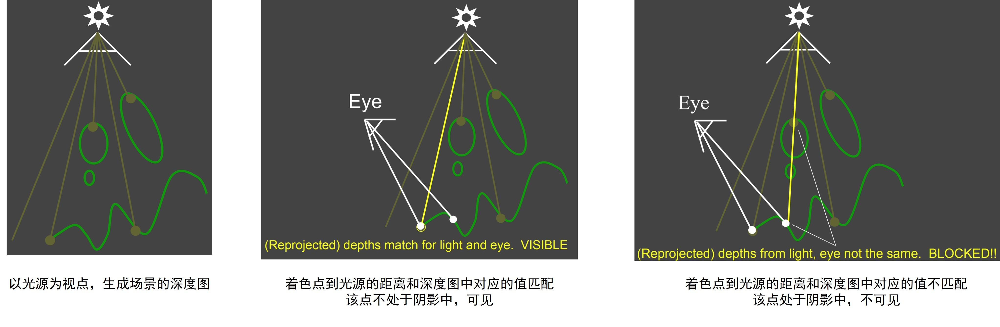
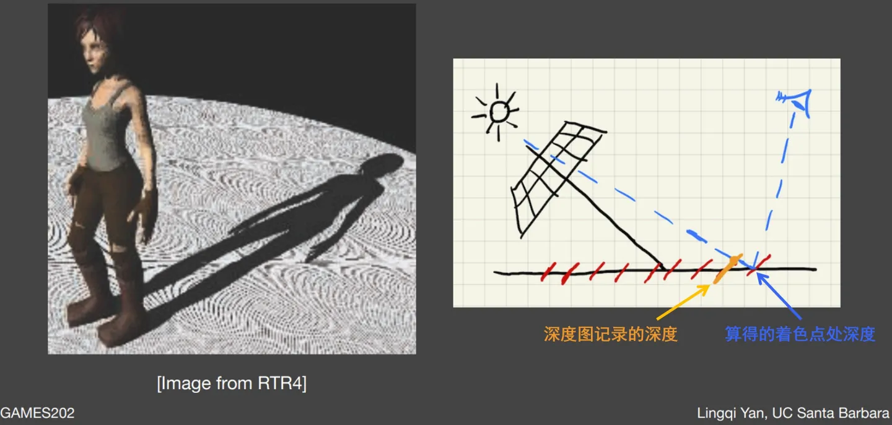
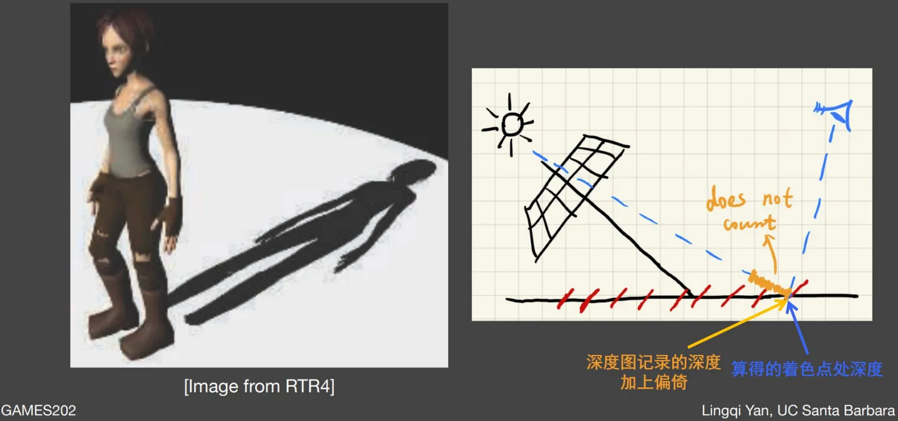
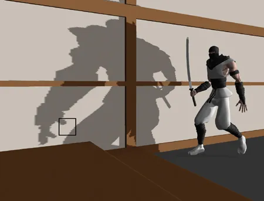
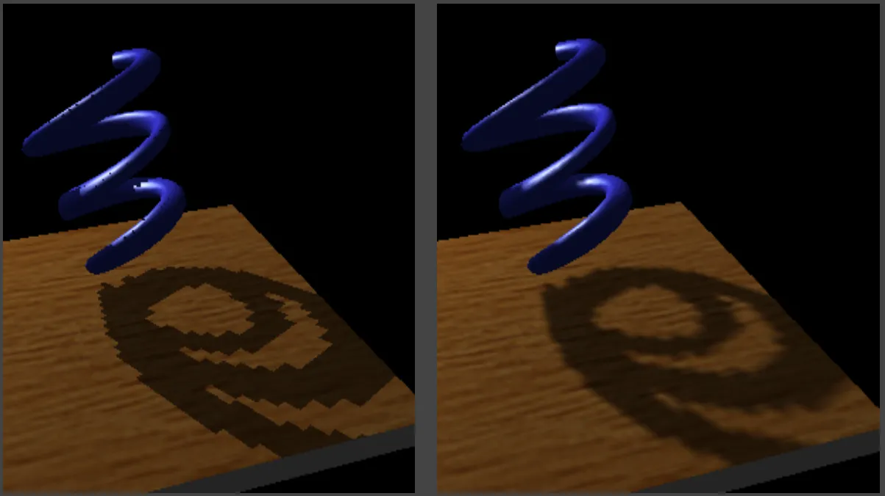
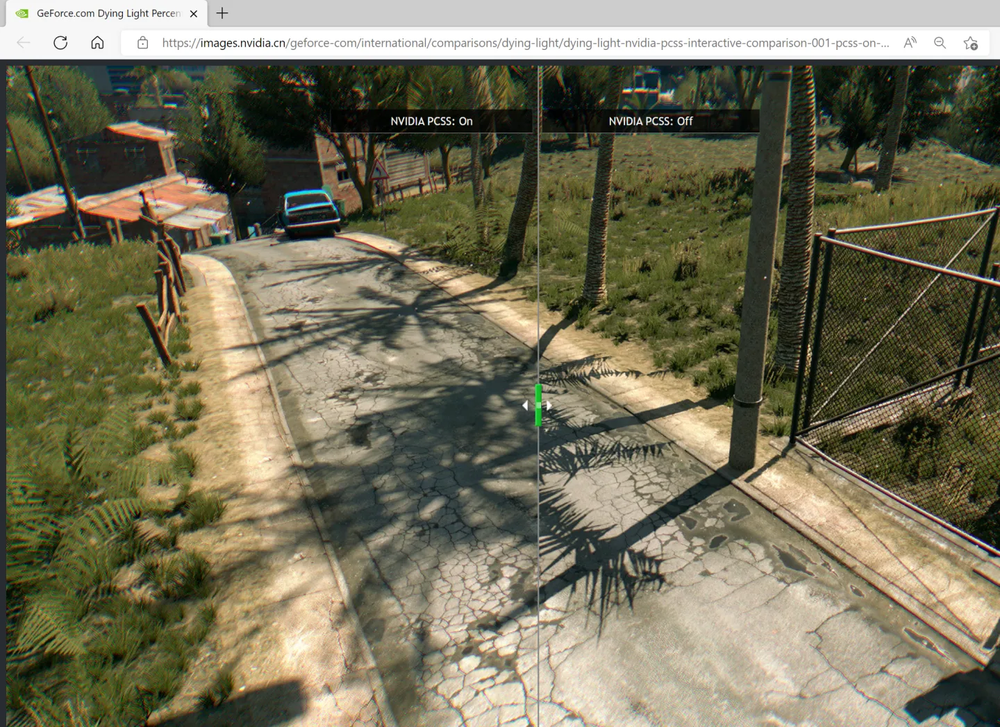

# 實時渲染1 Shadow Mapping、PCSS、VSSM、SDF Shadows

## 1. Shadow Mapping (陰影映射)

## 1.1 陰影映射算法流程
Shadow Mapping 為圖像空間算法，用於快速判斷Shadow point 是否於陰影之中
- 好處: 不需要場景的幾何信息(只需屏幕信息)
- 壞處: 存在自遮擋和走樣的問題
陰影映射算法分成兩步: 
1. 以光源為視點，生成場景的深度圖(Shadow map)
2. 將著色點(Shadow point)到光源的距離和深度圖中的對應值作比較，判斷該點是否處位陰影之中



``` 
// Shadow Mapping 
// 計算有多少點不在陰影內 
int noShadowCount = 0;
// 深度圖中的對應值
float closestDepth = unpack(closestDepthVec);
// 著色點到光源距離
float currentDepth = coords.z;
if(currentDepth < closestDepth){
    noShadowCount += 1;
}
```
## 1.2 自遮擋問題
## 甚麼是自遮擋?

在第一步生成的深度圖中，深度變化差可能比較大，但深度圖分辨率不夠，所以在生成的深度圖採樣的深度有誤差

在第二步中，假設著色點在光源處上可以看見，但當計算著色點到光源距離時，會誤以為比從深度圖讀取的距離長( 著色點到光源距離 > 深度圖讀取的距離 )，算法會認為這個點位於陰影之中，以為著色點在光源處上看不見。



## 簡單的解決方法 偏倚 bias
加入額外的變量bias作比較

如果(著色點到光源距離 < 深度圖讀取的距離 + bias)，有多少點不在陰影內 

``` 
// Shadow Mapping 
// 計算有多少點不在陰影內 
int noShadowCount = 0;
// 深度圖中的對應值: closestDepthVec為深度圖
float closestDepth = unpack(closestDepthVec);
// 著色點到光源距離
float currentDepth = coords.z;
// 加入額外的變量作比較
if(currentDepth < closestDepth + 0.01){
    noShadowCount += 1;
}
```



## 1.3 走樣問題 Aliasing
生成的陰影可能會呈現階梯狀，仍然是深度圖分辨率不足的問題


## 2.1 PCF (Percentage Closer Filtering) 反走樣
改善剛剛提及的階梯狀陰影問題

## PCF流程

1. 對於某一個著色點p，先計算該點在場景中與光源的距離 

$$
D_{scene}(p)
$$

2. 取濾波卷積核w，根據卷積核的呎吋，以p點為中心，取深度圖中附近區域內保存的深度信息

$$
D_{SM}(q), q \in N(p)
$$

3. 計算可見性判斷，並得出結果

$$
X^+[D_SM(q) - d_{scene}(p)]
$$

4. 根據卷積核的權重w(p,q)，對結果進行加權平均，得到p點最終可見性結果

$$
V(p) = \sum_{q \in N(p)}w(p,q) * X^{+}[D_{SM}(q) - d_{scene}(p)]
$$

$$
(n > 0), X^{+}(n) = 1
$$

假設已得到濾波卷積核w，那麼它的均值濾波(取平均值)為0.6667

$$
w = \begin{bmatrix}
    1 & 0 & 1 \\
    1 & 0 & 0 \\
    1 & 1 & 1
\end{bmatrix}, 6 / 9 = 0.6667
$$

## 2.2 PCF 在 GAMES202 homework 1 的 實現過程
1. 需要完善 phongFragment.glsl 中的 PCF(sampler2D shadowMap, vec4
shadowCoord, float filterSize) 函数。我们推荐在一个圆盘滤波核中进行随机采样，采用这种方案的原因是可以简化后续PCSS Shader 的编写同时可以使软阴影上模糊的部分更显圆润自然，计算出来的伴影直径可与单位圆盘上的采样点相乘生成 ShadowMap 上的采样坐标
2. （值得注意的是随机采样函数的质量将与最终渲染效果的好坏息息相关，我们在框架中提供了泊松圆盘采样和均匀圆盘采样两种采样函数，替换使用对比一下两种采样函数的细微区别，我们也鼓励使用其他的采样方法）。

```
// 採樣點數量
#define NUM_SAMPLES 20
vec2 poissonDisk[NUM_SAMPLES];
float PCF(sampler2D shadowMap, vec4 coords) 
{
  // 泊松分佈採樣 （Poisson-Disk Sample）
  // 圓範圍內隨機取一系列坐標作為採樣點，但是這些坐標還需要滿足一定約束，即坐標與坐標之間至少有一定距離間隔
  poissonDiskSamples(coords.xy);
  // 均勻圓盤分佈採樣（Uniform-Disk Sample）
  // 圓範圍內隨機取一系列坐標作為採樣點；看上去比較雜亂無章，採樣效果的 noise 比較嚴重。
  //uniformDiskSamples(coords.xy);

  // shadow map 的大小, 越大滤波的范围越小
  float textureSize = 400.0;
  // 濾波的波長
  float filterStride = 5.0;
  // 濾波窗口的範圍
  float filterRange = 1.0 / textureSize * filterStride;
  // 計算有多少點不在陰影內
  int noShadowCount = 0;
  for( int i = 0; i < NUM_SAMPLES; i ++ ) {
    vec2 sampleCoord = poissonDisk[i] * filterRange + coords.xy;
    vec4 closestDepthVec = texture2D(shadowMap, sampleCoord); 
    float closestDepth = unpack(closestDepthVec);
    float currentDepth = coords.z;
    // 簡單理解
    // float closestDepth = unpack(texture2D(shadowMap,coords.xy+disk[i]*0.001).rgba);
    if(currentDepth < closestDepth + 0.01){
      noShadowCount += 1;
    }
  }
  // 根據卷積核的權重w(p,q)，對結果進行加權平均
  float shadow = float(noShadowCount) / float(NUM_SAMPLES);
  return shadow;
}
```

效果圖


## LightMVP 使用

<details>

1. PhongMaterial.js的buildPhongMaterial()函數通過調用PhongMaterial
2. ShadowMaterial.js的buildShadowMaterial()函數通過調用ShadowMaterial
3. 在ShadowMaterial中進行CalcLightMVP()
4. 計算過後在loadOBJ中結合定義的transform和scale賦值傳入material
   
</details>

# 3.1 Soft Shadow

# 4.1 PCSS
PCSS（Percentage Closer Soft Shadows）是一種在 PCF 的基礎上得到的軟陰影生成技術，它根據著色點和光源之間遮擋物的相對平均深度來判斷著色點的被遮擋程度，依此選擇合適的 PCF 濾波卷積核尺寸，使得陰影邊緣的柔和程度隨著遮擋程度的變化而變化。


PCSS 算法可分為三步：

1. 遮擋物搜索（blocker search）： 在深度圖上計算著色點附近給定區域的平均遮擋物深度$d_{blocker}$ ； 這個搜索遮擋物區域的範圍可以是恆定的，例如固定為$5*5$， 也可以使用啟發法（heuristics），根據光源的尺寸$w_{light}$和著色點與光源之間的距離$d_{receiver}$  確定搜索遮擋物區域的範圍；
2. 半影估計（penumbra estimation）： 假設光源、遮擋物和著色點所在表面相互平行，根據光源的尺寸$w_{light}$，著色點與光源之間的距離$d_{receiver}$和平均遮擋物深度$d_{blocker}$ 估計陰影在著色點處的柔和程度$w_{penumbra} = \frac{d_{receiver} - d_{blocker}}{d_{blocker}} $；
3. PCF：執行 PCF 算法，而 PCF 卷積核的尺寸和半影估計w_{penumbra}成正比；
   
# 4.2 PCSS 在 GAMES202 homework 1 的 實現過程
1. 需要完善 phongFragment.glsl 中的 findBlocker(sampler2D shadowMap,vec2 uv, float zReceiver)
2. 需要完善 phongFragment.glsl 中的 PCSS(sampler2D shadowMap, vec4 shadowCoord) 函数。findBlocker 函数中需要完成对遮挡物平均深度的计算。


# 5.1 VSSM
PCSS 算法的第一步為了估計著色點平均遮擋物深度$z_{occ}$，需要讀取深度圖中該點附近所有紋元（texel）保存的深度，並與著色點的深度進行比較，求取那些比著色點深度更小的紋元深度的平均值，而在第三步為了得到平均可見性結果，也要再次重複這個統計過程。

VSSM（Variance Soft Shadow Mapping） 近似了這個統計過程，大大加速了 PCSS 第一步和第三步的估計。加速的統計過程可簡單地分為如下兩步：

計算著色點附近深度分佈的均值和方差；
借助不等式估計該點附近未遮擋物的平均深度$z_{occ}$或該點的可見性判斷結果$V(p)$；
