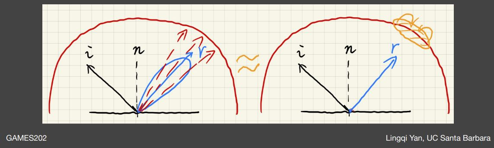
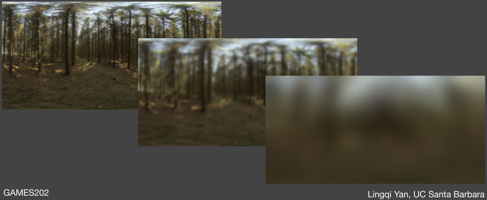

# 實時環境光照：環境光照與預計算 環境光與Split Sum
## 環境映射 Environment Mapping

在《Real-Time Rendering 3rd》第八章 : Area and Environmental Lighting 中，介紹了 Environment Mapping (環境映射)

Environment mapping（環境映射），又稱Reflection Mapping（反射映射）,是計算機圖形學領域中使用基於圖像的光照（Image-Based Lighting，IBL）技術，用預先計算的紋理圖像模擬複雜鏡面的一種高效方法。

環境映射將周圍環境與光照通過直接投影而簡化表示為紋理，保存的環境光照在繪製時假設來自無窮遠處，得到的環境光照圖常是球體圖（spherical map）或立方體圖（cube map）。

球體圖（spherical map）及立方體圖（cube map）示意 圖源：[GAMES202 閆令琪]

由於是事先準備好的數據，這種實現方法比傳統的光線跟踪算法效率更高，但是需要注意的是這種方法是實際反射的一種近似，有時甚至是非常粗糙的近似。這種技術的一個典型的缺點是沒有考慮自反射，即無法看到物體反射的物體自身的某一部分。

## IBL（Image-Based Lighting）
IBL（Image-Based Lighting）是指根據環境光照圖，在不考慮可見性 V(p,ωi) 的條件下直接著色給定點 p 的技術，相應的繪製方程如下：

$$
\begin{align} L_o \left( p ,\, \omega_o \right)  &= \int_{\Omega^{+}} L_{i} \left( p ,\, \omega_i \right) f_{r}\left( p ,\, \omega_i ,\, \omega_o \right) \cos\theta_i \cancel{ V\left(p,\,\omega_i\right) } \mathrm{d}\omega_i \end{align} \\
$$

為了求解繪製積分，可以使用蒙特卡羅方法抽樣環境光入射方向進行近似，但是為了讓蒙特卡羅方法收斂，可能需要抽樣大量的環境光入射方向樣本，這將耗費大量的計算資源，

# The Split Sum Approximation
簡單理解:
- 放棄原渲染方程的visibility項
- 著色點的lighting項就變成了環境光的lighting

在實時渲染中存在如下重要的估算定積分方法，將兩個函數乘積的定積分拆解成兩個函數定積分的乘積：

$$
\int_{\Omega} f(x) g(x)\, \mathrm{d}x \approx \frac{\int_{\Omega} f(x)\,\mathrm{d}x}{\int_{\Omega}\mathrm{d}x} \cdot \int_{\Omega} g(x)\,\mathrm{d}x \\
$$

- 假如被積函數較為平滑（例如漫反射材質的 BRDF），或者支撐集較小（例如光源相對不多時直接採樣光源所用的可見性函數），則在實時渲染中認為該估計基本成立；

為了避免抽樣估計定積分，分離求和方法（The Split Sum）認為 BRDF 在求解定積分時可以被拆解出來，於是繪製方程變成瞭如下形式：

$$
\begin{align} L_o \left( p ,\, \omega_o \right) &= \int_{\Omega^{+}} L_{i} \left( p ,\, \omega_i \right) f_{r}\left( p ,\, \omega_i ,\, \omega_o \right) \cos\theta_i \mathrm{d}\omega_i \\ &\approx \frac{\int_{\Omega^{+}} L_{i} \left( p ,\, \omega_i \right) \, \mathrm{d} \omega_i }{\int_{\Omega^{+}}\mathrm{d}\omega_i } \int_{\Omega^{+}}  f_{r}\left( p ,\, \omega_i ,\, \omega_o \right) \cos\theta_i \mathrm{d}\omega_i \end{align} \\
$$

漫反射材質 BRDF 較為平滑，而對於那些不怎麼平滑的有光澤材質 BRDF，支撐集又一般較小，於是可以得到不錯的近似結果。

另外，該方法之所以被稱為拆解求和（split sum）而不是拆解積分，是因為方法的提出者把積分寫成了求和形式

$$
\frac{1}{N} \sum_{k=1}^{N} \frac{  L_{i} \left( p ,\, \omega_i \right) f_{r}\left( p ,\, \omega_i ,\, \omega_o \right) \cos\theta_i }{ \mathrm{pdf}\left( p ,\, w_i\right) } \approx \left( \frac{1}{N} \sum_{k=1}^{N}  L_{i} \left( p ,\, \omega_i \right) \right) \left( \frac{1}{N} \sum_{k=1}^{N} \frac{ f_{r}\left( p ,\, \omega_i ,\, \omega_o \right) \cos\theta_i }{ \mathrm{pdf}\left( p ,\, w_i\right) } \right) \\
$$

## The Split Sum 第一部分積分

我們先來處理這一部分的積分: $\frac{\int_{\Omega^{+}} L_{i} \left( p ,\, \omega_i \right)\,\mathrm{d}\omega_i }{\int_{\Omega^{+}} \mathrm{d}\omega_i }$

$\frac{\int_{\Omega^{+}} L_{i} \left( p ,\, \omega_i \right)\,\mathrm{d}\omega_i }{\int_{\Omega^{+}} \mathrm{d}\omega_i }$，它相當於對環境光照圖施加了均值濾波，而濾波卷積核的尺寸取決於 BRDF 的支撐集。

於是，當著色給定點時，根據理想鏡面反射方向查詢預濾波後的環境光照圖，就相當於同時查詢了以理想鏡面反射方向為中心的區域內的環境光照，便不需要抽樣了

查詢一次濾波後結果，相當於查詢多次沒有濾波的結果 圖源：[GAMES202 閆令琪]

不同尺寸的濾波卷積核，預計算環境光照圖的圖像金字塔(mipmap)；在著色時，根據 BRDF 得到合適的濾波卷積核的尺寸，可以方便地從相應的層級或通過三線性插值得到環境光

使用不同尺寸的濾波卷積核預計算 MIPMAP 圖源：[GAMES202 閆令琪]

## The Split Sum 第二部分積分
第二部分的積分: $\int_{\Omega^{+}}  f_{r}\left( p ,\, \omega_i ,\, \omega_o \right) \cos\theta_i \mathrm{d}\omega_i$

可以根據所有可能的參數進行預計算，或者使用 LTC 方法（Linearly Transformed Cosines）。

對於微表面模型的 BRDF，可以對菲涅爾項使用石里克近似（Schlick’s approximation）

$$
F\left(\theta\right) = R_0 + \left(1-R_0\right) \left(1-\cos\theta\right)^5 \\
$$

- $R_0 = \left( \frac{\eta_1 - \eta_2}{\eta_1 + \eta_2} \right)^2$ 是基底顏色，其中 $\eta_1$ 和 $\eta_2$ 是著色點所處表面兩側介質的折射率；
- 在實時渲染中，著色點出光線的入射角 $\theta_i$、出射角 $\theta_o$ 及兩者的半角被認為非常接近，於是此處簡單地用 $\theta$ 描述光線方向

然後，後一部分的定積分可以根據菲涅爾項進行拆解：

$$
\begin{align} \int_{\Omega^{+}}  f_{r}\left( p ,\, \omega_i ,\, \omega_o \right) \cos\theta_i \mathrm{d}\omega_i &\approx \int_{\Omega^{+}}  \frac{f_{r}\left( p ,\, \omega_i ,\, \omega_o \right)}{F\left(\theta_i\right)} \left[ R_0 + \left(1-R_0\right) \left(1-\cos\theta_i\right)^5 \right] \cos\theta_i \mathrm{d}\omega_i \\ &=  R_0 \int_{\Omega^{+}}  \frac{f_{r}\left( p ,\, \omega_i ,\, \omega_o \right)}{F\left(\theta_i\right)} \left[ 1 - \left(1-\cos\theta_i\right)^5 \right] \cos\theta_i \mathrm{d}\omega_i + \int_{\Omega^{+}}  \frac{f_{r}\left( p ,\, \omega_i ,\, \omega_o \right)}{F\left(\theta_i\right)}  \left(1-\cos\theta_i\right)^5  \cos\theta_i \mathrm{d}\omega_i \end{align} \\
$$

於是定積分不再依賴於基底顏色 R0，在預計算 $\frac{f_{r}\left( p ,, \omega_i ,, \omega_o \right)}{ F\left(\theta\right)}$ 時只需要考慮粗糙程度和入射角的餘弦即可。

### 甚麼是 LTC 方法（Linearly Transformed Cosines）?

### 甚麼是 石里克近似（Schlick’s approximation）?

# Signed Distance Function (SDF)
- Distance Function: 就是空間中任何一點，到某個物體的最小距離
- Signed: 就是加入規定負數代表在物體內部，正數則表示在物體外部。這樣不止定義了距離，還定義了方向

## SDF 的應用
1. Ray Marching
   - 以迭代方式遍歷射線，從而將每條射線有效地劃分為較小的射線段，並在每個步驟中對某些函數進行採樣  
2. 生成軟陰影
