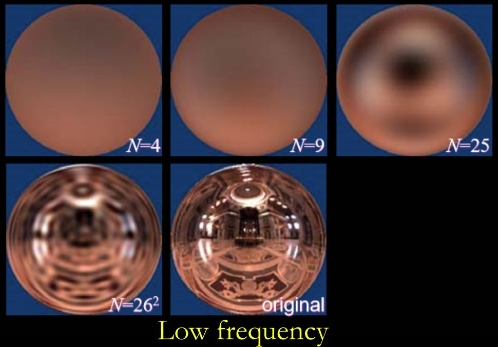

# 實時環境光照：環境光照與預計算 環境光與Split Sum、PRT
## 1 環境映射 Environment Mapping

在《Real-Time Rendering 3rd》第八章 : Area and Environmental Lighting 中，介紹了 Environment Mapping (環境映射)

Environment mapping（環境映射），又稱Reflection Mapping（反射映射）,是計算機圖形學領域中使用基於圖像的光照（Image-Based Lighting，IBL）技術，用預先計算的紋理圖像模擬複雜鏡面的一種高效方法。

環境映射將周圍環境與光照通過直接投影而簡化表示為紋理，保存的環境光照在繪製時假設來自無窮遠處，得到的環境光照圖常是球體圖（spherical map）或立方體圖（cube map）。

球體圖（spherical map）及立方體圖（cube map）示意 圖源：[GAMES202 閆令琪]

由於是事先準備好的數據，這種實現方法比傳統的光線跟踪算法效率更高，但是需要注意的是這種方法是實際反射的一種近似，有時甚至是非常粗糙的近似。這種技術的一個典型的缺點是沒有考慮自反射，即無法看到物體反射的物體自身的某一部分。

## 1.1 IBL（Image-Based Lighting）
IBL（Image-Based Lighting）是指根據環境光照圖，在不考慮可見性 V(p,ωi) 的條件下直接著色給定點 p 的技術，相應的繪製方程如下：

$$
\begin{align} L_o \left( p ,\, \omega_o \right)  &= \int_{\Omega^{+}} L_{i} \left( p ,\, \omega_i \right) f_{r}\left( p ,\, \omega_i ,\, \omega_o \right) \cos\theta_i \cancel{ V\left(p,\,\omega_i\right) } \mathrm{d}\omega_i \end{align} \\
$$

為了求解繪製積分，可以使用蒙特卡羅方法抽樣環境光入射方向進行近似，但是為了讓蒙特卡羅方法收斂，可能需要抽樣大量的環境光入射方向樣本，這將耗費大量的計算資源，

# 2 The Split Sum Approximation
簡單理解:
- 放棄原渲染方程的visibility項
- 著色點的lighting項就變成了環境光的lighting

在實時渲染中存在如下重要的估算定積分方法，將兩個函數乘積的定積分拆解成兩個函數定積分的乘積：

$$
\begin{align}
\int_{\Omega} f(x) g(x)\, \mathrm{d}x 
\end{align}
$$

$$
\begin{align}
\approx \frac{\int_{\Omega} f(x)\,\mathrm{d}x}{\int_{\Omega}\mathrm{d}x} \cdot \int_{\Omega} g(x)\,\mathrm{d}x \\
\end{align}
$$

- 假如被積函數較為平滑（例如漫反射材質的 BRDF），或者支撐集較小（例如光源相對不多時直接採樣光源所用的可見性函數），則在實時渲染中認為該估計基本成立；

為了避免抽樣估計定積分，分離求和方法（The Split Sum）認為 BRDF 在求解定積分時可以被拆解出來，於是繪製方程變成瞭如下形式：

$$
\begin{align} L_o \left( p ,\, \omega_o \right) &= \int_{\Omega^{+}} L_{i} \left( p ,\, \omega_i \right) f_{r}\left( p ,\, \omega_i ,\, \omega_o \right) \cos\theta_i \mathrm{d}\omega_i \\ &\approx \frac{\int_{\Omega^{+}} L_{i} \left( p ,\, \omega_i \right) \, \mathrm{d} \omega_i }{\int_{\Omega^{+}}\mathrm{d}\omega_i } \int_{\Omega^{+}}  f_{r}\left( p ,\, \omega_i ,\, \omega_o \right) \cos\theta_i \mathrm{d}\omega_i \end{align} \\
$$

漫反射材質 BRDF 較為平滑，而對於那些不怎麼平滑的有光澤材質 BRDF，支撐集又一般較小，於是可以得到不錯的近似結果。

另外，該方法之所以被稱為拆解求和（split sum）而不是拆解積分，是因為方法的提出者把積分寫成了求和形式

$$
\frac{1}{N} \sum_{k=1}^{N} \frac{  L_{i} \left( p ,\, \omega_i \right) f_{r}\left( p ,\, \omega_i ,\, \omega_o \right) \cos\theta_i }{ \mathrm{pdf}\left( p ,\, w_i\right) } \approx \left( \frac{1}{N} \sum_{k=1}^{N}  L_{i} \left( p ,\, \omega_i \right) \right) \left( \frac{1}{N} \sum_{k=1}^{N} \frac{ f_{r}\left( p ,\, \omega_i ,\, \omega_o \right) \cos\theta_i }{ \mathrm{pdf}\left( p ,\, w_i\right) } \right) \\
$$

## 2.1 The Split Sum 第一部分積分

我們先來處理這一部分的積分: $\frac{\int_{\Omega^{+}} L_{i} \left( p ,\, \omega_i \right)\,\mathrm{d}\omega_i }{\int_{\Omega^{+}} \mathrm{d}\omega_i }$

$\frac{\int_{\Omega^{+}} L_{i} \left( p ,\, \omega_i \right)\,\mathrm{d}\omega_i }{\int_{\Omega^{+}} \mathrm{d}\omega_i }$，它相當於對環境光照圖施加了均值濾波，而濾波卷積核的尺寸取決於 BRDF 的支撐集。

於是，當著色給定點時，根據理想鏡面反射方向查詢預濾波後的環境光照圖，就相當於同時查詢了以理想鏡面反射方向為中心的區域內的環境光照，便不需要抽樣了

查詢一次濾波後結果，相當於查詢多次沒有濾波的結果 圖源：[GAMES202 閆令琪]

不同尺寸的濾波卷積核，預計算環境光照圖的圖像金字塔(mipmap)；在著色時，根據 BRDF 得到合適的濾波卷積核的尺寸，可以方便地從相應的層級或通過三線性插值得到環境光

使用不同尺寸的濾波卷積核預計算 MIPMAP 圖源：[GAMES202 閆令琪]

## 2.2 The Split Sum 第二部分積分
第二部分的積分: $\int_{\Omega^{+}}  f_{r}\left( p ,\, \omega_i ,\, \omega_o \right) \cos\theta_i \mathrm{d}\omega_i$

可以根據所有可能的參數進行預計算，或者使用 LTC 方法（Linearly Transformed Cosines）。

對於微表面模型的 BRDF，可以對菲涅爾項使用石里克近似（Schlick’s approximation）

$$
F\left(\theta\right) = R_0 + \left(1-R_0\right) \left(1-\cos\theta\right)^5 \\
$$

- $R_0 = \left( \frac{\eta_1 - \eta_2}{\eta_1 + \eta_2} \right)^2$ 是基底顏色，其中 $\eta_1$ 和 $\eta_2$ 是著色點所處表面兩側介質的折射率；
- 在實時渲染中，著色點出光線的入射角 $\theta_i$、出射角 $\theta_o$ 及兩者的半角被認為非常接近，於是此處簡單地用 $\theta$ 描述光線方向

然後，後一部分的定積分可以根據菲涅爾項進行拆解：

$$
\begin{align} \int_{\Omega^{+}}  f_{r}\left( p ,\, \omega_i ,\, \omega_o \right) \cos\theta_i \mathrm{d}\omega_i
\end{align}
$$

$$
\begin{align}
\approx \int_{\Omega^{+}}  \frac{f_{r}\left( p ,\, \omega_i ,\, \omega_o \right)}{F\left(\theta_i\right)} \left[ R_0 + \left(1-R_0\right) \left(1-\cos\theta_i\right)^5 \right] \cos\theta_i \mathrm{d}\omega_i 
\end{align}
$$

$$
\begin{align} &=  R_0 \int_{\Omega^{+}}  \frac{f_{r}\left( p ,\, \omega_i ,\, \omega_o \right)}{F\left(\theta_i\right)} \left[ 1 - \left(1-\cos\theta_i\right)^5 \right] \cos\theta_i \mathrm{d}\omega_i + \int_{\Omega^{+}}  \frac{f_{r}\left( p ,\, \omega_i ,\, \omega_o \right)}{F\left(\theta_i\right)}  \left(1-\cos\theta_i\right)^5  \cos\theta_i  \mathrm{d}\omega_i \end{align}
$$

於是定積分不再依賴於基底顏色 R0，在預計算 $\frac{f_{r}\left( p ,, \omega_i ,, \omega_o \right)}{ F\left(\theta\right)}$ 時只需要考慮粗糙程度和入射角的餘弦即可。

### 2.3 甚麼是 LTC 方法（Linearly Transformed Cosines）?

### 2.4 甚麼是 石里克近似（Schlick’s approximation）?

# 3 環境光照陰影
假如在著色時需要考慮環境光的可見性，則實現實時渲染是一個相當困難的問題。

$$
\underset{ \text{給定點 $p$ 的著色給果} }{ \underbrace{ L_o \left( p ,\, \omega_o \right) } } = \int_{\Omega^{+}}  \underset{ \text{環境光照} }{ \underbrace{ L_{i} \left( p ,\,\omega_i \right)  } } \cdot \underset{ \text{ BRDF} }{ \underbrace{ f_{r}\left(  p ,\,\omega_i ,\, \omega_o \right)  \cos\theta_i  } } \cdot \underset{ \text{可見性} }{ \underbrace{ V\left(p ,\,\omega_i\right)   } }  \mathrm{d}\omega_i \\
$$

- 因為環境光照來自四面八方，所以如果把環境光照下的著色看作多光繪製（many-light rendering），則每一個光源都要生成一張陰影圖，那麼陰影圖的數量將極其龐大；
- 如果把該問題看作抽樣問題，則環境光照的可見性項 $V$ 可能是任意複雜度，不能根據 split sum 方法估計積分結果；
- 因為 $L_i\left(p ,\, \omega_o\right)$ 的支撐集是整個半球，而 BRDF $f_{r}\left( p ,\, \omega_i ,\, \omega_o \right)$ 可能並不平滑，於是 拆解出 $V$ 後，餘下的 $L_{i} \left( p ,\, \omega_i \right) f_{r}\left( p ,\, \omega_i ,\, \omega_o \right) \cos\theta_i$ 支撐集並不小，也可能並不平滑；

目前，工業界的一般方案是選取環境中最亮的那個光源（例如太陽）或前幾個光源生成陰影圖，然後由此生成陰影，而學術界的一些相關研究如下：

- imperfect shadow maps；
- lightcuts；
- RTRT（real time ray tracing），可能是終極解決方案；
- PRT（precomputed radiance transfer）；

# 4 PRT（Precomputed Radiance Transfer，預計算輻射亮度傳輸）
PRT（precomputed radiance transfer，預計算輻射亮度傳輸）的核心思想是假設場景中的只有光照會發生變化，將繪製方程的被積函數拆分成光照（lighting）和光線傳輸（light transport）這兩部分，並分別預計算兩者的紋理圖像，再把圖像從空間域轉換到頻域，最終把著色時繪製方程中的定積分計算轉換成向量的點積，或者轉換成向量與矩陣的乘法。

PRT 效果示意 圖源：[GAMES202 閆令琪]

## 4.1 預計算光照（Lighting）和光線傳輸（Light transport）
PRT 將繪製方程的被積函數拆分成光照（lighting）和光線傳輸（light transport）這兩部分，分別預計算而得到兩張紋理圖像：

$$
\begin{align} \underset{ \text{給定點的著色結果} }{ \underbrace{ L_o \left( \omega_i \right) } } &= \int_{\Omega^{+}}  \underset{ \text{光照} }{ \underbrace{ L_{i} \left( \omega_i \right)  } } \cdot \underset{ \text{ BRDF} }{ \underbrace{ f_{r}\left(  \omega_i ,\, \omega_o \right)  \cos\theta_i  } } \cdot \underset{ \text{可見性} }{ \underbrace{ V\left(\omega_i\right)   } }  \mathrm{d}\omega_i
\end{align}
$$

$$
\begin{align}
&= \int_{\Omega^{+}}  \underset{ \text{光照} }{ \underbrace{ L_{i} \left( \omega_i \right)  } } \cdot \underset{ \text{光線傳輸，記作 } T\left(\omega_i ,\, \omega_o \right) }{ \underbrace{ f_{r}\left( \omega_i ,\, \omega_o \right)  \cos\theta_i V\left(\omega_i\right)   } }  \mathrm{d}\omega_i \end{align}
$$

然後，把這兩個在空間域的圖像信號變換到頻域，表示成基本信號 $B_{i}\left(\omega_i\right)$ 的線性組合：

$$
\begin{align} L_{i} \left( \omega_i \right) &= \sum_{p} \underset{ \text{光照系數} }{ \underbrace{ l_p }} \cdot \underset{ \text{基函數} }{ \underbrace{ B_p \left(\omega_i\right) }} \end{align}
$$

$$
\begin{align}
T\left(\omega_i,\, \omega_o\right) &= \sum_{q} \underset{ \text{光線傳輸系數} }{ \underbrace{ t_q \left(\omega_o\right)  }} \cdot \underset{ \text{基函數} }{ \underbrace{ B_q\left(\omega_i\right) }} \end{align}
$$

基本信號構成了正交函數系 $\left\{ B_{i}\left(\omega_i\right) \right\}$ ，在空間域的圖像信號與各個基函數的點積運算可以得到該函數正交級數的各項係數：

$$
l_p =  \int_{\Omega^+} L_{i} \left( \omega_i \right) \, \overline{B_p\left(\omega_i\right)}  \,\mathrm{d}\omega_i \\ t_q \left(\omega_o\right)  =  \int_{\Omega^+} T \left( \omega_i ,\, \omega_o \right) \, \overline{B_q\left(\omega_i\right)}  \,\mathrm{d}\omega_i \\
$$

- 推廣點積運算，兩個複變函數的點積是在給定區間上一個函數和另一個函數共軛的乘積的定積分。

PRT 中選取 **球諧函數（spherical harmonics，SH）** 作為基函數進行變換。

- 實時渲染中涉及的很多函數都是定義在球面上的函數，例如此處的 $L_{i} \left( \omega_i \right)$ 和 $T\left(\omega_i\right)$ 。對於這些函數，如果使用二維傅里葉變換，則在根據傅里葉係數及基函數於空間域中重建圖像信號函數時，定義域的球面上可能會出現一條“縫”，而定義在球面上的球諧函數不會；
  - 可以把環境光照圖保存為立方體圖（cube map），然後對立方體每一個面的子圖單獨做變換；
- 另外，球諧函數還有一些其它的好處，例如可以快速地計算出旋轉光源後新的係數；
- 對於球諧函數基函數，不僅 $\int_{\Omega} B_n\left(\omega\right) \,B_m\left(\omega\right) \,\mathrm{d}\omega = 0$，而且 $\int_{\Omega} \left[ B_n\left(\omega\right) \right]^2 \,\mathrm{d}\omega = 1$ ，於是其構成的函數係是規范正交函數係；
為了更進一步地追求效率，可以在誤差允許的範圍內省略變換後頻域中那些繁雜的、描述細節的高頻成分，只保留低階的球諧函數。

球諧函數適合描述漫反射這樣的低頻信息，而對於高頻信息，雖然也可以描述，但是需要用到比較高階的球諧函數，才能得到比較好的效果，開銷較高。於是一些研究嘗試使用其它的基函數進行變換，例如小波變換（wavelet transform）。

描述高頻信息時需要用到比較高階的球諧函數才能得到比較好的效果 圖源：[GAMES202 閆令琪]

## 4.2 PRT 特殊材質

### 4.2.1 PRT Diffuse Case
對於朗伯模型描述的漫反射材質，它的 BRDF 是一個常數，而光線傳輸部分也與 ωo 無關：

$$
f_{r}\left(\omega_i ,\, \omega_o \right) = \rho \\ T\left(\omega_i ,\, \omega_o\right) = T\left(\omega_i\right) \\
$$

在繪製方程計算定積分時，BRDF 可以被拆解出來，可以理解為：

$$
\begin{align} L\left( \omega_o \right)  &= \int_{\Omega^{+}}  L_{i} \left( \omega_i \right) \cdot f_{r}\left( \omega_i ,\, \omega_o \right) \cos\theta_i V\left(\omega_i\right) \,\mathrm{d}\omega_i
\end{align}
$$

$$
\begin{align}
&= \int_{\Omega^{+}} \sum_{p} \left[l_p \cdot B_p\left(\omega_i\right)\right] \cdot \rho \cdot \cos\theta_i V\left(\omega_i\right) \,\mathrm{d}\omega_i \end{align}
$$

$$
\begin{align}
&= \rho \sum_{p} l_p  \underset{ \text{恰好是光線傳輸用球諧函數線性表示} }{ \underbrace{ \int_{\Omega^{+}} B_p\left(\omega_i\right) \cdot \cos\theta_i V\left(\omega_i\right)  \,\mathrm{d}\omega_i }}
\end{align}
$$

$$
\begin{align}
&= \rho \sum_{p} l_p \cdot T_p \left(\omega_i\right) = \rho \cdot\begin{bmatrix} l_0 & l_1 & \cdots l_p \end{bmatrix} \begin{bmatrix} T_0 \left(\omega_i\right) & T_1 \left(\omega_i\right) & \cdots & T_p \left(\omega_i\right) \end{bmatrix}^T \end{align}
$$

另一種理解方式：

$$
\begin{align} &L\left( \omega_o \right)  = \int_{\Omega^{+}}  L_{i} \left( \omega_i \right) \cdot f_{r}\left( \omega_i ,\, \omega_o \right) \cos\theta_i V\left(\omega_i\right) \,\mathrm{d}\omega_i \\ &\quad\quad\quad = \int_{\Omega^{+}} \sum_{p} \left[l_p \cdot B_p\left(\omega_i\right)\right] \cdot \sum_{q} \left[t_q \cdot B_q\left(\omega_i\right)\right] \,\mathrm{d}\omega_i \\ &\quad\quad\quad = \rho \sum_{p} \sum_{q} l_p \cdot t_q \cdot \int_{\Omega^{+}} B_p\left(\omega_i\right) \cdot B_q\left(\omega_i\right) \,\mathrm{d}\omega_i \\ &\because \int_{\Omega^{+}} B_p\left(\omega_i\right) \cdot B_q\left(\omega_i\right) \,\mathrm{d}\omega_i = \left\{\begin{array}{} 1 & p = q \\ 0 & p \ne q \end{array}\right. \\ &\therefore L\left( \omega_o \right)  = \rho \cdot \sum_{k} l_k t_k \quad\quad \color{Green}{k = \min\left\{ p ,\, q \right\}} \\ &\quad\quad\quad\quad\,= \rho \cdot\begin{bmatrix} l_0 & l_1 & \cdots l_k \end{bmatrix} \begin{bmatrix} t_0 & t_1 & \cdots & t_k \end{bmatrix}^T \end{align} \\
$$

於是，對於漫反射材質景物表面，根據 PRT 著色表面某一點的運算過程被簡化成了向量的點積運算。

- 對於漫反射，使用前三階的球諧函數便可以得到比較好的近似；

### 4.2.2 PRT Glossy Case
對於有光澤（glossy）材質的繪製方程，則有：

$$
\begin{align} L\left( \omega_o \right)  &= \int_{\Omega^{+}}  L_{i} \left( \omega_i \right) \cdot f_{r}\left( \omega_i ,\, \omega_o \right) \cos\theta_i V\left(\omega_i\right) \,\mathrm{d}\omega_i \\ &= \int_{\Omega^{+}} \sum_{p} \left[l_p \cdot B_p\left(\omega_i\right)\right] \cdot f_{r}\left( \omega_i ,\, \omega_o \right)  \cos\theta_i V\left(\omega_i\right) \,\mathrm{d}\omega_i \\ &= \sum_{p} l_p  \underset{ \text{恰好是光線傳輸用球諧函數線性表示} }{ \underbrace{ \int_{\Omega^{+}} B_p\left(\omega_i\right) \cdot f_{r}\left( \omega_i ,\, \omega_o \right) \cos\theta_i V\left(\omega_i\right)  \,\mathrm{d}\omega_i }}  \\ &= \sum_{p} l_p \cdot T_i\left( \omega_i, \omega_o \right) \\ &=\begin{bmatrix} l_0 & l_1 & \cdots l_p \end{bmatrix} \begin{bmatrix} T_0 \left(\omega_i, \omega_o\right) & T_1 \left(\omega_i, \omega_o\right) & \cdots & T_p \left(\omega_i, \omega_o\right) \end{bmatrix}^T \end{align} \\
$$

另一種理解方式：

$$
\begin{align} &L\left( \omega_o \right)  = \int_{\Omega^{+}}  L_{i} \left( \omega_i \right) \cdot f_{r}\left( \omega_i ,\, \omega_o \right) \cos\theta_i V\left(\omega_i\right) \,\mathrm{d}\omega_i \\ &\quad\quad\quad = \int_{\Omega^{+}} \sum_{p} \left[l_p \cdot B_p\left(\omega_i\right)\right] \cdot \sum_{q} \left[t_q\left(\omega_o\right) \cdot B_q\left(\omega_i\right)\right] \,\mathrm{d}\omega_i \\ &\quad\quad\quad = \sum_{p} \sum_{q} l_p \cdot t_q\left(\omega_o\right) \cdot \int_{\Omega^{+}} B_p\left(\omega_i\right) \cdot B_q\left(\omega_i\right) \,\mathrm{d}\omega_i \\ &\because \int_{\Omega^{+}} B_p\left(\omega_i\right) \cdot B_q\left(\omega_i\right) \,\mathrm{d}\omega_i = \left\{\begin{array}{} 1 & p = q \\ 0 & p \ne q \end{array}\right. \\ &\therefore L\left( \omega_o \right)  = \sum_{k} l_k t_k\left(\omega_o\right) \quad\quad \color{Green}{k = \min\left\{ p ,\, q \right\}} \end{align} \\
$$

繼續把係數 $t_k\left(\omega_o\right)$ 基於規范正交函數係 $\left\{ B_{r}\left(\omega_o\right) \right\}$ 展開成正交級數：

光傳輸矩陣元素基函數
tk(ωo)=∑rtk,r(ωo)⏟光傳輸矩陣元素⋅Br(ωo)⏟基函數

$$
t_k\left(\omega_o\right) = \sum_{r}   \underset{ \text{光傳輸矩陣元素} }{ \underbrace{ t_{k,r} \left(\omega_o\right)  }} \cdot \underset{ \text{基函數} }{ \underbrace{ B_{r}\left(\omega_o\right) }} \\
$$

於是有：

$$
\begin{align} L\left( \omega_o \right) &= \sum_{k} l_k t_k\left(\omega_o\right) \\ &=  \sum_{k} l_k \sum_{r} t_{k,r} B_{r}\left(\omega_o\right) \\ &= \begin{bmatrix} l_0 & l_1 & \cdots & l_k \end{bmatrix} \begin{bmatrix} t_{0,0} & t_{0,1} & \cdots & t_{0,r} \\ t_{1,0} & t_{1,1} & \cdots & t_{1,r} \\ \vdots & \vdots &\ddots &\vdots \\ t_{k,0} & t_{k,1} & \cdots & t_{k,r} \\ \end{bmatrix} \begin{bmatrix} B_{0}\left(\omega_o\right) \\ B_{1}\left(\omega_o\right) \\ \vdots \\ B_{r}\left(\omega_o\right) \end{bmatrix} \end{align} \\
$$

於是，對於有光澤材質的景物表面，根據 PRT 著色表面某一點的運算過程被簡化成了向量和矩陣的乘法。

* 有光澤的材質需要用到比漫反射更高階數的球諧函數；對於學術界，有時用到十階也仍覺得不夠；

# 5 Signed Distance Function (SDF)
- Distance Function: 就是空間中任何一點，到某個物體的最小距離
- Signed: 就是加入規定負數代表在物體內部，正數則表示在物體外部。這樣不止定義了距離，還定義了方向

## 5.1 SDF 的應用
1. Ray Marching
   - 以迭代方式遍歷射線，從而將每條射線有效地劃分為較小的射線段，並在每個步驟中對某些函數進行採樣  
2. 生成軟陰影

# 參考
Karis B, Games E. [Real shading in unreal engine 4](https://cdn2.unrealengine.com/Resources/files/2013SiggraphPresentationsNotes-26915738.pdf)[J]. Proc. Physically Based Shading Theory Practice, 2013, 4(3): 1.

