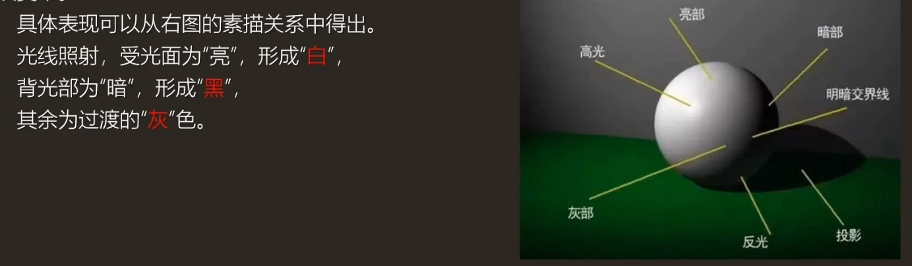
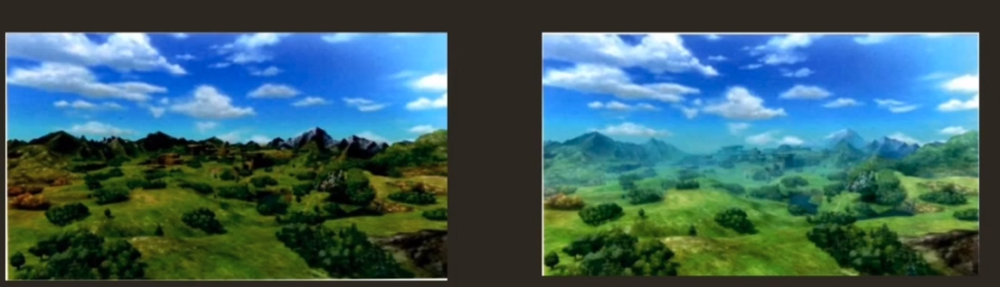
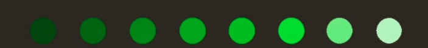
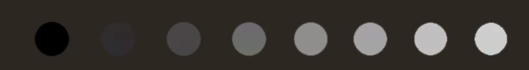
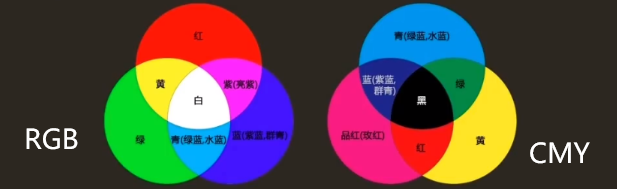
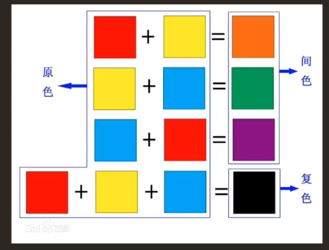
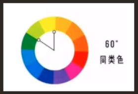
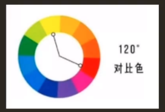

# 美術理論基礎

# 1. 光影
### 什麼是光影?
  - 物體在不同受光面的明暗變化、以及物體的影子
### 什麼是黑白灰
  - 美術中，黑白灰指亮面、灰面、暗面，屬於素描三大面。
  - 主要體現物體的受光的過程。
### 什麼是明暗五調子?

結合上邊的圖，包含以下五點：

- 高光：受光面最亮的點
- 亮面：受光面的高光與深灰面中間的層次
- 灰面：亮面與明暗交界線中間的層次
- 明暗交界線：亮、暗面的轉折處，一般明暗交界線為最重的地方
- 暗面：包含物體的背光面、反光、投影

## 2. 透視
- 平行透視
- 成角透視（二點透視）
- 三點透視
- 散點透視
- 魚眼透視
- 空氣透視
- 達芬奇的透視觀點
  - 達芬奇的透視觀點中，透視分為以下類型
  - 色彩透視：研究這些物體的顏色消退
  - 消逝透視：研究物體在不同距離處清晰度的減低
  - 線透視：研究物體在不同距離處的大小
  - 這和我們平常說的散點、焦點透視有所不同
- 遊戲中的透視
  - 經常使用霧，營造空間感。高度霧、大氣散射等
  - 左側未使用、右側使用

# 3. 色彩
## 什麼是色彩
- 是眼、腦和我們生活經驗對光的顏色類別描述的視覺感知特徵。
## 色彩三要素
- 色調（色相）、飽和度（純度）、明度
## 色相
- 色彩的相貌，是色彩最顯著的特種，為不同波長的色彩被感知的結果
- 光譜上的紅、橙、黃、綠、青、藍、紫
  

## 飽和度/純度
- 色彩的純度，指原色在色彩中所佔的百分比。
- 純度用來表示色彩的濃淡和深淺。
- 純度是深色、淺色等色彩鮮豔度的判斷標準
- 彩色系中，常用彩度和飽和度表示
- 黑白的純度，稱為灰度

## 明度
- 指色彩的明暗、深淺程度的差別，取決於反射光的強弱。
- 包含兩個含義：
  - 一種顏色本身的明與暗
  - 指不同色相之間存在著明與暗的差別

## 三原色
- 三原色，指色彩中不能再分解的三種基本顏色，通常說的三原色，是顏料三原色以及光學三原色。
- 光學三原色（RGB）
  - 紅、綠、藍（靛藍）。
  - 光學三原色混合後，組成顯示屏顯示的顏色
  - 光學三原色相加為白色，白色屬於無色系（黑白灰）中的一種
- 顏料三原色（CMY）
  - 繪畫色彩中最基本的顏色為三種，紅（品紅Magenta）、黃（檸檬黃Yellow）、藍（青Cyan）稱之為原色

## 間色（二次色）
三原色中的任何兩種原色作等量混合調出的顏色，叫作間色（也稱二次色）

## 複色
任何兩種間色（或者一種間色與原色）混合調出的顏色稱為複色（也稱再間色、第三次色）
- 黑色的深灰黑色，所以任何一種顏色與黑色混合得到的都是複色。
- 即凡是複色，都有紅黃藍三原色的成分

## 同類色
同一色相中不同傾向的系列顏色被稱為同類色。
- 例如：黃色中可以分為檸檬黃、中黃、橘黃、土黃等，都稱之為同類色

## 互補色
色相環中相隔180°的顏色，稱為互補色
- 補色相減（例如顏料配色時，將兩種補色顏料塗在白紙的同一位置）時，會成為黑色
- 補色並列時，會引起強烈對比的色覺（紅的更紅，綠的更綠）

## 對比色
對比色是人的視覺感官產生的一種生理現象，是視網膜對色彩的平衡作用
- 對比色指在24色環上相距120°~180°的兩種顏色。

## 冷暖色

# 4. 構圖
## 什麼是構圖
是一個造型藝術術語，即：創作時根據題材和主題思想的要求，把要表現的形象適當地組織起來，構成一個協調的完整的畫面。
## 來歷和目的
來歷：源於西方美術，其中有一門課程在西方繪畫中，叫作構圖學
- 構圖在我國國畫畫論中，叫作佈局/經營位置
- 攝影構圖是從美術上的構圖轉化而來，也可以簡單地稱為取景
目的：研究在一個平面上處理好三維空間高、寬、深之間的關係，以突出主題，增強藝術的感染力。
- 構圖處理是否得當，是否新穎，是否簡潔，對於藝術作品的成敗至關重要

# 5. 鏡頭語言
## 什麼是鏡頭語言
用鏡頭像語言一樣，表達我們的意思。
- 通常經由攝像機所拍攝出來的畫面，來表達拍攝者的意圖，從他拍攝的主題以及畫面的變化，來感受拍攝者透過鏡頭要表達的內容
- 蒙太奇（Montage）在法語中是“剪接”的意思
  - 到了俄國被發真偽一種電影中鏡頭組合的理論
  - 塗料、塗裝行業，蒙太奇也是獨樹一幟的藝術手法和自由式的塗裝的含義
## 一些概念
- 廣角鏡頭：鏡頭視角打大，視野寬闊
  - 從某一點觀察到的景物範圍比人眼看到的大得多
  - 景深長。表現的清晰的範圍大
  - 能強調畫面的透視效果，善於誇張前景、表達景物的遠近感、有利於增強畫面的感染力
- 長焦距鏡頭：比校準鏡頭焦距長，
  - 視角小，景深短，透視效果差

[【每天一个电影镜头】第一季1-24期全集（分P）](https://www.bilibili.com/video/BV1fv411L7yd/?vd_source=c8f797eb0ed2b9ae031c806a2b48a232)

# 6. 總結常用美術用語
- 臟：
  - 顏色臟：顏色偏暗
  - 素描關係上的髒：體現在調子上的髒。畫了很多筆
- 亂：
  - 和線條有一定關係，層次結構不分明
- 散：
  - 參考散點構圖，
  - 整體看起來有割裂感，或者整體分得構圖不太好。

- 光影：
  - 物體在不同受光面的明暗變化
- 黑白灰：
  - 指亮面、灰面、暗面
- 明暗五調子：
  - 高光、明暗交界線、亮面、灰面、暗面
- “飄了”
  - 光影有問題、不通透/不立體
- 透視
  - 指在平面上表現立體感、空間感的方法
- 色調/色相
  - 平常人們理解的顏色，是色彩最顯著的特種，為不同波長的色彩被感知的結果
- 飽和度/純度
  - 色彩的純度，指原色在色彩中所佔的百分比。
- 明度
  - 指色彩的明暗、深淺程度的差別，取決於反射光的強弱
- 三原色
  - 色彩中不能再分解的三種基本顏色
  - 光學（RGB）三原色：紅、綠、藍
  - 顏料（CMYK）三原色：紅、黃、藍
- 間色
  - 三原色中的任何兩種原色作等量混合調出的顏色
- 複色
  - 任何兩種間色（或者一種間色與原色）混合調出的顏色稱為複色（也稱再間色、第三次色）
- 同類色
  - 同一色相中不同傾向的系列顏色被稱為同類色。
- 互補色
  - 色相環中相隔180°的顏色
- 對比色
  - 24色環上相距120°~180°的兩種顏色
- 構圖
  - 在平面的物質空間上，根據構思中預想的形象和審美效果，安置和處理審美客體的位置與關係，將個別或局部的形象組成整體的藝術手法。

## 補充
- 輪廓
  - 指繪畫中界定描繪對象形狀大小、粗細、高低等基本範圍的邊緣線。
- 體積感
  - 體積感是指畫中所描繪的物體給人的一種佔有立體空間的感覺。
- 空間感
  - 空間感是在繪畫中，依照透視法所營造出來的物體之間的稠密、遠近、高下等空間關係，是畫面中所體現出的立體感和縱深度如何的一個層面,也是繪畫中構圖、佈局成敗的一個重要標準。
- 塑造能力
  - 形和體和結構的準確能力即是塑造能力。
  - 形就是物體的剪影，
  - 體則是形的體積。
  - 結構即是連續相組和的體積。
- 質感
  - 質感是指繪畫等造型藝術中，通過色彩的光亮、冷暖以及線條的粗細等不同的表現手法，在作品中所表現出的各種物體所具有的內在特質和秉性。
  - eg：衣服的光滑、粗糙，花朵的嬌豔、衰敗
- 量感
  - 量感，繪畫術語。指畫面上借助線條、色彩、明暗等造型因素，所表現出的描繪對象厚重、輕薄、稠密、大小等各種感覺。
  - eg：雲霞的飄逸、大山的凝重
- 調子
  - 光線強度的物理特徵，是形體中的面所反映光的數量，也就是面的深淺度。它是表現形體、立體、空間、質量等的要素，是造型的重要手段。
- 筆觸
  - 繪畫中的筆法。又稱肌理常指油畫和水粉畫中運筆的痕跡不同的筆觸感覺有不同的特徵表現為畫家的藝術風格和個