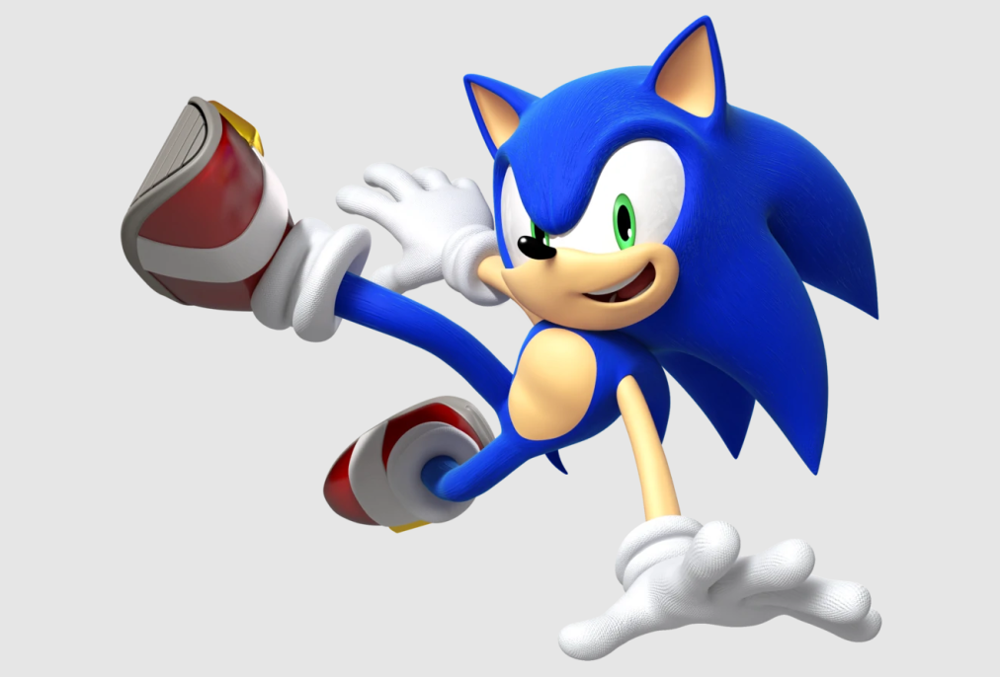
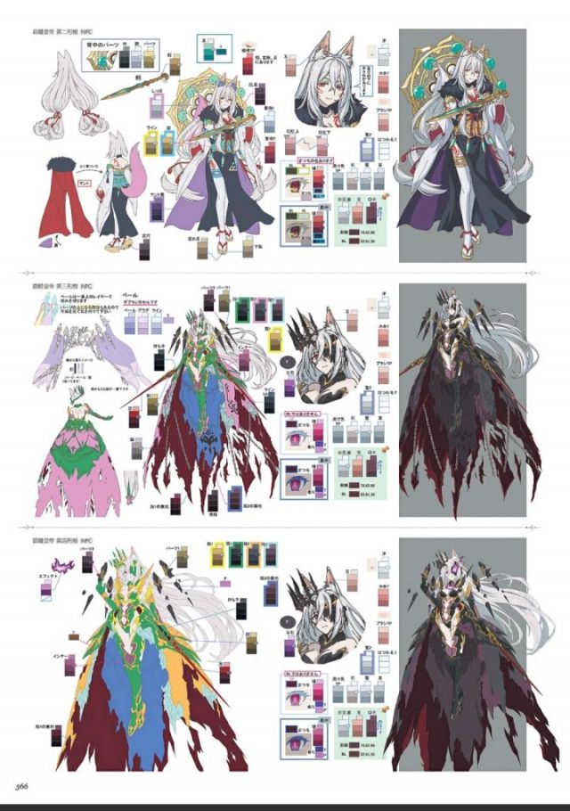
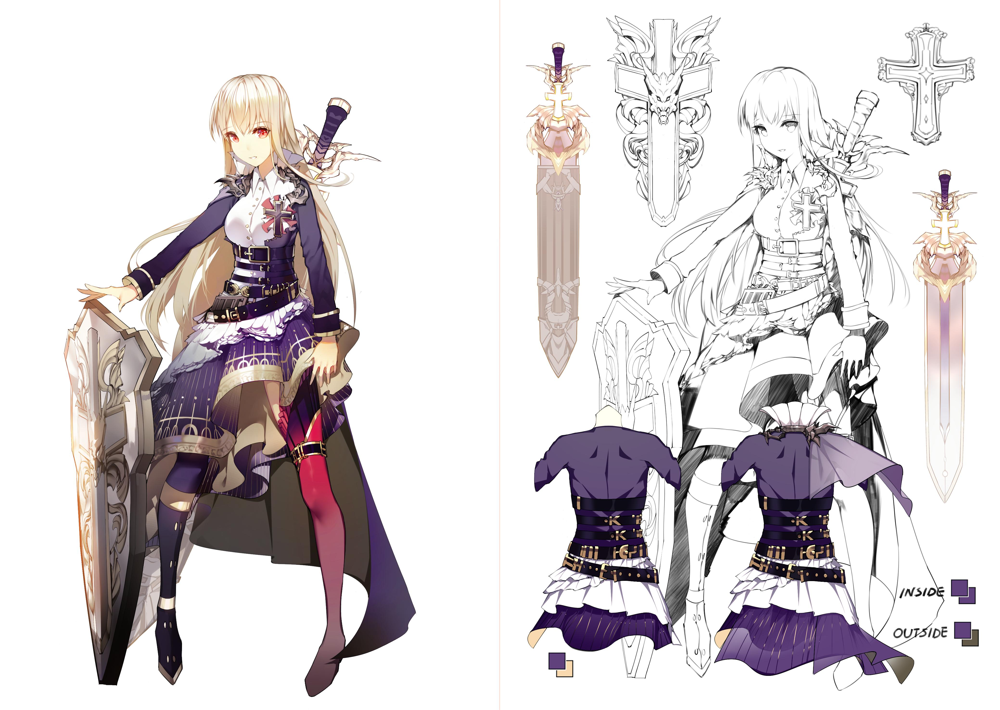

# 角色設計簡介

# 1. 角色設計流程
所有的設計流程：
- 確定方向、尋找參考、細化需求、設計原型、迭代
- 角色設計流程：確定角色關鍵詞、收集素材和靈感、構圖設計、配色、服裝設計
# 2. 確定角色關鍵詞
了解角色，並找到那些讓角色獨一無二的關鍵詞
- 世界觀、背景、能力、職業、性格、喜好——都可以成為角色的重要標識
- 角色的靈魂，角色的所有組成部分都服務於這些關鍵詞
# 3. 收集素材和靈感
設計 = 10%瘋狂 + 90%參考
- 與人類有關、文化參考、日常經驗、有基礎的設計、真實世界的參考
- 收集素材，發散思維。圍繞中心設計點展開更細微的設計，讓細節設計更加考究與真實
- 我們從來都不是創造元素，而是用已有的元素創造。

# 4. 構圖設計
角色涉及里所說的圖形感，通常包括：輪廓剪影 & 內在構成。
## 構圖元素
- 基礎元素組成了各種構圖。不同元素帶來不同感受
## 輪廓剪影
- 剪影差異化，強化辨識度。外輪廓越整體流程，辨識度越高
## 內在構成
- 點、線、面
- 比重：輕重、鬆緊、疏密的簡繁對比--辨識度高
- 疏密：製造反差--誘導視線
- 構圖不需要具體形狀，因為現實好看的東西都是多邊形的

# 5. 配色
整體配色根據風格定調，參考類似風格作品--傳達感受。
# 6. 服裝設計
烘託人物性格、豐富細節信息

# 7. 角色參考
《刺猬索尼克》Sonic，世界上最著名的遊戲角色之一Sonic。世嘉公司的吉祥物。 1990年的經典角色，一代人的童年。

## Sonic：角色關鍵詞
“世界上最快的刺猬”、超音速。 “像風一樣的角色”，隨心所欲的漂泊著。冒險、自由。膽大妄為、誠實、忠於朋友、信守諾言、不喜歡眼淚。
## Sonic：素材與靈感
- 藍色：世嘉鈷藍色
- 鞋子與手套：聖誕老人、邁克爾杰克遜。紅色來自於傑克遜的1987專輯環
個性：總統克林頓的“完成任務”態度
## Sonic：構圖設計
- 頭部：速度、攻擊、競爭
- 細長四肢：同樣代表了速度。
## Sonic：其它設計
- 技能設計：Spin Dash（自旋攻擊）。快速發射旋轉。
- 弱點：不會游泳（來源於認為刺猬不會游泳）。
# 8. 角色设定集

