# 場景設計簡介

# 1. 主題設定
- 設計遊戲場景之前，要先確定遊戲的背景、時間等因素，進而來明確遊戲風格。和角色設計思路類似
- 通過對玩家動線的設計，功能模型的合理佈局構建出場景的基礎骨架。
- 通過光影效果、色彩變化來烘托場景氛圍
- 用人話說就是：不同主題的遊戲，有著不同的畫風
- 市場常見遊戲類型：劍俠、科幻、廢墟、魔幻......
# 2. 場景風格確定
- 按照大類分化為：寫實風、非寫實風
- 細分常見風格：賽博朋克、寫實、卡通、像素風.....
- [窥探未来：全面了解赛博朋克【就知道玩游戏31】](https://www.bilibili.com/video/BV1AW411Q7qL/?spm_id_from=333.337.search-card.all.click)
# 3. 場景設計構圖
場景構圖是場景設計中非常重要的一部分
- 三分法
  - 畫面從水平方向和垂直方向分別分成三部分時，線條交叉的地方就是黃金分割點，是焦點的最佳位置
  - 也是相機常用的
- 環形
  - 環形是由連續的曲線組成，其環形的運動軌跡將視線牢牢地吸引在畫面上。
  - 動態性的環形，讓人感覺不太穩定，會稍微自然一些。
  - 它們像軌道一樣的外觀通常擅長創造獨特的道路感和行進距離感，以及將焦點吸引到場景中間。

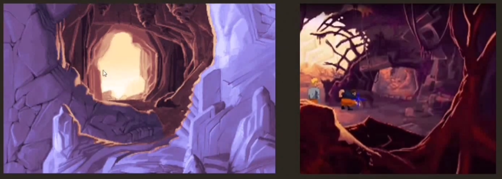

- 對稱式構圖
  - 對稱式構圖具有平靜，穩定，重量等特點
  - 常用於水面、平川、草原；或重要的人物出場
  - 缺點：構圖太過單一，畫面缺少生動性
  - 
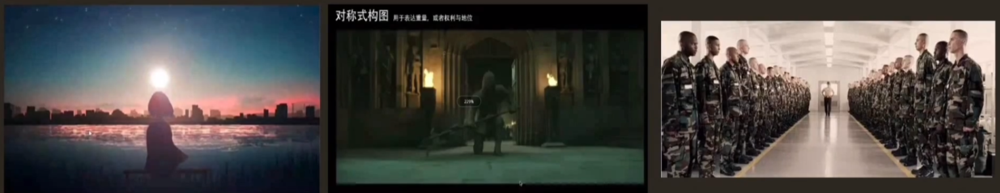

- 垂直線構圖
  - 通常以樹、電線桿等垂直的東西作為垂直線，突出重點，畫樹的時候需要把節奏感表現出來。
  - 畫面以垂直線條為主
  - 運用長度、粗度不用的垂直線，來讓畫面產生一種動態的節奏感。
  - 常見的：垂直線分割手法：讓垂直線沿著一個方向逐漸變短，從而產生距離感，為畫面增加深度

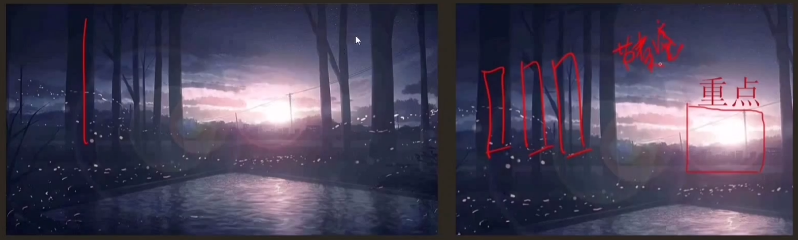
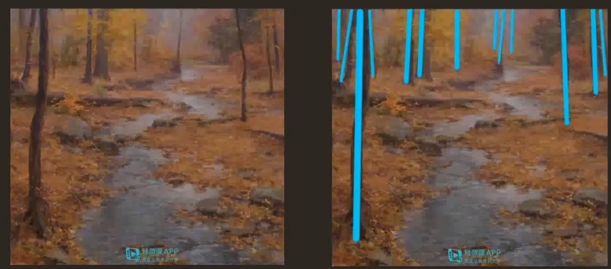

- 水平線分割構圖
  - 常用於表現遼闊的場景，比如風景畫
  - 在畫面中添加水平線可以增強畫面的穩定感，給人平穩、舒展的感覺。
  - 但是過多的水平線會破壞畫面的緊湊感，要注意控制水平線的數量和疏密程度

- 十字分割構圖（水平線和垂直線組合）
  - 十字型的垂直線和水平線的交叉狀態，是一種特殊的交叉線，它具有交叉線的所有特徵，比如：視覺聚焦、主體突出、製造出視覺中心。
  - 是畫手引導觀眾按照他的想法欣賞畫作的一種方式
  
- 視覺引導線
  - 引導線會把玩家的視線吸引到畫面的主體上，道路和牆壁都可以作為畫面的引導線。

# 4. 速塗場景剪影
構圖構思好後，就可以開始場景速塗剪影了
## 剪影：
原畫中，剪影設計是一張好的場景設計的前奏，是一種較為概括外觀的設計，

## 剪影練習：
剪影需要大量練習，要主動打破單一的結構關係，突出重點，找出變化趨勢，順勢調整變化的組織關係。做到疏密得當、突出重點
- 注意：
  - 即使是簡單的形狀，也要遵循統一中求變變化的原則，這樣結構才會好看
  - 剪影的辨識度，簡單來說就是一個就知道這是個什麼東西

# 5. 可能遇到的問題：
- 雜亂無章：
  - 問題是變化過多，缺乏統一，找不到視覺中心
  - 改善：外部的條狀物進行刪改，突出核心

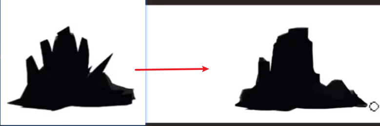

- 變化單一：
  - 問題： 沒有節奏、沒有疏密關係
- 分析方法1：把剪影用時鐘標出來，整點的位置必有設計
  - 可以看出問題：
  - 物體之間大小相同，無重點
  - 物體朝向平均往周圍發散、視覺中心不集中
  - 剪影過於簡單

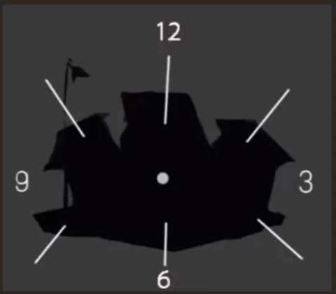

- 分析方法2：把剪影中物體的位置均等間隔放置
可以看出問題：
  - 佈局朝向過於均等
  - 朝向單一、圖形太簡單
  - 沒有主次關係
  - 剪影不明確（看不出這是個啥東西）

# 6. 如何用剪影激發創作靈感
可以通過不斷變換剪影來激發靈感，把靈感具象化
方法：
  - 利用同一個剪影模板的基礎上，不斷添加設計元素給場景新設定
  - 利用剪影模板，通過變形、局部誇張、局部替換等手段，重新設計一個新的場景

# 7. 剪影內切
剪影速塗後，要進行剪影內切，把剪影內部的初步結構通過內切來整理清新，挑出線稿的框架來練習
- 方法
  1. 切出剪影內部的具體結構，把重要的部分先切出來
  2. 明確基本結構之後，把物體亮暗面，通過二分初步分出亮暗灰三大面，使作品立體化
  3. 進一步優化物體的“五大調子”（高光、明暗交界線、亮面、灰面、暗面。*概念見前幾章。），疏密關係。如：投影、空間關係。
## 用三分法構圖舉例剪影流程
- 三分法剪影：用20分鐘左右的時間速塗起稿，重點在：概括地形、視覺中心在畫面中的位置
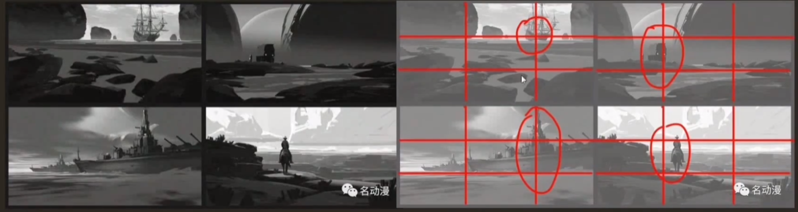
剪影的空間處理：重點在突出空間關係，畫面中的視覺中心呈現“突出部”的結構
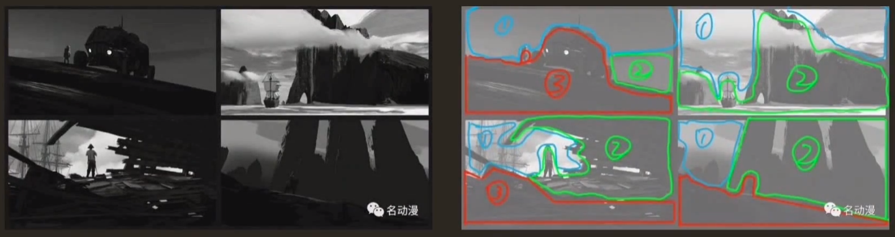 
## 三分法構圖流程：
- 草稿
- 上基礎色
- 增加元素
- 處理地形、整體細化

# 前景場景和縱深感（空間關係）
## 前景
- 指位於注意前邊的部分
- 合理運用不僅可以突出主體，還能給畫面營造出縱深感，提高視覺衝擊力
- 注意：
  - 前景是用來烘托注意的，而不是阻擋看向主體的視線
  - 前景的定位就是綠葉、配角型的，所以表現力弱於主體，所以要讓人能分出主次。
  - 運用準確，構圖唯美，要保證前景符合整個畫面注意，也就是前邊所說的統一性
- 透視感在前景場景與縱深感起到了很大的作用，後景可以讓畫面看起來有縱深感

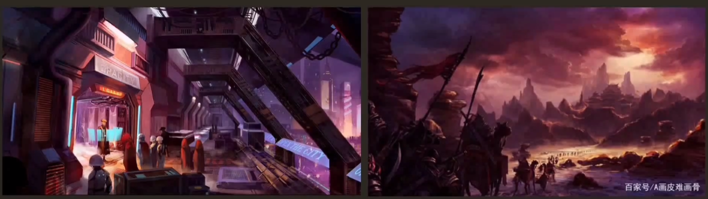
## 場景色彩分類
- 色彩是一張原畫的關鍵，可以傳達很多信息
- 色彩搭配是比較需要經驗和學習的部分，多看多練
- 三原色：紅黃藍、色彩的特徵：色相、純度/飽和度、明度（*具體概念前幾章）
- 色性：
  - 包括暖色調、冷色調、中性色
  - 冷色調：
    - 色彩中沒有絕對的冷色調，冷色調是相對的，環境和比例是影響顏色冷暖的兩個因素
    - 常見的：藍、藍紫、藍綠，給人寒冷、平靜、理智的感覺
  - 暖色調：
    - 常見的：紅、紅橙、黃橙、和紅紫，給人溫暖、熱烈、激情、危險的感覺
  - 中性色：
    - 常見：黑、白、灰
    - 離橙色越近顏色偏暖，離藍色越近顏色偏冷。
## 配色比例
日本設計師提出過的配色黃金比例：70：25：5，其中70%大面積的主色，25%為輔助色，5%為點綴色。一般情況下建議畫面色彩不超過三種

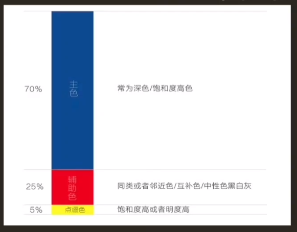

## 色彩關係
色彩之間的關係取決於在色環上的位置
- 色相之間的角度越近，對比越弱；角度越遠，對比越強

## 疊色
先用黑白灰，再疊色，體積感會更強，直接上色出來的色彩感也不錯
- 三大步：起稿、鋪調子、設計和塑造

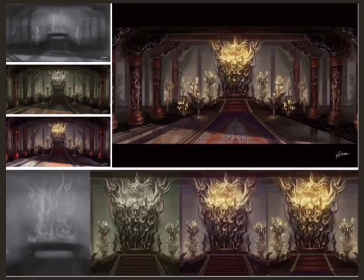

## 不同遊戲中不同色彩的例子
- 色彩的首要宏能是幫助我們便是物體，eg：紅色的蘋果，因為現實中就是紅色的，方便我們更容易的辨識
- 畫面分為很大一部分是由顏色決定的，比如一些經典遊戲主題的配色
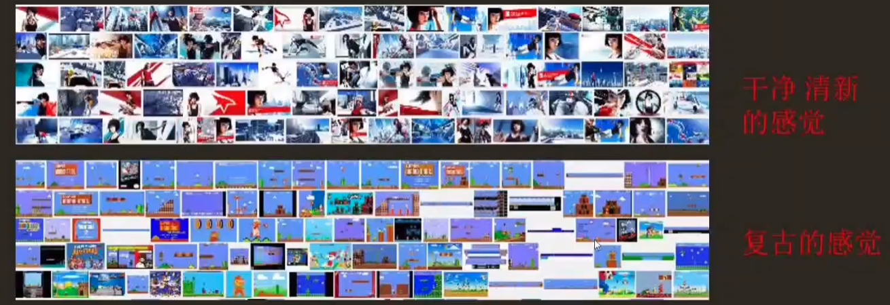
- 休閒遊戲和核心遊戲色彩的區別
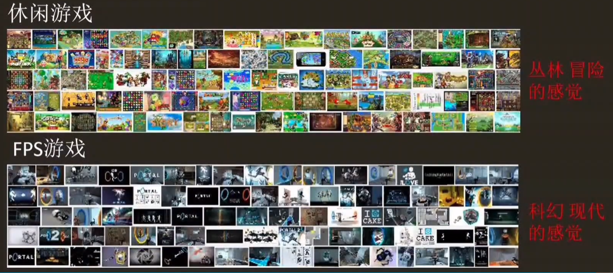

# 6. 場景光影氛圍
光影中重要的亮點：
- 打光
- 光影的分割
不同的光會給人不同的情緒影響
- 光影的分割：
  - 就算內容一樣，不同的打光情況下，會有不同的氛圍和情緒，它所代表的東西也是不一樣的。