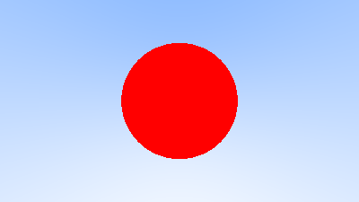
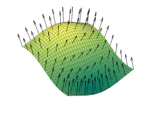
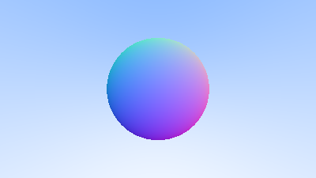

# 手寫軟光柵2
這次嘗試加入一些三維物體

[參考網址](https://raytracing.github.io/books/RayTracingInOneWeekend.html)

# 前情提要 ~~(水字數)~~
 
## 球是甚麼?

$$
x^2 + y^2 + z^2 =
R^2
$$

## 如何判斷一個點是否在球內部?

### 如果球的球心座標為 $(0,0,0)$ :

$$
內部: x^2 + y^2 + z^2 <
R^2
$$

$$
外部: x^2 + y^2 + z^2 >
R^2
$$

$$
表面: x^2 + y^2 + z^2 =
R^2
$$

### 如果球的球心座標為 $(C_x,C_y,C_z)$ :

$$
(x-C_x)^2 + (y-C_y)^2 + (z-C_z)^2 < R^2
$$

## 如果點是用向量的形式表示呢?

$$
\mathbf{P} = (x,y,z) 
$$

$$
(\mathbf{P} - \mathbf{C}) \cdot (\mathbf{P} - \mathbf{C})
     = (x - C_x)^2 + (y - C_y)^2 + (z - C_z)^2
$$

$$
(\mathbf{P} - \mathbf{C}) \cdot (\mathbf{P} - \mathbf{C}) = R^2
$$

# 第一步: 數學
現在有一個需求: 

> 我們有一條射線和一個球體，求它們是否相交? 如果它們相交，那麼它們相交的點又在哪裡?

首先先設射線 $\mathbf{P}(t)$ 方程， 其中 $\mathbf{A} + t\mathbf{b}$ 為直線方程參數， $t$ 則代表需要求解相交的點

$$
\mathbf{P}(t) = \mathbf{A} + t\mathbf{b}
$$

再代入到剛剛上面的式子

$$
(\mathbf{P}(t) - \mathbf{C}) \cdot (\mathbf{P}(t) - \mathbf{C}) = r^2
$$

拆開 $\mathbf{P}(t)$ 方程:

$$
(\mathbf{A} + t \mathbf{b} - \mathbf{C})
      \cdot (\mathbf{A} + t \mathbf{b} - \mathbf{C}) = r^2
$$

$$
t^2 \mathbf{b} \cdot \mathbf{b}
     + 2t \mathbf{b} \cdot (\mathbf{A}-\mathbf{C})
     + (\mathbf{A}-\mathbf{C}) \cdot (\mathbf{A}-\mathbf{C}) - r^2 = 0
$$

$t$ 有三種可能:
- 不相交
- 相交一個點
- 相交兩個點


那麼我們就可以開始模擬一個球體了，先寫一個hit_sphere()函數，返回值為與當前射線是否相交。在ray_color()函數中，如果射線相交了，則放上一顆紅色像素點

```c++
bool hit_sphere(const point3& center, double radius, const ray& r) {
    vec3 oc = r.origin() - center;
    auto a = dot(r.direction(), r.direction());
    auto b = 2.0 * dot(oc, r.direction());
    auto c = dot(oc, oc) - radius*radius;
    auto discriminant = b*b - 4*a*c;
    return (discriminant > 0);
}

color ray_color(const ray& r) {
    // 球在在(0,0,-1)的位置，相交了，則放上一顆紅色像素點
    if (hit_sphere(point3(0,0,-1), 0.5, r))
        return color(1, 0, 0);
    
    vec3 unit_direction = unit_vector(r.direction());
    auto t = 0.5*(unit_direction.y() + 1.0);
    return (1.0-t)*color(1.0, 1.0, 1.0) + t*color(0.5, 0.7, 1.0);
}
```

完成基本的著色



# 第二步: 表面法線和更多物體

表面法線是垂直於該平面的三維向量。

曲面在某點P處的法線為垂直於該點切平面（tangent plane）的向量



那麼如果我們想要求球面的法向量呢? 很簡單，只要P點減去球心C就是法向量了


```c++
// 重新改寫 return double
double hit_sphere(const point3& center, double radius, const ray& r)
{
	vec3 oc = r.origin() - center;
	auto a = dot(r.direction(), r.direction());
	auto b = 2.0 * dot(oc, r.direction());
	auto c = dot(oc, oc) - radius * radius;
	auto discriminant = b * b - 4 * a * c;
	if (discriminant < 0) {
		return -1.0;
	}
	else {
		// 尋根公式
		return (-b - sqrt(discriminant)) / (2.0 * a);
	}
}

color ray_color(const ray& r)
{
	// t 為hit_sphere()返回值
	auto t = hit_sphere(point3(0, 0, -1), 0.5, r);
	if (t > 0.0) {
		// 我們還沒有任何燈光或任何東西，所以讓我們用彩色貼圖可視化法線。
		// 這裡提供了一個可視化法線的常用技巧，就是單位長度向量
		// 因為它很容易假設並且直觀————每個分量都在 -1 和 +1 之間
		// 其實這裡就是將每個分量映射到 0 到 1 的區間，
		// 然後將 x / y / z 映射到 r / g / b
		vec3 N = unit_vector(r.at(t) - vec3(0, 0, -1));
		return 0.5 * color(N.x() + 1, N.y() + 1, N.z() + 1);
	}
	vec3 unit_direction = unit_vector(r.direction());
	t = 0.5 * (unit_direction.y() + 1.0);
	return (1.0 - t) * color(1.0, 1.0, 1.0) + t * color(0.5, 0.7, 1.0);
}
```



注意到在 hit_sphere() 中 $b$ 項使用了2倍的向量，嘗試簡化成下列式子，當 $b = 2h$ :

$$
\frac{-b \pm \sqrt{b^2 - 4ac}}{2a}
$$

$$
= \frac{-2h \pm \sqrt{(2h)^2 - 4ac}}{2a}
$$

$$
= \frac{-2h \pm 2\sqrt{h^2 - ac}}{2a}
$$

$$
= \frac{-h \pm \sqrt{h^2 - ac}}{a}
$$

我們可以將代碼優化一下:

```c++
double hit_sphere(const point3& center, double radius, const ray& r) {
    vec3 oc = r.origin() - center;
	// 長度平方
    auto a = r.direction().length_squared();
	// 將 b = 2h, 取h的值
    auto half_b = dot(oc, r.direction());
    auto c = oc.length_squared() - radius*radius;
    auto discriminant = half_b*half_b - a*c;

    if (discriminant < 0) {
        return -1.0;
    } else {
        return (-half_b - sqrt(discriminant) ) / a;
    }
}
```

# 第三步: 抽象類
為了在後續增加更多物體，我們把 "hit" 和 "sphere" 等多個類別分開處理，先幫他們起類:

```c++
// [hittable.h] The hittable class
#ifndef HITTABLE_H
#define HITTABLE_H

#include "ray.h"

struct hit_record
{
	point3 p;
	vec3 normal;
	double t;
};

class hittable
{
public:
	// t_min 和 t_max 為光線命中的有效區間，我們只計算符合 t_min < t < t_max 內的t
	// 有一個問題就是，如果光線命中了物體，那此點的法線要計算嗎?
	virtual bool hit(const ray& r, double t_min, double t_max, hit_record& rec) const = 0;
};


#endif
```

```c++
// [sphere.h] The sphere class
#ifndef SPHERE_H
#define SPHERE_H

#include "hittable.h"
#include "vec3.h"

class sphere : public hittable
{
public: 
	sphere() {}
	sphere(point3 cen, double r) : center(cen), radius(r){};

	virtual bool hit(const ray& r, double t_min, double t_max, hit_record& rec) const override;


public:
	point3 center;
	double radius;
};

bool sphere::hit(const ray& r, double t_min, double t_max, hit_record& rec) const
{
	vec3 oc = r.origin() - center;
	auto a = r.direction().length_squared();
	auto half_b = dot(oc, r.direction());
	auto c = oc.length_squared() - radius * radius;

	auto discriminant = half_b * half_b - a * c;
	// 如果不命中則返回false
	if (discriminant < 0) return false;
	auto sqrtd = sqrt(discriminant);

	auto root = (-half_b - sqrtd) / a;
	// 找到位於可接受範圍內的最近根。
	if (root < t_min || t_max < root)
	{
		root = (-half_b + sqrtd) / a;
		// 再次判斷，如果還是不在則返回false
		if (root < t_min || t_max < root)
			return false;
	}

	rec.t = root;
	rec.p = r.at(rec.t);
	// 球體表面法線公式
	rec.normal = (rec.p - center) / radius;

	return true;
}


#endif // !SPHERE_H

```

# 第四步: 法線設計問題

1. 如果我們命中到什麼東西的時候，是否需要計算法線?
   - 當我們進行搜索時，可能最終會命中到更近的東西，我們只需要最接近這個東西的法線
2. 是否應該總是指出，目前找到的法線永遠是中心到交點的方向?（法線指向外）如果射線從外部與球體相交，則法線指向射線。如果光線從內部與球體相交，則法線（始終指向外）指向光線。或者，我們可以讓法線始終指向光線。如果光線在球體外部，法線將指向外部，但如果光線在球體內部，則法線將指向內部。
   - 在設計光線的時候，可能要計算光線從內部照射的可能性，所以是否要計算內外兩表面的法線就成了一個問題
   - 我們需要選擇其中一種可能性，因為我們最終要確定光線來自表面的哪一側。這對於在每一面呈現不同的對象（如雙面紙上的文本）或具有內部和外部的對象（如玻璃球）非常重要


如果我們決定讓法線始終指向外，那麼我們將需要在著色時確定射線在哪一側。我們可以通過將光線與法線進行比較來解決這個問題。如果光線與法線方向相同，則光線在物體內部，如果光線與法線方向相反，則光線在物體外部。這可以通過計算兩個向量的點積來確定，如果它們的點為正，則光線在球體內。

```c++
if (dot(ray_direction, outward_normal) > 0.0) {
    // ray is inside the sphere
    ...
} else {
    // ray is outside the sphere
    ...
}
```

如果我們決定讓法線始終指向光線，我們將無法使用點積來確定光線在表面的哪一側。相反，我們需要存儲該信息：

```c++
bool front_face;
if (dot(ray_direction, outward_normal) > 0.0) {
    // ray is inside the sphere
    normal = -outward_normal;
    front_face = false;
} else {
    // ray is outside the sphere
    normal = outward_normal;
    front_face = true;
}
```

## 你覺得哪種設計最好?

我們可以進行設置，使法線始終指向表面“向外”，或者始終指向入射光線。該決定取決於您是要在幾何相交時還是在著色時確定曲面的邊。在這裡，我們擁有的材料類型多於幾何類型，因此我們將減少工作量並將確定放在幾何時間。這只是一個偏好問題，您會在其他地方中看到這兩種實現。

我們將 bool front_face 添加到 hit_record 結構中。我們還將添加一個函數來為我們解決這個計算。

```c++
struct hit_record {
    point3 p;
    vec3 normal;
    double t;
	// front-face tracking
    bool front_face;

    inline void set_face_normal(const ray& r, const vec3& outward_normal) {
        front_face = dot(r.direction(), outward_normal) < 0;
        normal = front_face ? outward_normal :-outward_normal;
    }
};
```

然後我們將set_face_normal()添加到球類中：

```c++
bool sphere::hit(const ray& r, double t_min, double t_max, hit_record& rec) const {
    ...

    rec.t = root;
    rec.p = r.at(rec.t);
	// old
	// rec.normal = (rec.p - center)/ radius;
	// new
	vec3 outward_normal = (rec.p - center) / radius;
	rec.set_face_normal(r, outward_normal);

    return true;
}
```

我們將front_facebool 添加到hit_record結構中。我們還將添加一個函數來為我們解決這個計算。

我們有一個通用對象hittable，光線可以與之相交。我們現在添加一個存儲hittables 列表的類 hittable_list.h

```c++
// [hittable_list.h] The hittable_list class
#ifndef HITTABLE_LIST_H
#define HITTABLE_LIST_H

#include "hittable.h"

#include <memory>
#include <vector>

using std::shared_ptr;
using std::make_shared;

class hittable_list : public hittable
{
public:
	hittable_list() {};
	hittable_list(shared_ptr<hittable> object){add(object); }

	void clear() {}
	void add(shared_ptr<hittable> object) { objects.push_back(object); }
		
	virtual bool hit(const ray& r, double t_min, double t_max, hit_record& rec) const override;

public:
	std::vector<shared_ptr<hittable>> objects;
};

bool hittable_list::hit(const ray& r, double t_min, double t_max, hit_record& rec) const
{
	hit_record temp_rec;
	bool hit_anything = false;
	auto closest_so_far = t_max;

	for (const auto& object : objects)
	{
		if (object->hit(r, t_min, closest_so_far, temp_rec))
		{
			hit_anything = true;
			// 更新最近物體
			closest_so_far = temp_rec.t;
			rec = temp_rec;
		}
	}
	return hit_anything;
}

#endif

```

# 第四又二分之一步: c++特性
hittable_list類代碼使用了兩個 C++ 特性，如果您通常不是 C++ 程序員，這兩個特性可能會讓您感到困惑 ：vector和shared_ptr.

shared_ptr<type>是指向某個已分配類型的指針，具有引用計數語義。每次將其值分配給另一個共享指針（通常使用簡單的分配）時，引用計數都會增加。當共享指針超出範圍時（比如在塊或函數的末尾），引用計數會減少。一旦計數變為零，對象將被刪除。

通常，共享指針首先使用新分配的對象進行初始化，如下所示： 

```c++
// 使用 shared_ptr 的示例
shared_ptr<double> double_ptr = make_shared<double>(0.37);
shared_ptr<vec3>   vec3_ptr   = make_shared<vec3>(1.414214, 2.718281, 1.618034);
shared_ptr<sphere> sphere_ptr = make_shared<sphere>(point3(0,0,0), 1.0);
```

make_shared<thing>(thing_constructor_params ...)thing使用構造函數參數分配 type 的新實例。它返回一個shared_ptr<thing>.

由於可以通過 的返回類型自動推導出類型，因此可以使用 C++ 的類型說明符 make_shared<type>(...)更簡單地表達上面的行：auto

```c++
// 使用自動類型的 shared_ptr 的示例
auto double_ptr = make_shared<double>(0.37);
auto vec3_ptr   = make_shared<vec3>(1.414214, 2.718281, 1.618034);
auto sphere_ptr = make_shared<sphere>(point3(0,0,0), 1.0);
```

我們將在我們的代碼中使用共享指針，因為它允許多個幾何體共享一個公共實例（例如，一堆球體都使用相同的紋理貼圖材質），並且因為它使內存管理自動化

std::shared_ptr包含在<memory>文件中

您可能不熟悉的第二個 C++ 特性是std::vector. 這是一個任意類型的類通用數組集合。上面，我們使用了一組指向hittable. std::vector 隨著添加更多值而自動增長：objects.push_back(object)將值添加到std::vector成員變量的末尾objects。

std::vector包含在<vector>文件中。

最後，在 listing 20 using 語句告訴編譯器我們將從 std 庫中獲取 shared_ptr 和獲取 make_shared，因此我們不需要在 每次引用它們時都添加前綴std::。

# 第五步: Common Constants and Utility Functions
把一些可能的數學常數，以及經常使用到的函數扔到一個.h文件中:

```c++
// [rtweekend.h]
#ifndef RTWEEKEND_H
#define RTWEEKEND_H

#include <cmath>
#include <limits>
#include <memory>

// Usings

using std::shared_ptr;
using std::make_shared;
using std::sqrt;

// Constants

const double infinity = std::numeric_limits<double>::infinity();
const double pi = 3.1415926535897932385;

// Utility Functions

inline double degrees_to_radians(double degrees)
{
	return degrees * pi / 180.0;
}

// Common Headers

#include "ray.h"
#include "vec3.h"

#endif
```

新的main.cpp:

```c++
#include "rtweekend.h"

#include "color.h"
#include "hittable_list.h"
#include "sphere.h"

#include <iostream>

color ray_color(const ray& r, const hittable& world)
{
	hit_record rec;
	if (world.hit(r, 0, infinity, rec))
	{
		return 0.5 * (rec.normal + color(1, 1, 1));
	}
	vec3 unit_direction = unit_vector(r.direction());
	auto t = 0.5 * (unit_direction.y() + 1.0);
	return (1.0 - t) * color(1.0, 1.0, 1.0) + t * color(0.5, 0.7, 1.0);
}

int main()
{
	// Image
	const auto aspect_ratio = 16.0 / 9.0;
	const int image_width = 400;
	const int image_height = static_cast<int>(image_width / aspect_ratio);

	// World
	hittable_list world;
	world.add(make_shared<sphere>(point3(0, 0, -1), 0.5));
	world.add(make_shared<sphere>(point3(0, -100.5, -1), 100));

	// Cam

	auto viewport_height = 2.0;
	auto viewport_width = aspect_ratio * viewport_height;
	auto focal_length = 1.0;

	auto origin = point3(0, 0, 0);
	auto horizontal = vec3(viewport_width, 0, 0);
	auto vertical = vec3(0, viewport_height, 0);
	auto lower_left_corner = origin - horizontal / 2 - vertical / 2 - vec3(0, 0, focal_length);

	std::cout << "P3\n" << image_width << " " << image_height << "\n255\n";

	for (int i = image_height - 1; i >= 0; --i)
	{
		std::cerr << "\rScanlines remaining: " << i << ' ' << std::flush;

		for (int j = 0; j < image_width; ++j)
		{
			auto u = double(j) / (image_width - 1);
			auto v = double(i) / (image_height - 1);
			ray r(origin, lower_left_corner + u * horizontal + v * vertical - origin);
			color pixel_color = ray_color(r,world);
			write_color(std::cout, pixel_color);
		}
	}
	std::cerr << "\nDone.\n";
}
```

