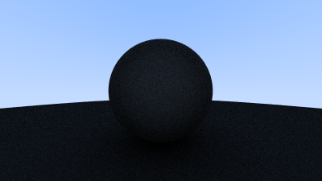
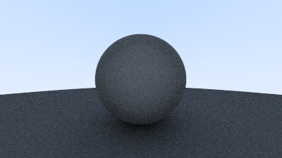

# 手寫軟光柵3
今天來做點抗鋸齒(反走樣)

順便把項目給扔到github倉庫上，方便記錄歷史

# 第一步: 抗鋸齒(反走樣)?
當真實相機拍攝照片時，邊緣通常沒有鋸齒，因為邊緣像素是一些前景和一些背景的混合。我們可以通過對每個像素內的一堆樣本進行平均來獲得相同的效果

先在 [rtweekend.h] 裡新增一些隨機數函數:

```c++
#include <cstdlib>
...

inline double random_double() {
    // Returns a random real in [0,1).
    return rand() / (RAND_MAX + 1.0);
}

inline double random_double(double min, double max) {
    // Returns a random real in [min,max).
    return min + (max-min)*random_double();
}
```

random_double() 你也可以寫成這個樣子:

```c++
#include <random>

inline double random_double() {
    static std::uniform_real_distribution<double> distribution(0.0, 1.0);
    static std::mt19937 generator;
    return distribution(generator);
}
```

對於特定的像素，我們對像素內做多個取樣，並通過每個取樣發送光線。然後對這些光線的顏色進行加權平均，

我們來把之前寫的相機寫成一個相機類吧:

```c++
// [camera.h]
#ifndef CAMERA_H
#define CAMERA_H

#include "rtweekend.h"

class camera
{
public:
	camera()
	{
		auto aspect_ratio = 16.0 / 9.0;
		auto viewport_height = 2.0;
		auto viewport_width = aspect_ratio * viewport_height;
		auto focal_length = 1.0;

		origin = point3(0, 0, 0);
		horizontal = vec3(viewport_width, 0, 0);
		vertical = vec3(0, viewport_height, 0);
		lower_left_corner = origin - horizontal / 2 - vertical / 2 - vec3(0, 0, focal_length);
	}
	ray get_ray(double u, double v) const
	{
		return ray(origin, lower_left_corner + u * horizontal + v * vertical - origin);
	}
private:
	point3 origin;
	point3 lower_left_corner;
	vec3 horizontal;
	vec3 vertical;
};


#endif
```

為了處理多采樣時的顏色計算，我們將更新 write_color() 函數。

不是每次我們為顏色累積更多光時都添加分數貢獻，而是每次迭代添加完整顏色，然後在寫出顏色時在最後（按樣本數）執行一次除法。

此外，我們將向 rtweekend.h 添加一個方便的實用程序函數：clamp(x,min,max)，它將值 x 限制在 [min,max] 範圍內：

```c++
// [rtweekend.h]
inline double clamp(double x, double min, double max) {
    if (x < min) return min;
    if (x > max) return max;
    return x;
}
```

```c++
// [color.h] The multi-sample write_color() function
void write_color(std::ostream& out, color pixel_color,int samples_per_pixel) {
    auto r = pixel_color.x();
    auto g = pixel_color.y();
    auto b = pixel_color.z();

    // Divide the color by the number of samples.
    auto scale = 1.0 / samples_per_pixel;
    r *= scale;
    g *= scale;
    b *= scale;
    
    // Write the translated [0,255] value of each color component.
    out << static_cast<int>(256 * clamp(r, 0.0, 0.999)) << ' '
        << static_cast<int>(256 * clamp(g, 0.0, 0.999)) << ' '
        << static_cast<int>(256 * clamp(b, 0.0, 0.999)) << '\n';
}

#endif
```

```c++
// [main.cpp]
int main()
{
	// Image
	const auto aspect_ratio = 16.0 / 9.0;
	const int image_width = 400;
	const int image_height = static_cast<int>(image_width / aspect_ratio);
	const int samples_per_pixel = 100;

	// World
	hittable_list world;
	world.add(make_shared<sphere>(point3(0, 0, -1), 0.5));
	world.add(make_shared<sphere>(point3(0, -100.5, -1), 100));

	// Cam

	camera cam;

	std::cout << "P3\n" << image_width << " " << image_height << "\n255\n";

	for (int i = image_height - 1; i >= 0; --i)
	{
		std::cerr << "\rScanlines remaining: " << i << ' ' << std::flush;

		for (int j = 0; j < image_width; ++j)
		{
			color pixel_color(0, 0, 0);
			// 射出100條光線 
			for (int s = 0; s < samples_per_pixel; ++s)
			{
				auto u = (j + random_double()) / (image_width - 1);
				auto v = (i + random_double()) / (image_height - 1);
				ray r = cam.get_ray(u, v);
				pixel_color += ray_color(r, world);
			}
			write_color(std::cout, pixel_color, samples_per_pixel);
		}
	}
	std::cerr << "\nDone.\n";
}
```


# 第二步: 漫反射材料
現在我們已經完成多個球體以及每個像素的多條光線，就可以製作一些逼真的材質。

我們將從漫反射（啞光）材料開始。

一個問題是我們是否混合和匹配幾何體和材質（因此我們可以將一種材質分配給多個球體，反之亦然）或者幾何體和材質是否緊密結合（這對於幾何體和材質鏈接的程序對像很有用）。我們將使用 separate —— 這在大多數渲染器中很常見

不發光的漫射物體只會呈現周圍環境的顏色，但它們會用自己的固有顏色調節周圍環境的顏色。從漫反射表面反射的光的方向是隨機的。因此，如果我們將三束光線發射到兩個漫反射表面之間的裂縫中，它們將各自具有不同的隨機行為：


它們也可能被吸收而不是反射。表面顏色越深，吸收的可能性就越大。 （這就是為什麼它是黑暗的！）實際上，任何隨機化方向的算法都會產生看起來無光澤的表面。事實證明，最簡單的方法之一對於理想的漫反射表面是完全正確的。

有兩個與命中點 $p$ 相切的單位半徑球體，這兩個球體的中心是 $(\mathbf{P} + \mathbf{n})$ 和 $(\mathbf{P} - \mathbf{n})$ ( $n$ 是表面的法向量) 

球心位於 $(\mathbf{P} - \mathbf{n})$ 在表面的裡面，球心位於 $(\mathbf{P} + \mathbf{n})$ 在表面的外面。

選擇與射線原點位於曲面同一側的切線單位半徑球體。選擇一個隨機點 $S$ ，在這個單位半徑球體內部並從命中點 $P$ 發出一條射線到隨機點 $S$ ，這條射條就叫做 $(\mathbf{S}-\mathbf{P})$

我們需要一種方法來在單位半徑球體中選擇一個隨機點。我們將使用通常最簡單的算法：__拒絕方法__。首先，在單位立方體中選擇一個隨機點，其中 x、y 和 z 的範圍都從 −1 到 +1。如果該點在球體之外，則拒絕該點並重試。


開始更新我們 [vec3.h] ，寫一些關於隨機向量的函數:

```c++
// [vec3.h]
class vec3 {
  public:
    ...
    inline static vec3 random() {
        return vec3(random_double(), random_double(), random_double());
    }

    inline static vec3 random(double min, double max) {
        return vec3(random_double(min,max), random_double(min,max), random_double(min,max));
    }
```

```c++
vec3 random_in_unit_sphere() {
    while (true) {
        auto p = vec3::random(-1,1);
        if (p.length_squared() >= 1) continue;
        return p;
    }
}
```

然後在 main.cpp 更新 ray_color() 函數以使用新的隨機方向生成器：

```c++
// [main.cpp]
color ray_color(const ray& r, const hittable& world)
{
	hit_record rec;
	if (world.hit(r, 0, infinity, rec))
	{
		point3 target = rec.p + rec.normal + random_in_unit_sphere();

		return 0.5 * ray_color(ray(rec.p,target - rec.p),world);
	}
	vec3 unit_direction = unit_vector(r.direction());
	auto t = 0.5 * (unit_direction.y() + 1.0);
	return (1.0 - t) * color(1.0, 1.0, 1.0) + t * color(0.5, 0.7, 1.0);
}
```

我們需要限制一下子射線的數量，這裡潛伏著一個潛在的問題。注意到，ray_color 函數是遞歸的。什麼時候停止遞歸？當它沒有擊中任何東西時。然而，在某些情況下，這可能會很長一段時間——足夠長的時間來摧毀堆棧。為了防止這種情況，讓我們限制最大遞歸深度，在這情況下不返回光：

```c++
color ray_color(const ray& r, const hittable& world, int depth) {
    hit_record rec;

    // If we've exceeded the ray bounce limit, no more light is gathered.
    if (depth <= 0)
        return color(0,0,0);

    if (world.hit(r, 0, infinity, rec)) {
        point3 target = rec.p + rec.normal + random_in_unit_sphere();
        return 0.5 * ray_color(ray(rec.p, target - rec.p), world, depth-1);
    }

    vec3 unit_direction = unit_vector(r.direction());
    auto t = 0.5*(unit_direction.y() + 1.0);
    return (1.0-t)*color(1.0, 1.0, 1.0) + t*color(0.5, 0.7, 1.0);
}

...

int main() {

    // Image

    const auto aspect_ratio = 16.0 / 9.0;
    const int image_width = 400;
    const int image_height = static_cast<int>(image_width / aspect_ratio);
    const int samples_per_pixel = 100;
    const int max_depth = 50;
    ...

    // Render

    std::cout << "P3\n" << image_width << " " << image_height << "\n255\n";

    for (int j = image_height-1; j >= 0; --j) {
        std::cerr << "\rScanlines remaining: " << j << ' ' << std::flush;
        for (int i = 0; i < image_width; ++i) {
            color pixel_color(0, 0, 0);
            for (int s = 0; s < samples_per_pixel; ++s) {
                auto u = (i + random_double()) / (image_width-1);
                auto v = (j + random_double()) / (image_height-1);
                ray r = cam.get_ray(u, v);
                pixel_color += ray_color(r, world, max_depth);
            }
            write_color(std::cout, pixel_color, samples_per_pixel);
        }
    }

    std::cerr << "\nDone.\n";
}
```

你會發現程序變慢了很多，不過沒關係，可以在後續加速。



更新一下 Gramma 較正:

```c++
// [color.h] The multi-sample write_color() function
void write_color(std::ostream& out, color pixel_color,int samples_per_pixel) {
    auto r = pixel_color.x();
    auto g = pixel_color.y();
    auto b = pixel_color.z();

    // Divide the color by the number of samples and gamma-correct for gamma=2.0.
    auto scale = 1.0 / samples_per_pixel;
    r = sqrt(scale * r);
    g = sqrt(scale * g);
    b = sqrt(scale * b);
    
    // Write the translated [0,255] value of each color component.
    out << static_cast<int>(256 * clamp(r, 0.0, 0.999)) << ' '
        << static_cast<int>(256 * clamp(g, 0.0, 0.999)) << ' '
        << static_cast<int>(256 * clamp(b, 0.0, 0.999)) << '\n';
}
```



這裡還有一個微妙的bug。一些光線並命中在了t=0，那是在 $t=-0.0000001$ 和 $t=0.0000001$ ，我們需要忽略非常接近於零的命中：

```c++
if (world.hit(r, 0.001, infinity, rec)) {
```
# True Lambertian Reflection
此處介紹的拒絕方法會在沿表面法線的單位球偏移中產生隨機點。這對應於半球上接近法線的概率高的拾取方向，以及以掠射角散射光線的概率較低。該分佈按比例縮放 $\cos^3 (\phi)$ ， $\phi$ 是法線的角度。

這是有用的，因為以小角度到達的光會散佈在更大的區域，因此對最終顏色的貢獻較小。

然而，我們對 Lambertian 分佈感興趣，它的分佈是 $\cos (\phi)$
. True Lambertian 光線散射接近法線的概率更高，但分佈更均勻。

這是通過在單位球體的表面上沿表面法線偏移的隨機點來實現的。在單位球面上選取隨機點可以通過在單位球面上選取隨機點，然後對它們進行歸一化來實現。

```c++
inline vec3 random_in_unit_sphere() {
    ...
}
vec3 random_unit_vector() {
    return unit_vector(random_in_unit_sphere());
}
```

random_unit_vector() 是現有 random_in_unit_sphere() 函數的替代品。


Lambertian spheres:


鑑於我們的兩個球體場景非常簡單，很難說出這兩種漫反射方法之間的區別，但是您應該能夠注意到兩個重要的視覺差異：

- 更改後陰影不太明顯
- 更改後兩個球體的外觀都更光亮了

這兩種變化都是由於光線的散射更均勻，向法線散射的光線更少。這意味著對於漫射物體，它們會顯得更亮，因為更多的光會反射到相機。對於陰影，較少的光線直接向上反射，因此較大球體的正下方較小球體的部分更亮。

其他方法: __hemisphere__

```c++
vec3 random_in_hemisphere(const vec3& normal)
{
	vec3 in_unit_sphere = random_in_unit_sphere();
	if (dot(in_unit_sphere, normal) > 0.0) // In the same hemisphere as the normal
		return in_unit_sphere;
	else
		return -in_unit_sphere;
}

```

