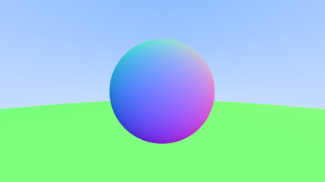

# 手寫軟光柵3
今天來做點抗鋸齒(反走樣)

順便把項目給扔到github倉庫上，方便記錄歷史

# 第一步: 抗鋸齒(反走樣)?
當真實相機拍攝照片時，邊緣通常沒有鋸齒，因為邊緣像素是一些前景和一些背景的混合。我們可以通過對每個像素內的一堆樣本進行平均來獲得相同的效果

先在 [rtweekend.h] 裡新增一些隨機數函數:

```c++
#include <cstdlib>
...

inline double random_double() {
    // Returns a random real in [0,1).
    return rand() / (RAND_MAX + 1.0);
}

inline double random_double(double min, double max) {
    // Returns a random real in [min,max).
    return min + (max-min)*random_double();
}
```

random_double() 你也可以寫成這個樣子:

```c++
#include <random>

inline double random_double() {
    static std::uniform_real_distribution<double> distribution(0.0, 1.0);
    static std::mt19937 generator;
    return distribution(generator);
}
```

對於特定的像素，我們對像素內做多個取樣，並通過每個取樣發送光線。然後對這些光線的顏色進行加權平均，

我們來把之前寫的相機寫成一個相機類吧:

```c++
// [camera.h]
#ifndef CAMERA_H
#define CAMERA_H

#include "rtweekend.h"

class camera
{
public:
	camera()
	{
		auto aspect_ratio = 16.0 / 9.0;
		auto viewport_height = 2.0;
		auto viewport_width = aspect_ratio * viewport_height;
		auto focal_length = 1.0;

		origin = point3(0, 0, 0);
		horizontal = vec3(viewport_width, 0, 0);
		vertical = vec3(0, viewport_height, 0);
		lower_left_corner = origin - horizontal / 2 - vertical / 2 - vec3(0, 0, focal_length);
	}
	ray get_ray(double u, double v) const
	{
		return ray(origin, lower_left_corner + u * horizontal + v * vertical - origin);
	}
private:
	point3 origin;
	point3 lower_left_corner;
	vec3 horizontal;
	vec3 vertical;
};


#endif
```

為了處理多采樣時的顏色計算，我們將更新 write_color() 函數。

不是每次我們為顏色累積更多光時都添加分數貢獻，而是每次迭代添加完整顏色，然後在寫出顏色時在最後（按樣本數）執行一次除法。

此外，我們將向 rtweekend.h 添加一個方便的實用程序函數：clamp(x,min,max)，它將值 x 限制在 [min,max] 範圍內：

```c++
// [rtweekend.h]
inline double clamp(double x, double min, double max) {
    if (x < min) return min;
    if (x > max) return max;
    return x;
}
```

```c++
// [color.h] The multi-sample write_color() function
void write_color(std::ostream& out, color pixel_color,int samples_per_pixel) {
    auto r = pixel_color.x();
    auto g = pixel_color.y();
    auto b = pixel_color.z();

    // Divide the color by the number of samples.
    auto scale = 1.0 / samples_per_pixel;
    r *= scale;
    g *= scale;
    b *= scale;
    
    // Write the translated [0,255] value of each color component.
    out << static_cast<int>(256 * clamp(r, 0.0, 0.999)) << ' '
        << static_cast<int>(256 * clamp(g, 0.0, 0.999)) << ' '
        << static_cast<int>(256 * clamp(b, 0.0, 0.999)) << '\n';
}

#endif
```

```c++
// [main.cpp]
int main()
{
	// Image
	const auto aspect_ratio = 16.0 / 9.0;
	const int image_width = 400;
	const int image_height = static_cast<int>(image_width / aspect_ratio);
	const int samples_per_pixel = 100;

	// World
	hittable_list world;
	world.add(make_shared<sphere>(point3(0, 0, -1), 0.5));
	world.add(make_shared<sphere>(point3(0, -100.5, -1), 100));

	// Cam

	camera cam;

	std::cout << "P3\n" << image_width << " " << image_height << "\n255\n";

	for (int i = image_height - 1; i >= 0; --i)
	{
		std::cerr << "\rScanlines remaining: " << i << ' ' << std::flush;

		for (int j = 0; j < image_width; ++j)
		{
			color pixel_color(0, 0, 0);
			// 射出100條光線 
			for (int s = 0; s < samples_per_pixel; ++s)
			{
				auto u = (j + random_double()) / (image_width - 1);
				auto v = (i + random_double()) / (image_height - 1);
				ray r = cam.get_ray(u, v);
				pixel_color += ray_color(r, world);
			}
			write_color(std::cout, pixel_color, samples_per_pixel);
		}
	}
	std::cerr << "\nDone.\n";
}
```




