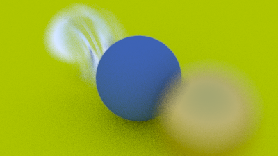
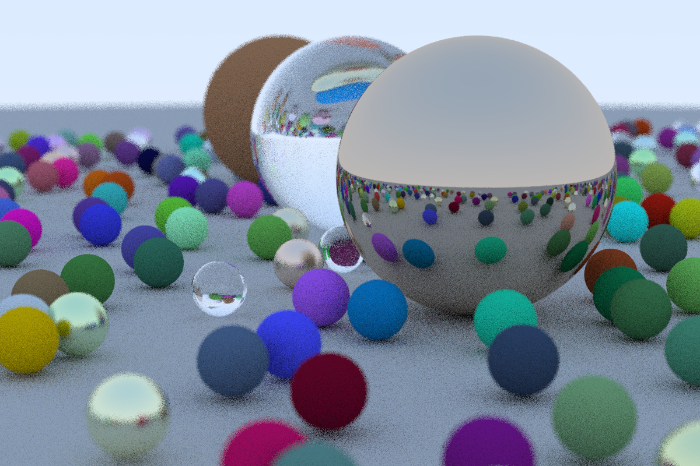

# GQ026 手寫軟光柵6
最後一部分了，寫關於景深以及一些隨機的小球

# Defocus Blur 散焦模糊

現在我們的最終功能：散焦模糊。請注意，所有攝影師都將其稱為“景深”，因此請注意僅在朋友之間使用“散焦模糊”。

我們在真實相機中散焦模糊的原因是因為它們需要一個大孔（而不僅僅是一個針孔）來收集光線。這會使一切散焦，但如果我們在孔中插入一個鏡頭，就會有一定的距離，一切都在焦點上。你可以這樣想一個鏡頭：所有來自焦距特定點的光線 - 並且擊中鏡頭 - 將被彎曲回圖像傳感器上的一個點。

我們將投影點與一切都完美聚焦的平面之間的距離稱為焦距。請注意，焦距與焦距不同——焦距是投影點與圖像平面之間的距離。


在物理相機中，焦距由鏡頭和膠片/傳感器之間的距離控制。這就是為什麼當你改變焦點時你會看到鏡頭相對於相機移動的原因（這也可能發生在你的手機相機中，但傳感器會移動）。 “光圈”是一個可以有效控製鏡頭大小的孔。對於真實的相機，如果你需要更多的光，你就把光圈調大，這樣會得到更多的散焦模糊。對於我們的虛擬相機，我們可以擁有一個完美的傳感器並且永遠不需要更多的光線，所以我們只有在需要散焦模糊時才需要一個光圈。

# random_in_unit_disk()

之前我們所有的光線都是從lookfrom發出的, 但現在加入了散焦模糊, 所有光線都從內部的一個虛擬透鏡發出, 經過lookfrom點, 這個透鏡的半徑越大, 圖像就越模糊。你可以認為之前的攝像機, 這個半徑為0。

```c++
// [vec3.h] Generate random point inside unit disk
vec3 random_in_unit_disk()
{
	while (true)
	{
		auto p = vec3(random_double(-1, 1), random_double(-1, 1), 0);
		if (p.length_squared() >= 1) continue;
		return p;
	}
}
```

```c++
class camera {
    public:
        camera(
            point3 lookfrom,
            point3 lookat,
            vec3   vup,
            double vfov, // vertical field-of-view in degrees
            double aspect_ratio,
            double aperture,
            double focus_dist
        ) {
            auto theta = degrees_to_radians(vfov);
            auto h = tan(theta/2);
            auto viewport_height = 2.0 * h;
            auto viewport_width = aspect_ratio * viewport_height;

            w = unit_vector(lookfrom - lookat);
            u = unit_vector(cross(vup, w));
            v = cross(w, u);

            origin = lookfrom;
            horizontal = focus_dist * viewport_width * u;
            vertical = focus_dist * viewport_height * v;
            lower_left_corner = origin - horizontal/2 - vertical/2 - focus_dist*w;

            lens_radius = aperture / 2;
        }


        ray get_ray(double s, double t) const {
            vec3 rd = lens_radius * random_in_unit_disk();
            vec3 offset = u * rd.x() + v * rd.y();

            return ray(
                origin + offset,
                lower_left_corner + s*horizontal + t*vertical - origin - offset
            );
        }

    private:
        point3 origin;
        point3 lower_left_corner;
        vec3 horizontal;
        vec3 vertical;
        vec3 u, v, w;
        double lens_radius;
};
```



# 最終成品圖

```c++
//main.cc
hittable_list random_scene() {
    hittable_list world;

    world.add(make_shared<sphere>(
        vec3(0,-1000,0), 1000, make_shared<lambertian>(vec3(0.5, 0.5, 0.5))));

    int i = 1;
    for (int a = -11; a < 11; a++) {
        for (int b = -11; b < 11; b++) {
            auto choose_mat = random_double();
            vec3 center(a + 0.9*random_double(), 0.2, b + 0.9*random_double());
            if ((center - vec3(4, 0.2, 0)).length() > 0.9) {
                if (choose_mat < 0.8) {
                    // diffuse
                    auto albedo = vec3::random() * vec3::random();
                    world.add(
                        make_shared<sphere>(center, 0.2, make_shared<lambertian>(albedo)));
                } else if (choose_mat < 0.95) {
                    // metal
                    auto albedo = vec3::random(.5, 1);
                    auto fuzz = random_double(0, .5);
                    world.add(
                        make_shared<sphere>(center, 0.2, make_shared<metal>(albedo, fuzz)));
                } else {
                    // glass
                    world.add(make_shared<sphere>(center, 0.2, make_shared<dielectric>(1.5)));
                }
            }
        }
    }

    world.add(make_shared<sphere>(vec3(0, 1, 0), 1.0, make_shared<dielectric>(1.5)));

    world.add(
        make_shared<sphere>(vec3(-4, 1, 0), 1.0, make_shared<lambertian>(vec3(0.4, 0.2, 0.1))));

    world.add(
        make_shared<sphere>(vec3(4, 1, 0), 1.0, make_shared<metal>(vec3(0.7, 0.6, 0.5), 0.0)));

    return world;
}

int main() {
    ...
    auto world = random_scene();

    vec3 lookfrom(13,2,3);
    vec3 lookat(0,0,0);
    vec3 vup(0,1,0);
    auto dist_to_focus = 10.0;
    auto aperture = 0.1;

    camera cam(lookfrom, lookat, vup, 20, aspect_ratio, aperture, dist_to_focus);
    ...
}
```



終於完成了!

你可能會發現玻璃球沒有陰影, 使得他們看上去像漂浮在空中似得。這不是bug(你在現實世界中很少有機會見到真正的玻璃球, 它們看起來的確就是這樣的)。玻璃球下的那個作為地板的大球仍然能被那麼多光線擊中, 因為光線並不會被玻璃球阻擋，經由玻璃球的折射最終射向天空

現在你擁有一個coooool斃了的光線追踪器了! 那接下來我該何去何從呢?

# 你的余生:

1. 光照。你可以使用陰影光線來顯式實現這部分, 也可以使用產生光線的材質來隱式實現*。

2. 偏移散射光線, 然後降低這些光線的權重來消除偏移。這兩種都行。硬要說的話, 我偏向後者一點點。

3. 加入三角形。大部分模型都是三角網格。模型的IO部分是最噁心的, 基本上所有人都不想自己寫, 都去找別人的代碼用。

4. 表面紋理*。這可以讓你像貼牆紙一樣把圖片貼到物體上去。實現起來也很簡單。

5. 固體紋理*。可以參見Ken Perlin的在線代碼, Andrew Kensler的blog中也有關於這部分的信息。

6. 體積體(volumes 即霧等)*與其他介質。很Cool, 但是會改變你的代碼構築。我喜歡把體積體也設計成hittable的子類, 根據其密度來隨機決定光線是否與其相交。使用這個方法, 你的渲染器甚至不用知道你渲的是體積體就渲出來了。

7. 並行優化。使用不同的隨機種子, 把你的代碼複製上N份跑在N個核心上,然後再求平均值。你可以分層來完成這部分工作, 比如分成N/2對, 每次平均求出N/4的圖片, 然後在對這些對之間求平均值。這應該用不了多少代碼【試試CUDA吧】。