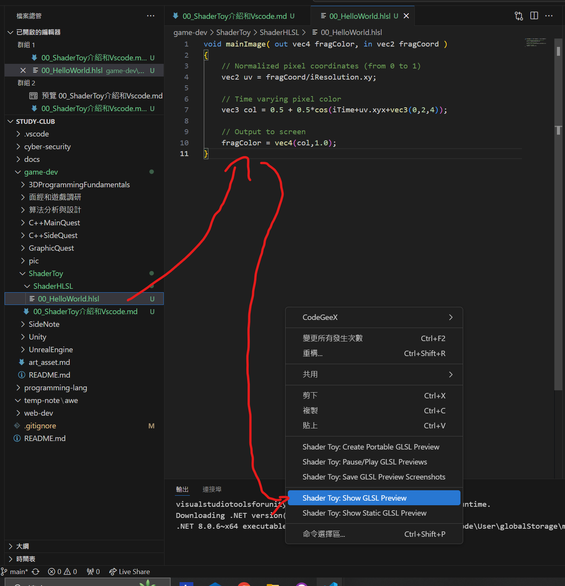

# ShaderToy介紹和Vscode

## 1. ShaderToy介紹

ShaderToy是一個線上工具，可以讓你用Cg或GLSL來寫Shader，然後在線上跑看看效果。

## 2. ShaderToy的用法

https://www.shadertoy.com/

1. 首先，在ShaderToy的網站上，選擇一個範例，然後點擊右上角的「新增」按鈕。

2. 然後，在「Code」欄位中，會出現一個預設的Shader。

3. 你可以修改這個Shader，然後點擊右上角的「Run」按鈕來執行它。

4. 然後，你可以在右邊的「Output」欄位中看到你的Shader的執行結果。

參考代碼：

```hlsl
void mainImage( out vec4 fragColor, in vec2 fragCoord )
{
    // Normalized pixel coordinates (from 0 to 1)
    vec2 uv = fragCoord/iResolution.xy;

    // Time varying pixel color
    vec3 col = 0.5 + 0.5*cos(iTime+uv.xyx+vec3(0,2,4));

    // Output to screen
    fragColor = vec4(col,1.0);
}
```

## 3. VScode插件

在插件市場安裝 ShaderToy 即可

## 3.1 Hello world

應該只選 "Shader Toy: Show GLSL Preview" 即可



## 4. GLSL 2D Tutorials
文件夾包含了一個簡單的 GLSL 2D 教程，你可以使用它來學習如何使用 ShaderToy。

在以下設置中前往你想要的教程

```hlsl
#define TUTORIAL 0
```

## 5. 資源

- ShaderToy官方網站：https://www.shadertoy.com/
- ShaderToy官方GitHub：https://github.com/shadertoy/shadertoy
- ShaderToy官方API：https://www.shadertoy.com/docs