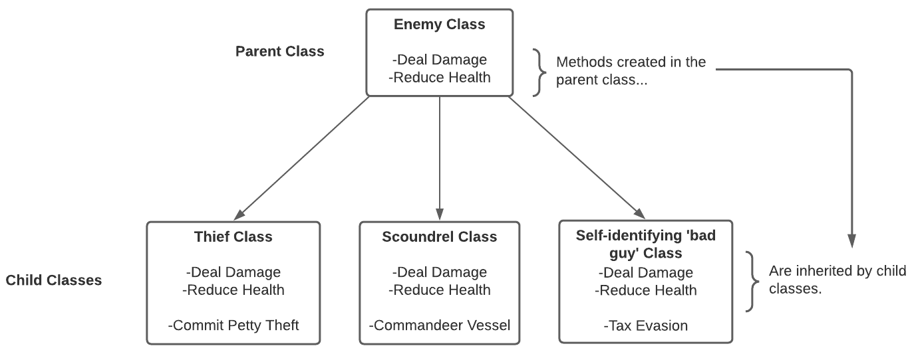

# 什麼是抽象？ Abstraction 

OOP 的第一個支柱就是讓你的代碼對使用它的程序員保持乾淨和簡單，無論是你還是其他人。抽像是從其他程序員會看到的腳本中刪除複雜代碼的過程，並且隻公開其他程序員真正需要的功能。當您“抽像出”細節時，您可以減少重複代碼並提供對最有用功能的輕鬆訪問。您實際上已經非常熟悉這個支柱，因為您在整個過程中經常從中受益。每當您調用一個方法來執行任務而不是手動編寫所有代碼時，您就會從抽像中受益！

面向對象編程的下兩個支柱，繼承和多態性，深深地交織在一起。繼承，顧名思義，關注不同對象之間的父子關係。多態是繼承的結果，是指子類修改從父類繼承的東西的過程。結合使用，繼承和多態性可以減少您必須在應用程序中編寫的代碼量。

# 什麼是繼承？Inheritance 
繼承是創建主類（也稱為父類）的過程，從中可以創建其他類（稱為子類）。子類自動承擔或繼承父類的所有功能。在應用程序中讓不同的類共享相似的功能是很常見的。例如，一款視頻遊戲可能具有許多不同類型的敵人類別，但它們可能具有相同的核心功能，例如管理自身健康和對玩家造成傷害的能力。通過繼承，無需為每個單獨的敵人類別編寫生命值和傷害功能，這樣您就可以專注於編寫每個類別獨有的功能。

# 什麼是多態？ polymorphism
儘管從父類繼承核心功能可能會有幫助，但在許多情況下您不希望子類執行與父類完全相同的操作。多態性允許您更改對像從其父類繼承的功能。
