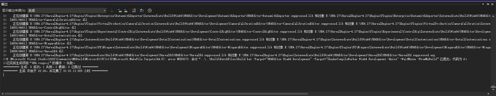

# 00-UE5.2源碼編譯與安裝
## 0. 安裝必要套件
這次安裝UE5.2是從GITHUB上的5.2分支上下載，踩了不少坑，所以要小心處理每一個文件

### 1. 下載UE5.2
- 需要去 https://www.unrealengine.com/en-US/ue-on-github 註冊一個帳號，才能下載
- Github下載網址：https://github.com/EpicGames/UnrealEngine/tree/5.2
- 下載+編譯硬盤空間為210GB，C盤也需要大約30GB編譯空間 (因為VS會編譯大量的中繼文檔，所以需要比較大的硬盤空間)
- 編譯一款簡單的第三人稱式遊戲和場景項目，一共需要4GB空間

### 2. 安裝Visual Studio 2022或Visual Studion 2019。

1. Visual Studio 2022 和 2019 的所有桌面版本都可以構建 UE5，包括Visual Studio Community。
2. 選擇 C++ 桌面開發，並選取 Windows 桌面應用程式 (C++)
3. 選擇 遊戲開發
4. 詳細選擇 https://docs.unrealengine.com/5.3/en-US/setting-up-visual-studio-development-environment-for-cplusplus-projects-in-unreal-engine/
5. 如果漏了個 NET 在第三步中，記得回去Installer那裡安裝 NET 6.0 以及 4.6.2 SDK 開發者套件


### 3. 運行Setup.bat。

- 引擎二進製文件的完整下載為 20-21 GB，這可能需要一些時間才能完成。後續運行會更快，因為它們只下載新的和更新的內容。

- 問題1: 小心路徑不要太長


### 4. 運行GenerateProjectFiles.bat

- 為引擎創建項目文件。完成時間應該不到一分鐘。

### 5. 雙擊新的UE5.sln文件將項目加載到 Visual Studio 中。

- 將解決方案配置設置為Development Editor，將解決方案平台設置為Win64，然後右鍵單擊UE5目標並選擇Build。完成編譯可能需要 10 到 40 分鐘，具體取決於您的系統規格。
- 這段時間很漫長，記得有時間去喝杯咖啡，休息一下。 :)
- 要注意的是，有時候你硬盤不夠大，VS無法編譯那些文件。就結束當前編譯之後，重新再編譯一次就OK了

- 問題: C++ 17 特性問題，當你使用VS 2017以下時會出現，關閉編譯器警告，或者升級VS即可


### 6. 常見問題
- 以後都要打開 VS，然後按 F5 啟動嗎？太煩了。
  - 可以到 Engine\Binaries\Win64 底下打開 UnrealEditor.exe
- 創建新項目之後，怎麼就只有個VS視窗，UE Editor不顯示了？
  - 因為你需要到那個新項目文件，打開.uproject，就又可以用 UE Editor了。
- 那我想寫新的代碼，每一次都要重新編譯嗎?
  - 就是這樣的，但你可以用live-coding特性: https://docs.unrealengine.com/5.1/zh-CN/using-live-coding-to-recompile-unreal-engine-applications-at-runtime/
- 很卡，怎麼辦？
  - 去右邊的選項，渲染部分，關閉所有 lumen 的部分
  - 可以參考下圖部分調整


### 7. Andorid 套件安裝
- 下載 Android Studio https://developer.android.com/studio
- 隨意創建一個 Android 專案，然後打開 Setting，安裝 Command-line Tool 插件 (最好選擇 8.0版本)
- 去 UnrealEngine\Engine\Extras\Andorid，啟動 SetupAndroid.bat

- 問題: Unable to locate local Android SDK location. Did you run Android Studio after installing?
  - https://forums.unrealengine.com/t/android-studio-path-c-program-files-android-android-studio-unable-to-locate-local-android-sdk/144686/5
- 問題: Unable to locate sdkmanager.bat. Did you run Android Studio and install cmdline-tools after installing?
  - https://stackoverflow.com/questions/68236007/i-am-getting-error-cmdline-tools-component-is-missing-after-installing-flutter
- 問題: JAVA_HOME is set to an invalid directory:
  - https://stackoverflow.com/questions/45182717/java-home-is-set-to-an-invalid-directory
- 問題: ANDROID Package Project: Error: Could not initialize class
  - https://forums.unrealengine.com/t/android-package-project-error-could-not-initialize-class/143103
  - https://www.reddit.com/r/unrealengine/comments/v6hr86/ue5_packaging_for_android_error_could_not/
  - https://www.youtube.com/watch?v=WnuhngCv2xI&ab_channel=CodeProf
  - https://forums.unrealengine.com/t/ue4-25-0-could-not-initialize-class-org-codehaus-groovy-reflection-reflectioncache/466244/4
  - https://forums.unrealengine.com/t/help-android-arm64-gradle-rungradle-bat-error-hell/241964
- 大部分問題都在路徑上，嘗試改路徑吧


### 7.5 1 大問題 >java.lang.NoClassDefFoundError: Could not initialize class org.codehaus.groovy.vmplugin.v7.Java7

~~最重要的一步来了，去升级gradle-properties，具体文件目录在引擎目录下Engine\Build\Android\Java\gradle\gradle\wrapper\gradle-wrapper.properties，打开这个Properties文件将原来的6.1.1修改为6.3，因为6.1.1会报Java的神秘错误。类似下面这种~~

```
1>java.lang.NoClassDefFoundError: Could not initialize class org.codehaus.groovy.vmplugin.v7.Java7
```


建議直接下載 JDK 11，去到系統PATH路徑那改成 JDK11，之後就行了

https://www.openlogic.com/openjdk-downloads

### 8. 之後呢

- 打包成 Android App 吧，之後你就可以玩了！

