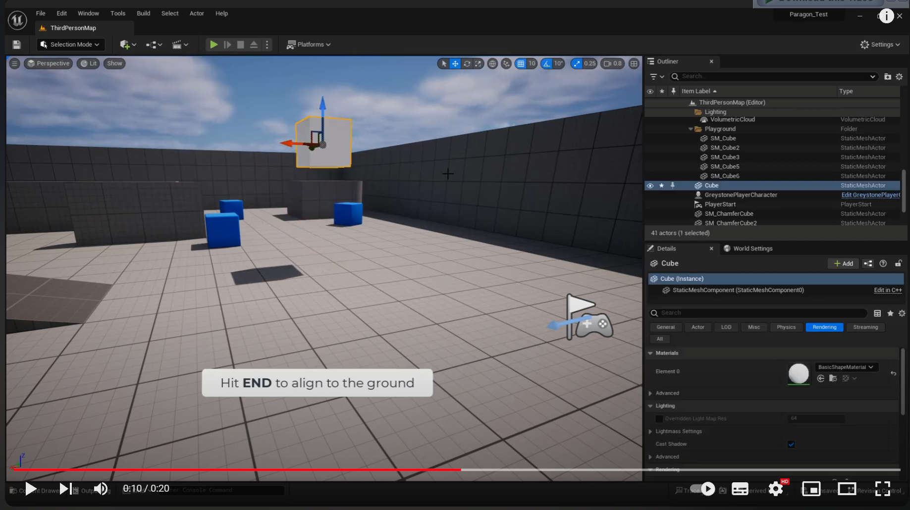

# Actors
https://docs.unrealengine.com/4.26/en-US/ProgrammingAndScripting/ProgrammingWithCPP/UnrealArchitecture/Actors/

- https://www.youtube.com/watch?v=wOvRTHda33U&ab_channel=EZUnreal

使用 `End` 與地面對齊

