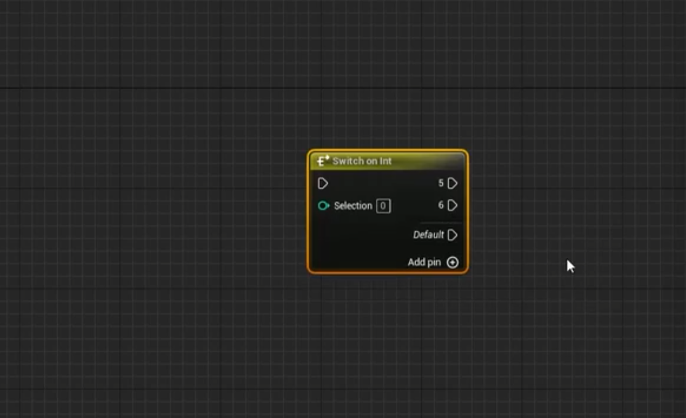

# BluePrint 藍圖

# BluePrint 變量
https://docs.unrealengine.com/5.2/zh-CN/blueprint-variables-in-unreal-engine/

# BluePrint 函數
https://docs.unrealengine.com/5.2/en-US/functions-in-unreal-engine/

# for loop, do N, switch

# delay

# Get actor

