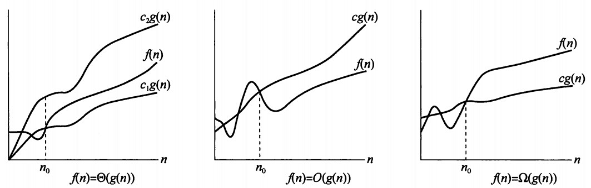

# 算法概述

本筆記為學校計算機科學大二課程中＂算法分析與設計＂的隨堂筆記

> by tom_ci

## 1. 什么是算法？

    算法(algorithm):算法是对特定问题求解步骤的描述，是指令的有限序列。就是定义良好的计算过程，他取一个或一组的值为输入，并产生出一个或一组值作为输出。简单来说算法就是一系列的计算步骤，用来将输入数据转化成输出结果。

## 2. 算法的五个特征

输入：算法有零个或多个输入量；

输出：算法至少产生一个输出量；

确定性：算法的每一条指令都有确切的定义，没有二义性；

可行性：算法的每一条指令必须足够基本，它们可以通过已经实现的基本运算执行有限次来实现；

有穷性：算法必须执行有限步之后终止。

## 3. 问题和问题求解

    问题求解：寻找一种方法来实现目标。

    问题求解过程：人们通过使用问题领域知识来理解和定义问题，并凭借自身的经验和知识求选择和使用适当的问题求解策略、技术和工具，将一个问题描述转换成问题解的过程。

    计算机求解问题的关键之一是寻找一种问题求解策略得到求解问题的算法，从而得到问题的解。

## 4. 算法复杂度

1. 渐近紧确界记号： Θ (big-theta) $\Theta$
2. 渐近上界记号：O (big-oh) $O$
3. 渐近下界记号：Ω (big-omega) $\Omega$



由下图中左侧 $f(n)=Θ(g(n))$ 图可以看出，对所有 $n>n_0​时，函数 $f(n)$ 乘一个常量因子可等于 $g(n)$ ，我们称 $g(n)$ 是 $f(n)$ 的一个 渐近紧确界 。 Θ记号在五个记号中，要求是最严格的，因为 $g(n)$ 即可以表示上界也可以表示下界。

# 几种常见的复杂度关系

$$
O(1) < O(\log(n)) < O(n) < O(n\log n) < O(n^2) < O(2^n) < O(n!) < O(n^n)
$$

需要注意的是：对数函数在没有底数时，默认底数为2；如 

$$
\lg n=\log n=\log_2 n
$$

因为计算机中很多程序是用二分法实现的。

# 素数测试

```c++
int isprime(int n) {
    for(int i=2; i<=(int)sqrt(n); i++) {
        if(n%i==0) { 
            return0;
        }
    }
    return1;
}
```

在上面这个素数测试的例子中，基本运算是整除；时间复杂度

$$
T ( n ) = O ( n^{\frac{1}{2}} )
$$

| 记号 | 含义 | 通俗理解 
| --- | --- | --- 
|(1)Θ（西塔）|	紧确界 | 相当于"=" 
|(2)O （大欧）|	上界。	|相当于"<="
|(3)o（小欧）|	非紧的上界。|	相当于"<"
|(4)Ω（大欧米伽）|	下界。|	相当于">="
|(5)ω（小欧米伽）|	非紧的下界。|	相当于">"
