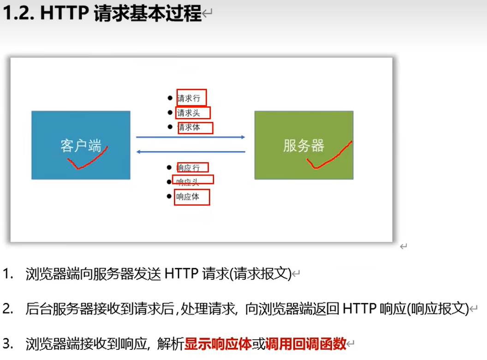
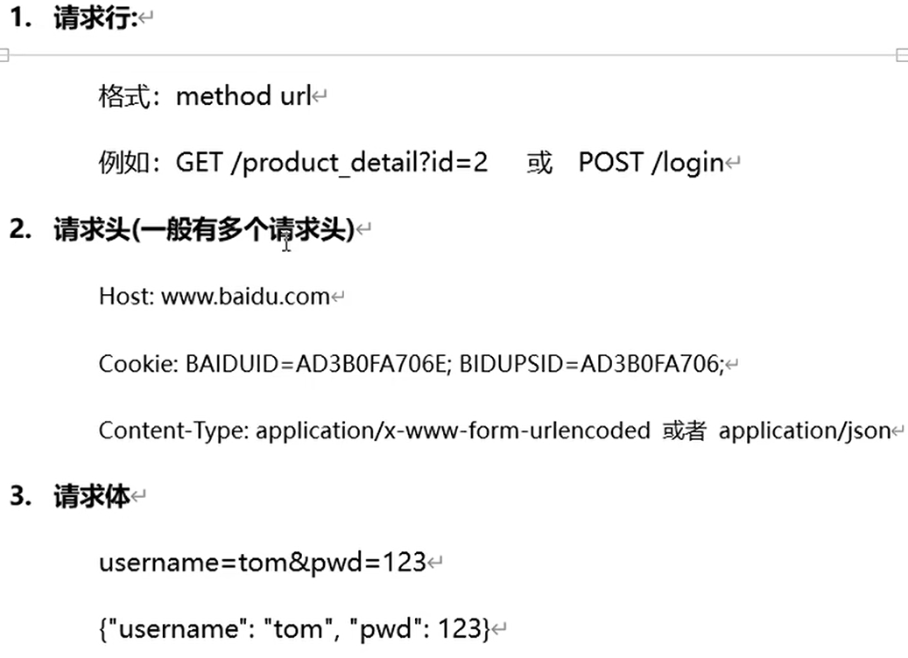
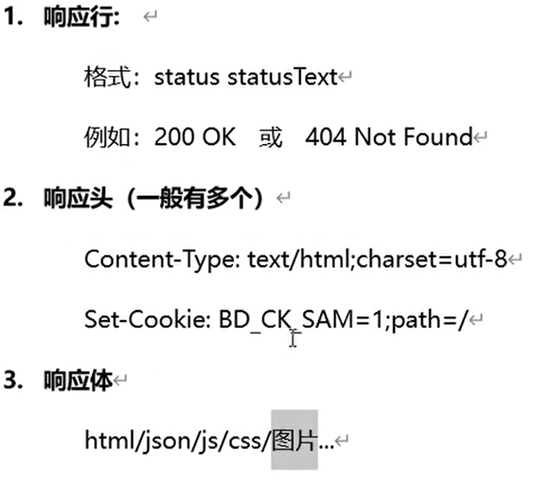
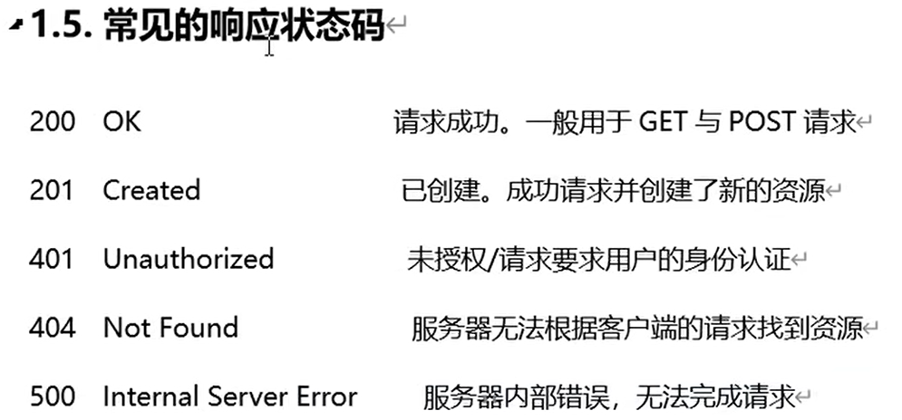

## Axios

Start here: https://www.bilibili.com/video/BV1Ga41177Tn

GitHub: https://github.com/axios/axios

## 01 HTTP相關內容




### HTTP請求報文




### HTTP響應報文







## 02 請求方式與請求參數的總結


### 總結

請求方式：GET POST PUT DELETE

請求參數：query params body(urlencoded, json)


## 03 API的分類


在server端(express.js)，**RESTful API可以在同一個路徑可以進行增刪改查**


## 04 json-server的使用

- 10秒搭建後端REST API
- 有能力的話可以自己用express.js寫一個(慢)

1. 安裝json-server

```
npm install -g json-server
```

2. 根據db.json的數據生成API

```
json-server db.json
```


## 05 postman接口測試工具

### GET

請求參數：利用query params


### POST

請求參數：利用body的x-www-form-urlencoded (json-server不能用query params, id自動增加)


### PUT

請求參數：**更新的數據**利用body的x-www-form-urlencoded，**id利用路徑params**(json-server規定)


### DELETE

請求參數：**id利用路徑params**(json-server規定)


Postman會在header加已選擇的content-type


選擇以json格式時，postman會在Content-Type自動設定 **application/json**


## 06 一般http請求與ajax請求


## 07 08 09 axios


課程所需的後端文件 https://github.com/huangyisan/apiDoc_server

apidoc 建立api文檔 https://apidocjs.com/


可cdn引用，npm或本地

### 模板


### GET

```javascript
btn.onclick=()=>{
	axios({
			url:'http://localhost:5000/persons', //請求地址
			method:'GET', //請求方式
	}).then(
    	response => {console.log('請求成功',response);},
        error => {console.log('請求失敗',error);},
    )
}
```

### response實例


- config裡的headers是請求頭

- config外的headers是響應頭

### 精簡寫法

有成功有失敗

```javascript
btn.onclick = ()=>{
	axios.get('http://localhost:5000/persons').then(
    	response => {console.log('請求成功',response.data);},
        error => {console.log('請求失敗',error);},
    )
}
```

只有成功(利用**async**和**await**)

```javascript
btn.onclick = async ()=>{
	const result = await axios.get('http://localhost:5000/persons')
	console.log(result.data);
}
```

### timeout

可以配置`timeout:2000`，超時error會顯示出timeout


### GET - params

Query String Parameters, **personId**是一個DOM

```javascript
axios({
	url:'http://localhost:5000/person',
	method:'GET',
	params:{id:personId.value}
}).then(
	response => {console.log('成功了', response.data);},
	error => {console.log('失敗了', error);}
)
```


### POST - data

```javascript
axios({
	url:'http://localhost:5000/person',
	method:'POST',
	//攜帶請求體參數(默認是JSON編碼)
    data:{
        name:personName.value,
        age:personAge.value
    }
}).then(
	response => {console.log('成功了', response.data);},
	error => {console.log('失敗了', error);}
)
```

```java
//攜帶請求體參數(url-encoded編碼)
    data:`name=${personName.value}&age=${personAge.value}`
```


### PUT - data

```javascript
axios({
	url:'http://localhost:5000/person',
	method:'PUT',
    data:{
        id:personUpdateId.value,
        name:personUpdateName.value,
        age:personUpdateName.value,
    }
}).then(
	response => {console.log('成功了', response.data);},
	error => {console.log('失敗了', error);}
)
```

### DELETE - data

這邊示範的是用**路徑param**，用甚麼參數方式是由後端決定

```javascript
axios({
	url:`http://localhost:5000/person/${personDeleteId.value}`,
	method:'DELETE',
}).then(
	response => {console.log('成功了', response.data);},
	error => {console.log('失敗了', error);}
)
```

### 總結


## 10 axios常用配置項 

`headers:{token:123} `配置請求頭

`responseType:'json'`配置響應數據的格式 (*如響應的不是json格式會回傳成null*)

也可以配置全局默認屬性，使**所有axios**都跟從這些屬性

`axios.defaults.timeout = 2000`

`axios.defaults.headers = {token:123}`

`axios.defaults.baseURL = 'http://localhost:5000'`配置baseURL (常用)


## 11 axios.create方法

目的：可以不同的axios做不同的配置


有些網站會block掉請求頭(headers)

### 總結


## 12 複習async await


## 13 14 攔截器

### axios.interceptors.request.use

過濾axios的**請求**

```javascript
axios.interceptors.request.use((config)=>{
    config.headers.toekn = "123"
    return config //必須返回config
})
```


### axios.interceptors.response.use

過濾axios的**響應**

```javascript
axios.interceptors.response.use(
	response => {
		console.log('響應攔截器成功的回調執行了', response)
        return response
	},
	error => {
		console.log('響應攔截器失敗的回調執行了', error)
        return Promise.reject(error) //必須返回一個失敗的promise
	}
)
```

以下的寫法為將**所有出錯 交由interceptors處理**，下面的axios請求只需await成功的值就好而不處理出錯

`error=>{return new Promise(()=>{})}` 會令下面的axios走向成功(response)


## 15 16 取消請求


### 利用interceptors統一管理任意請求的取消


然後之後的axios只需處理success response!


## 17 批量發送請求

### 失敗例子


### 正確做法 `axios.all([])`


test1 test2 test3 **同時發送請求**，而test2會delay 3秒，導致test1 test3也要等3秒才**一起response**，response的順序為[test1, test2, test3]，不會因test2 delay而變成了[test1, test3, test2]
