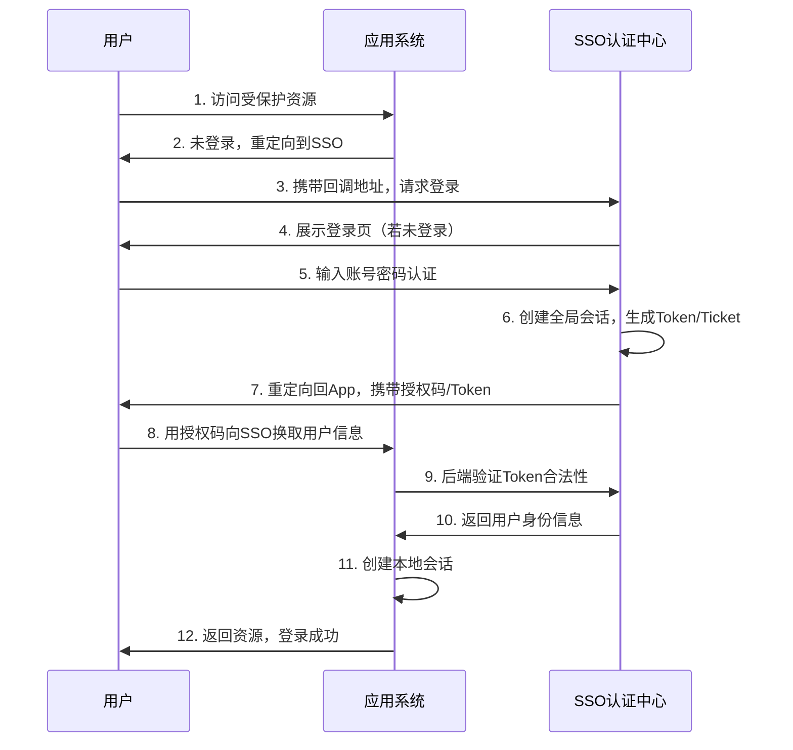
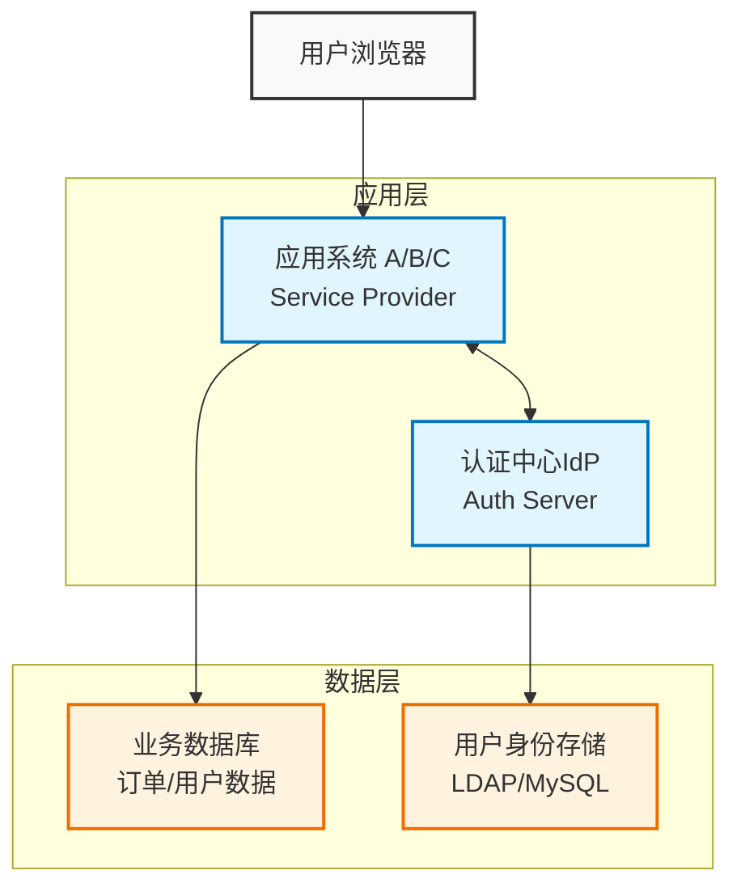

**SSO** 是 **Single Sign-On** 的缩写，中文译为 **单点登录**。它是一种身份认证方案，允许用户使用**一套账号密码**登录多个相互信任的应用系统，而无需在每个系统中重复登录。

**核心目标**：**一次登录，处处通行**。

## 一、为什么需要 SSO？（解决什么问题）

#### 传统多系统登录的痛点：
```
用户 → 系统A (登录)
用户 → 系统B (再登录)
用户 → 系统C (又登录)
```
*   **体验差**：用户需要记忆多套账号密码，频繁登录。
*   **效率低**：切换系统时要重复认证，打断工作流。
*   **管理难**：员工离职时，需要在多个系统中逐一禁用账号，易遗漏。
*   **安全性弱**：用户倾向于使用简单密码或在多个系统复用密码，增加泄露风险。

#### SSO 的解决方案：
```
用户 → SSO认证中心 (登录一次)
        ↓ (信任传递)
用户 → 系统A 系统B 系统C
```
*   **用户体验**：只需登录一次，访问其他应用自动通过认证。
*   **统一管理**：账号、权限、密码策略集中管理，便于审计和管控。
*   **安全性提升**：支持 MFA（多因素认证）、统一会话超时、集中登出。

---

## 二、SSO 的核心原理

SSO 的本质是 **信任传递** 和 **票据交换**。其核心流程可抽象为：



#### 关键概念：
| 术语                               | 说明                                                 |
| -------------------------------- | -------------------------------------------------- |
| **认证中心（Identity Provider, IdP）** | 负责用户身份验证的中央服务，如 Keycloak、Auth0、CAS Server          |
| **服务提供者（Service Provider, SP）**  | 依赖认证中心进行用户认证的应用系统                                  |
| **全局会话（Global Session）**         | 用户在 SSO 中心登录后创建的会话，跨应用共享                           |
| **局部会话（Local Session）**          | 各应用系统自己维护的会话，通常由 SSO 认证成功后创建                       |
| **Ticket / Token**               | 认证中心颁发的临时凭证，用于证明用户身份（如 TGT、JWT、Authorization Code） |

---

## 三、常见 SSO 协议与标准

### 3.1 CAS (Central Authentication Service)
*   **特点**：开源、协议简单、基于 Ticket 机制，适合企业内部系统。
*   **流程简述**：
    1.  用户访问 App，App 重定向到 CAS Server，携带 `service=App地址`
    2.  CAS 检查用户是否有全局会话（TGT），无则跳转登录页
    3.  登录成功后，CAS 生成 **Service Ticket (ST)**，重定向回 App
    4.  App 用 ST 向 CAS 后端验证，获取用户信息，创建本地会话

### 3.2 OAuth 2.0 + OpenID Connect (OIDC)
*   **特点**：现代 Web/API 主流标准，OIDC 在 OAuth 2.0 基础上增加了身份层。
*   **核心角色**：
    *   Resource Owner（用户）
    *   Client（应用）
    *   Authorization Server（认证中心）
    *   Resource Server（资源接口）
*   **关键令牌**：
    *   `Access Token`：访问资源接口的凭证
    *   `ID Token`（OIDC 特有）：包含用户身份信息的 JWT，用于认证
*   **适用场景**：第三方登录（微信/Google 登录）、微服务架构、前后端分离应用

### 3.3 SAML 2.0 (Security Assertion Markup Language)
*   **特点**：基于 XML 的企业级标准，安全性高，配置复杂，常用于 B2B 或大型组织。
*   **流程**：通过浏览器重定向 + XML 断言（Assertion）传递用户身份信息。
*   **适用场景**：企业级 SaaS 集成（如 Office 365、Salesforce 对接企业 AD）

### 3.4 JWT + 自实现 SSO
*   **特点**：轻量灵活，适合小型项目或特定场景。
*   **原理**：认证中心签发包含用户信息的 JWT，各应用验证签名即可信任用户身份。
*   **注意**：需自行处理令牌刷新、吊销、安全性等问题，不建议从零实现生产级 SSO。

---

## 四、SSO 的典型架构（以 OAuth2/OIDC 为例）



**会话管理策略：**

| 策略              | 说明                       | 优点        | 缺点             |
| --------------- | ------------------------ | --------- | -------------- |
| **集中式 Session** | 所有应用共享 Redis 等存储 Session | 实现简单，一致性好 | 存储压力大，有单点风险    |
| **Token 无状态**   | 使用 JWT 携带用户信息，应用无状态验证    | 易扩展，适合微服务 | 令牌吊销困难，需注意签名安全 |
| **混合模式**        | SSO 中心用 Token，应用本地缓存用户信息 | 平衡性能与灵活性  | 架构稍复杂          |

---

## 五、单点登出（Single Log-Out, SLO）

SSO 不仅要解决"单点登录"，还要解决"一处登出，处处退出"。

1.  **前端通知法**：
    *   用户登出时，认证中心通知所有已登录的应用（通过 iframe、WebSocket 或前端注册回调）。
    *   各应用收到通知后清除本地会话。
    *   ✅ 简单，❌ 可靠性依赖前端，易遗漏。

2.  **后端回调法（推荐）**：
    *   应用登录时向 SSO 中心注册 `logout_callback_url`。
    *   用户登出时，SSO 中心遍历所有注册的应用，后端发起 HTTP 请求通知登出。
    *   ✅ 可靠，❌ 实现稍复杂，需处理网络超时。

3.  **Token 黑名单法**：
    *   登出时将 JWT 加入 Redis 黑名单，设置剩余有效期为 TTL。
    *   各应用验证 Token 时检查是否在黑名单中。
    *   ✅ 无状态架构友好，❌ 增加 Redis 依赖和查询开销。

---

## 六、安全注意事项

✅ **必须做**：
*   所有通信使用 **HTTPS**，防止 Token 被窃听。
*   Token 设置合理有效期，支持刷新机制（Refresh Token）。
*   敏感操作（如修改密码）要求二次认证。
*   记录完整的登录/登出/授权日志，便于审计。
*   对用户输入和重定向 URL 做严格校验，防止 **Open Redirect** 攻击。

❌ **避免做**：
*   不要在 URL 中明文传递密码或敏感信息。
*   不要信任前端传来的用户身份，后端必须二次验证 Token。
*   不要使用弱签名算法（如 HS256 密钥过短），推荐 RS256。
*   不要忽略 CSRF 防护（尤其在 OAuth 授权码模式中）。

---

## 七、其它

### 7.1 开源 SSO 方案推荐

| 方案 | 语言 | 特点 | 适用场景 |
|------|------|------|----------|
| **Keycloak** | Java | 功能最全，支持 OIDC/SAML/LDAP，自带管理后台 | 企业级、中大型项目 |
| **CAS Server** | Java | 协议纯粹，社区成熟，插件丰富 | 传统 Java 企业应用 |
| **Auth0 / Okta** | SaaS | 开箱即用，多因素认证，用户行为分析 | 快速上线、预算充足 |
| **Ory Hydra/Kratos** | Go | 云原生设计，API 优先，适合微服务 | 技术团队强、定制化需求高 |
| **Spring Authorization Server** | Java | Spring 官方出品，与 Spring Boot 深度集成 | Spring 技术栈项目 |

### 7.2 简单代码示意（Spring Boot + OIDC）

**应用侧配置（application.yml）**：
```yaml
spring:
  security:
    oauth2:
      client:
        registration:
          my-sso:
            client-id: app-client
            client-secret: xxx
            authorization-grant-type: authorization_code
            redirect-uri: "{baseUrl}/login/oauth2/code/{registrationId}"
            scope: openid,profile,email
        provider:
          my-sso:
            issuer-uri: https://sso.example.com
```

**启用安全配置**：
```java
@Configuration
@EnableWebSecurity
public class SecurityConfig {
    @Bean
    public SecurityFilterChain filterChain(HttpSecurity http) throws Exception {
        http
            .authorizeHttpRequests(auth -> auth
                .anyRequest().authenticated()
            )
            .oauth2Login(oauth2 -> oauth2
                .loginPage("/oauth2/authorization/my-sso")
            );
        return http.build();
    }
}
```
*用户访问受保护接口时，Spring Security 会自动跳转 SSO 登录页，登录后回调并创建会话。*